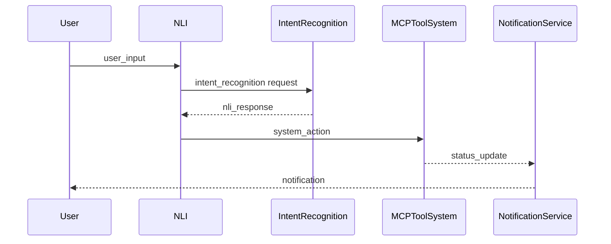

# Natural Language Interface: Detailed Specification

## 1. Introduction

The Natural Language Interface (NLI) is the user-facing component of our AI-powered Internal Developer Platform. It serves as the primary interaction point between developers and the system, allowing users to express their infrastructure needs in conversational natural language. This component is designed to be intuitive, responsive, and context-aware, providing a seamless experience that abstracts away the complexity of underlying infrastructure management.

## 2. Component Overview

The NLI is responsible for:

1. **User Interaction**: Providing a conversational interface for developers to express their infrastructure needs
2. **Context Management**: Maintaining conversation history and user context across multiple interactions
3. **Input Validation**: Ensuring user input is clean and appropriate for processing
4. **Output Presentation**: Displaying system responses in a clear, organized manner
5. **Error Handling**: Providing helpful feedback when system cannot understand or execute requests
6. **Progress Indication**: Showing status of long-running operations and tasks

## 3. Design Principles

### 3.1 Conversational Experience

The NLI adopts a chat-like interface that feels natural and intuitive to developers:

- **Multi-modal Communication**: Supports text, voice, and potential inputs where appropriate
- **Contextual Memory**: Remembers previous interactions within a session and across sessions
- **Prompt Templating**: Provides helpful suggestions and templates to guide user input
- **Interactive Clarification**: Asks follow-up questions when intent is unclear or parameters are missing

### 3.2 User Experience (UX) Design

The UX is designed to be clean, minimal, and functional:

1. **Input Area:**
   - Text input field with multi-line support
   - Voice input button (for supported browsers)
   - Suggested prompts and commands based on context
   - Attachment support for configuration files

2. **Conversation Area:**
   - Chronological display of messages
   - User and system messages distinguished by color and iconography
   - Scrollable history with clear separation between sessions
   - Search and filter capabilities for history

3. **Status Indicators:**
   - Typing indicator when system is processing
   - Read receipts when messages are delivered
   - System status notifications for long-running operations

4. **Help & Support:**
   - Context-sensitive help button
   - Quick commands for common actions
   - Feedback and reporting mechanisms

5. **Settings & Preferences:**
   - User profile management
   - Language and tone preferences
   - Notification preferences
   - Theme and display customization options

### 3.3 Accessibility

The interface is designed with accessibility as a core principle:

- **Keyboard Navigation**: Full keyboard navigation and shortcuts
- **Screen Reader Support**: Compatibility with screen readers
- **High Contrast Mode**: Clear visual indicators and large text
- **Responsive Design**: Adapts to different screen sizes and orientations
- **WCAG 2.1 Support**: Compliance with assistive technology standards

## 4. Technical Implementation

### 4.1 Frontend Technologies

The frontend is built using modern web technologies for maximum compatibility:

- **React.js** for the main interface components
- **TypeScript** for type safety and developer experience
- **WebSockets** for real-time communication with the backend
- **CSS-in-js** for styling and theming
- **Material-UI** or **Tailwind CSS** for consistent component design

### 4.2 Backend Architecture

The backend services manage conversation state, user authentication, and integration with other system components:

- **Node.js** or **Python** for the main application logic
- **Express** or **FastAPI** for the Web application framework
- **Socket.IO** for real-time communication
- **Redis** or **MongoDB** for conversation history storage
- **Auth** service for user identity and permission management

### 4.3 APIs and Endpoints

The NLI exposes several APIs for internal component communication:

1. **Conversation API**: Manages conversation state, messages, and sessions
   - POST /api/conversations - Start new conversation
   - GET /api/conversations/{id} - Get conversation details
   - PUT /api/conversations/{id} - Update conversation
   - DELETE /api/conversations/{id} - Delete conversation

2. **Message API**: Handles individual messages within a conversation
   - POST /api/messages - Send a new message
   - GET /api/messages/{id} - Get message details

3. **User API**: Manages user profiles and preferences
   - GET /api/user/profile - Get current user profile
   - PUT /api/user/profile - Update user profile
   - GET /api/user/preferences - Get user preferences

4. **Help API**: Provides help content and suggestions
   - GET /api/help/context - Get context-sensitive help
   - GET /api/help/suggestions - Get command suggestions

### 4.4 Data Models

Conversations and messages are stored using structured data models. The example below shows the structure of a conversation object:

```json
{
  "conversation": {
    "id": "uuid-value",
    "user_id": "user-id",
    "title": "New API for user management",
    "created_at": "2024-01-15T10:00:00Z",
    "updated_at": "2024-01-15T10:30:00Z",
    "status": "active",
    "messages": [
      {
        "id": "message-id-1",
        "type": "user",
        "content": "I need a new API server",
        "timestamp": "2024-01-15T10:00:00Z",
        "metadata": {
          "source": "web",
          "language": "en"
        }
      },
      {
        "id": "message-id-2",
        "type": "system",
        "content": "I can help you create a new API server. What would you like to name it?",
        "timestamp": "2024-01-15T10:01:50Z",
        "metadata": {
          "confidence": 0.95,
          "intent": "create_api_server"
        }
      }
    ]
  }
}
```

## 5. Integration with Other Components

### 5.1 Input Sources

The NLI receives input from:
- **User Interactions**: Direct input through the web interface
- **Voice Input**: Speech-to-text conversion for voice commands
- **File Uploads**: Configuration files and documentation
- **Contextual Help**: Context-sensitive help suggestions

### 5.2 Output Destinations

The NLI sends processed input to:
- **Intent Recognition & Parameter Extraction**: For intent analysis and parameter extraction
- **Audit & Traceability System**: For logging and audit trails
- **Governance & Policy Engine**: For permission checks and validation
- **MCP-Based Tool System**: For executing infrastructure operations

### 5.3 Event Flow

The NLI participates in an event-driven architecture. Add the following mermaid diagram when saving:



## 6. Security and Privacy

### 6.1 Authentication

The NLI implements robust authentication mechanisms:
- **Session Management**: Secure session creation and management
- **JWT Tokens**: Stateless authentication tokens for API access
- **Single Sign-On (SSO)**: Integration with organizational identity providers
- **Multi-Factor Authentication**: Support for additional authentication factors

### 6.2 Permissions

User permissions are enforced at multiple levels:
- **Role-Based Access**: Different permissions for developers, operators, and administrators
- **Resource Quotas**: Limits on the number and type of resources a user can create
- **Cost Controls**: Prevention of expensive infrastructure creation
- **Approval Workflows**: Requirement for approval for high-impact operations

### 6.3 Data Protection

The system protects user data and conversations:
- **Encryption**: All conversations are encrypted at rest
- **Data Retention**: Conversations are retained for a defined period
- **Anonymization**: User identities are protected and not linked to personal data
- **Compliance**: Regular audits to ensure compliance with data protection regulations

### 6.4 Security Monitoring

The system includes comprehensive security monitoring:
- **Audit Logging**: All user actions and system responses are logged
- **Intrusion Detection**: Monitoring for suspicious activity and potential security threats
- **Rate Limiting**: Protection against brute force attacks
- **Vulnerability Scanning**: Regular security scans to identify vulnerabilities

## 7. Performance Optimization

### 7.1 Frontend Optimization

The frontend is optimized for fast loading and responsiveness:
- **Code Splitting**: Bundles are split and lazy-loaded on demand
- **Caching**: Static assets are cached and served from CDN
- **Image Optimization**: Images are compressed and optimized for web delivery
- **Minification**: Unnecessary code is removed and assets are minified

### 7.2 Backend Optimization

The backend is optimized for scalability and performance:
- **Connection Pooling**: Database connections are pooled and reused
- **Redis Caching**: Frequently accessed data is cached in memory
- **Asynchronous Processing**: Long-running tasks are handled asynchronously
- **Load Balancing**: Requests are distributed across multiple instances for high availability

### 7.3 Monitoring and Alerting

The system includes comprehensive monitoring:
- **Performance Metrics**: Track response times, error rates, and usage patterns
- **Health Checks**: Monitor system health and performance
- **Alerting**: Configurable alerts for security events, performance issues, and system errors
- **Log Analysis**: Automated analysis of logs to identify issues and optimization opportunities

## 8. Testing Strategy

### 8.1 Unit Testing

Components are tested in isolation to ensure reliability:
- **Frontend Component Tests**: Unit tests for UI components, interaction logic, and state management
- **Backend API Tests**: Tests for API endpoints, data validation, and business logic
- **Integration Tests**: Tests for integration with other system components

### 8.2 Integration Testing

The system is tested end-to-end to ensure seamless integration:
- **End-to-End Test Suites**: Complete user journeys from input to infrastructure deployment
- **Performance Testing**: Load testing to ensure system can handle expected user load
- **Security Testing**: Penetration testing to identify vulnerabilities and security flaws
- **Acceptance Testing**: User acceptance testing to ensure the interface is intuitive and easy to use

### 8.3 User Acceptance Testing

Before deployment, the system undergoes user acceptance testing:
- **Alpha Testing**: Release to a small group of users for feedback and bug fixing
- **Beta Testing**: Continued testing with increasingly larger groups of users
- **Feedback Collection**: Regular collection of user feedback and suggestions
- **UX Research**: Continuous improvement based on user research and behavioral analysis

## 9. Deployment and Operations

### 9.1 Deployment Strategy

The NLI is designed for containerized deployment using modern DevOps practices:
- **Container Orchestration**: Docker containers for any environment deployment
- **Kubernetes Deployment**: Kubernetes manifests and helm charts for management
- **Configuration as Code**: All configuration is version-controlled and deployed with the application
- **Environment Variables**: Different configurations for development, staging, and production environments

### 9.2 Ongoing Operations

The system includes comprehensive ongoing operations and maintenance: 
- **Health Checks**: Monitoring of component health and performance
- **Log Management**: Centralized log collection and analysis
- **Metrics Collection**: Collection of usage and performance metrics
- **Backup and Recovery**: Regular backups and disaster recovery procedures
- **Updates and Patching**: Controlled update process with minimal downtime

### 9.3 Scaling Strategy

The system is designed to scale horizontally and vertically:
- **Horizontal Scaling**: Adding more instances to handle increased user load
- **Vertical Scaling**: Adding more layers of infrastructure to handle increased complexity
- **Database Scaling**: Adding more database instances to handle increased data volume
- **Caching Scaling**: Adding more caching layers to improve performance under heavy load

## 10. Conclusion

The Natural Language Interface serves as the critical entry point for developers into our AI-powered Internal Developer Platform. By providing an intuitive, context-aware, and responsive interface, it abstracts away the complexity of infrastructure provisioning while maintaining the governance and consistency required for enterprise deployment.

Through careful design of the user experience, robust technical implementation, and comprehensive security measures, the NLI ensures that developers can effectively communicate their infrastructure needs while providing the system with the structured input required for reliable and governed execution.

This component embodies our principle of making infrastructure management accessible while maintaining the standards and controls required for enterprise operations. It sets the stage for the entire system to transform natural language into actionable, governed infrastructure.

By focusing on user experience, technical excellence, and security, the NLI creates a foundation that enables developers to be more productive while ensuring that infrastructure remains compliant, cost-effective, and operationally sound.