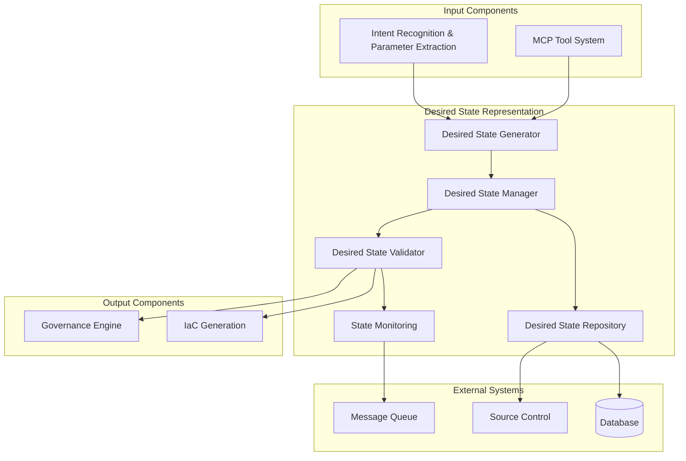

# Desired State Representation: Detailed Specification

## 1. Introduction

The Desired State Representation serves as the critical bridge between natural language developer requests and executable infrastructure code. This component transforms the structured output from the Intent Recognition & Parameter Extraction component into a standardized, machine-readable representation of the desired infrastructure state. By creating an intermediate representation that is both human-readable and machine-processable, the system enables governance, validation, and consistent infrastructure generation while maintaining a clear audit trail from the original developer request.

## 2. Component Overview

The Desired State Representation is responsible for:

1. **State Modeling**: Creating structured models of desired infrastructure states
2. **Intent Translation**: Converting developer intent into standardized representations
3. **Parameter Normalization**: Normalizing and validating extracted parameters
4. **Dependency Resolution**: Resolving dependencies between infrastructure components
5. **State Validation**: Ensuring the desired state is valid and complete
6. **Version Control**: Managing versions of desired state representations

## 3. State Representation Model

### 3.1 Core Data Structure

The desired state is represented using a standardized data structure:

```json
{
  "desiredState": {
    "id": "ds-uuid-v4",
    "version": "1.0.0",
    "timestamp": "2024-01-15T10:30:00Z",
    "requestId": "req-uuid-v4",
    "userId": "user-123",
    "teamId": "team-456",
    "environment": "development",
    "components": [
      {
        "type": "api-server",
        "name": "user-management-api",
        "template": "nodejs-api-server@1.2.0",
        "parameters": {
          "appName": "user-management-api",
          "port": 3000,
          "enableMetrics": true,
          "runtime": "nodejs",
          "database": "postgres-small",
          "cache": "redis-standard"
        },
        "dependencies": [
          {
            "type": "database",
            "name": "user-management-db"
          },
          {
            "type": "cache",
            "name": "user-management-cache"
          }
        ],
        "metadata": {
          "source": "natural-language",
          "confidence": 0.95,
          "estimatedCost": 45.00,
          "complianceLevel": "standard"
        }
      },
      {
        "type": "database",
        "name": "user-management-db",
        "template": "postgres-small@2.1.0",
        "parameters": {
          "instanceSize": "small",
          "storageSize": 100,
          "backupEnabled": true
        },
        "dependencies": [],
        "metadata": {
          "source": "inferred",
          "confidence": 0.90,
          "estimatedCost": 25.00,
          "complianceLevel": "standard"
        }
      },
      {
        "type": "cache",
        "name": "user-management-cache",
        "template": "redis-standard@1.5.0",
        "parameters": {
          "instanceSize": "standard",
          "enableClustering": false
        },
        "dependencies": [],
        "metadata": {
          "source": "inferred",
          "confidence": 0.90,
          "estimatedCost": 15.00,
          "complianceLevel": "standard"
        }
      }
    ],
    "relationships": [
      {
        "from": "user-management-api",
        "to": "user-management-db",
        "type": "connects-to"
      },
      {
        "from": "user-management-api",
        "to": "user-management-cache",
        "type": "uses"
      }
    ],
    "metadata": {
      "totalEstimatedCost": 85.00,
      "complianceStatus": "pending",
      "approvalStatus": "pending",
      "createdBy": "user-123",
      "createdAt": "2024-01-15T10:30:00Z",
      "lastModified": "2024-01-15T10:30:00Z"
    }
  }
}
```

### 3.2 Component Types

The system supports various component types:

1. **Application Components**
   - api-server: REST API servers
   - web-app: Web applications
   - background-worker: Background processing services
   - cli-tool: Command line tools
   - serverless-function: Serverless functions

2. **Data Components**
   - database: SQL and NoSQL databases
   - cache: In-memory caching systems
   - data-lake: Data lake storage
   - data-warehouse: Data warehouse systems

3. **Infrastructure Components**
   - load-balancer: Load balancing services
   - cdn: Content delivery networks
   - storage: Object and file storage
   - network: Networking components

4. **Messaging Components**
   - message-queue: Message queue systems
   - event-stream: Event streaming platforms
   - notification: Notification services

### 3.3 Relationship Types

Components can have various relationships:

- **connects-to**: Application connects to data store
- **uses**: Application uses infrastructure service
- **depends-on**: Component depends on another component
- **routes-to**: Load balancer routes to application
- **publishes-to**: Component publishes to message system
- **subscribes-to**: Component subscribes to message system

## 4. State Generation Process

### 4.1 Intent to State Translation

The system translates intent into desired state:

1. **Intent Analysis**: Analyze the recognized intent and extracted parameters
2. **Template Selection**: Select appropriate templates based on intent
3. **Parameter Mapping**: Map extracted parameters to template parameters
4. **Dependency Inference**: Infer required dependencies based on patterns
5. **State Construction**: Construct the complete desired state representation
6. **Validation**: Validate the constructed state for completeness and consistency

### 4.2 Parameter Normalization

The system normalizes parameters:

- **Type Conversion**: Convert parameters to appropriate types
- **Value Standardization**: Standardize values to common formats
- **Default Application**: Apply appropriate default values
- **Constraint Validation**: Validate against parameter constraints
- **Unit Conversion**: Convert units to standard units (e.g., GB, MB)

### 4.3 Dependency Resolution

The system resolves component dependencies:

- **Explicit Dependencies**: Handle explicitly defined dependencies
- **Implicit Dependencies**: Infer dependencies based on component types
- **Circular Dependency Detection**: Detect and prevent circular dependencies
- **Dependency Ordering**: Order components based on dependencies
- **Dependency Validation**: Validate that dependencies can be satisfied

## 5. State Validation

### 5.1 Structural Validation

The system validates the structure of the desired state:

- **Schema Validation**: Validate against the desired state schema
- **Required Fields**: Ensure all required fields are present
- **Data Types**: Validate data types of all fields
- **Format Validation**: Validate formats of specific fields (e.g., names, IDs)
- **Cardinality Validation**: Validate cardinality of relationships

### 5.2 Semantic Validation

The system validates the semantic meaning of the desired state:

- **Component Compatibility**: Validate compatibility between components
- **Parameter Consistency**: Ensure parameter values are consistent
- **Resource Availability**: Validate that requested resources are available
- **Naming Conflicts**: Detect and prevent naming conflicts
- **Environment Constraints**: Validate against environment constraints

### 5.3 Business Validation

The system validates business rules and policies:

- **Cost Validation**: Validate against cost budgets and limits
- **Compliance Validation**: Validate against compliance requirements
- **Security Validation**: Validate against security policies
- **Operational Validation**: Validate against operational constraints
- **Governance Validation**: Validate against governance policies

## 6. State Management

### 6.1 Version Control

The system manages versions of desired states:

- **Versioning Strategy**: Semantic versioning for desired states
- **Change Tracking**: Track changes between versions
- **Branching Support**: Support for branching desired states
- **Merge Capabilities**: Merge different versions of desired states
- **Rollback Support**: Rollback to previous versions

### 6.2 State Persistence

The system persists desired states:

- **Storage Backend**: Database or file-based storage for desired states
- **Indexing**: Indexing for efficient querying and retrieval
- **Backup and Recovery**: Backup and recovery of desired states
- **Retention Policies**: Configurable retention policies
- **Archival**: Archival of old or unused desired states

### 6.3 State Lifecycle

The system manages the lifecycle of desired states:

- **Creation**: Creation of new desired states
- **Modification**: Modification of existing desired states
- **Validation**: Validation of desired states
- **Approval**: Approval workflow for desired states
- **Deployment**: Deployment of desired states to infrastructure
- **Decommissioning**: Decommissioning of desired states

## 7. Integration with Other Components

### 7.1 Integration with Intent Recognition

The system integrates with Intent Recognition & Parameter Extraction:

- **Intent Consumption**: Consume structured intent from the recognition system
- **Parameter Extraction**: Extract parameters from intent data
- **Confidence Scoring**: Use confidence scores for validation
- **Context Preservation**: Preserve context from the original request
- **Error Handling**: Handle errors from intent recognition gracefully

### 7.2 Integration with Governance Engine

The system integrates with the Governance Engine:

- **Policy Validation**: Validate desired states against governance policies
- **Compliance Checking**: Check compliance requirements
- **Cost Analysis**: Analyze costs and validate against budgets
- **Approval Workflows**: Integrate with approval workflows
- **Audit Logging**: Log validation results and decisions

### 7.3 Integration with IaC Generation

The system integrates with IaC Generation:

- **State Translation**: Translate desired state to IaC format
- **Template Selection**: Select appropriate IaC templates
- **Parameter Mapping**: Map desired state parameters to IaC parameters
- **Output Generation**: Generate IaC code from desired state
- **Validation**: Validate generated IaC against desired state

## 8. Monitoring and Observability

### 8.1 State Metrics

The system collects metrics on desired state processing:

- **Generation Metrics**: Metrics on state generation performance
- **Validation Metrics**: Metrics on validation results and performance
- **Error Metrics**: Metrics on errors and error rates
- **Usage Metrics**: Metrics on usage patterns and frequency
- **Performance Metrics**: Metrics on system performance and resource usage

### 8.2 State Monitoring

The system monitors desired state processing:

- **Generation Monitoring**: Monitor state generation processes
- **Validation Monitoring**: Monitor validation processes and results
- **Error Monitoring**: Monitor errors and exceptions
- **Performance Monitoring**: Monitor system performance
- **Resource Monitoring**: Monitor resource usage and capacity

### 8.3 Alerting and Notification

The system provides alerting and notification:

- **Error Alerts**: Alerts for errors and exceptions
- **Performance Alerts**: Alerts for performance degradation
- **Validation Alerts**: Alerts for validation failures
- **Compliance Alerts**: Alerts for compliance violations
- **Cost Alerts**: Alerts for cost overruns and budget issues

## 9. Security and Compliance

### 9.1 Access Control

The system implements access control:

- **Authentication**: Authenticate users and systems
- **Authorization**: Authorize access to desired states
- **Role-based Access**: Role-based access control
- **Resource-based Access**: Resource-based access control
- **Audit Logging**: Audit all access and modifications

### 9.2 Data Protection

The system protects desired state data:

- **Encryption**: Encrypt data at rest and in transit
- **Data Masking**: Mask sensitive data in logs and displays
- **Retention Policies**: Implement data retention policies
- **Data Classification**: Classify data based on sensitivity
- **Backup and Recovery**: Backup and recover data

### 9.3 Compliance

The system ensures compliance:

- **Compliance Validation**: Validate against compliance requirements
- **Audit Trails**: Maintain comprehensive audit trails
- **Reporting**: Generate compliance reports
- **Policy Enforcement**: Enforce compliance policies
- **Regulatory Updates**: Update for regulatory changes

## 10. Architecture Diagram



## 11. Conclusion

The Desired State Representation serves as the critical bridge between natural language developer requests and executable infrastructure code. By creating a structured, standardized representation of the desired infrastructure state, the system enables governance, validation, and consistent infrastructure generation while maintaining a clear audit trail from the original developer request.

Through comprehensive state modeling, validation, and management capabilities, the Desired State Representation creates an environment where developer intent is accurately translated into machine-readable specifications that can be validated, governed, and executed. The system's focus on validation, monitoring, and security ensures that desired states are accurate, complete, and compliant with organizational requirements.

This component embodies our principle of structured intent representation, ensuring that the convenience of natural language interfaces is backed by rigorous validation and governance. By providing a clear, auditable trail from developer request to infrastructure specification, the Desired State Representation enables organizations to embrace AI-powered infrastructure management with confidence and control.

The result is a system that empowers developers to express their needs naturally while ensuring that all infrastructure is based on well-defined, validated specifications that meet organizational standards for security, compliance, and operational excellence.