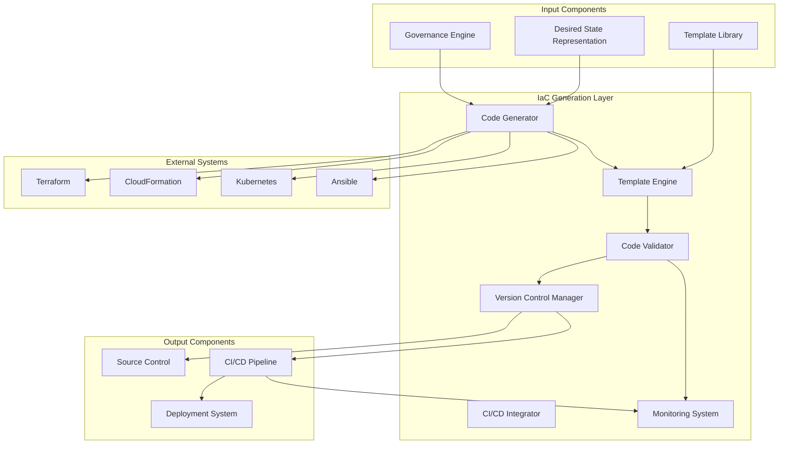

# IaC Generation Layer: Detailed Specification

## 1. Introduction

The IaC Generation Layer serves as the translation engine that converts structured desired state representations into executable infrastructure-as-code (IaC). This component bridges the gap between the abstract, validated infrastructure specifications and the concrete implementation code that can be deployed to cloud platforms or on-premises environments. By generating standardized, version-controlled IaC, the system ensures consistency, reproducibility, and maintainability of all infrastructure while leveraging existing IaC tools and workflows.

## 2. Component Overview

The IaC Generation Layer is responsible for:

1. **Code Generation**: Converting desired state into IaC code
2. **Template Processing**: Applying templates to generate consistent code
3. **Parameter Substitution**: Injecting parameters into generated code
4. **Code Validation**: Validating generated IaC for correctness and best practices
5. **Version Control**: Managing generated code in version control systems
6. **Integration**: Integrating with existing IaC tools and workflows

## 3. IaC Generation Architecture

### 3.1 Supported IaC Formats

The system supports multiple IaC formats:

1. **Terraform**
   - HCL (HashiCorp Configuration Language)
   - JSON configuration
   - Module-based architecture
   - Provider integration

2. **CloudFormation**
   - YAML templates
   - JSON templates
   - Nested stacks
   - Custom resources

3. **Kubernetes**
   - YAML manifests
   - Helm charts
   - Kustomize configurations
   - Operators

4. **Ansible**
   - YAML playbooks
   - Roles and collections
   - Dynamic inventories
   - Variable management

### 3.2 Generation Process

The IaC generation follows a structured process:

```json
{
  "generationRequest": {
    "desiredStateId": "ds-uuid-v4",
    "targetPlatform": "aws",
    "iacFormat": "terraform",
    "outputFormat": "hcl",
    "options": {
      "includeComments": true,
      "includeDocumentation": true,
      "formatCode": true,
      "validateSyntax": true,
      "runTests": false
    }
  },
  "generationResult": {
    "success": true,
    "files": [
      {
        "path": "terraform/main.tf",
        "content": "terraform {\n  required_providers {\n    aws = {\n      source  = \"hashicorp/aws\"\n      version = \"~> 4.0\"\n    }\n  }\n}\n\nprovider \"aws\" {\n  region = var.region\n}\n\nmodule \"api_server\" {\n  source = \"./modules/api-server\"\n  name   = var.app_name\n  port   = var.app_port\n  runtime = var.runtime\n}\n\nmodule \"database\" {\n  source     = \"./modules/database\"\n  instance_size = var.db_size\n  backup_enabled = var.db_backup\n}\n\nmodule \"cache\" {\n  source     = \"./modules/cache\"\n  instance_size = var.cache_size\n  enable_clustering = var.cache_clustering\n}\n",
        "type": "terraform"
      },
      {
        "path": "terraform/variables.tf",
        "content": "variable \"region\" {\n  description = \"AWS region\"\n  type        = string\n  default     = \"us-east-1\"\n}\n\nvariable \"app_name\" {\n  description = \"Application name\"\n  type        = string\n}\n\nvariable \"app_port\" {\n  description = \"Application port\"\n  type        = number\n  default     = 3000\n}\n\nvariable \"runtime\" {\n  description = \"Application runtime\"\n  type        = string\n  default     = \"nodejs\"\n}\n\nvariable \"db_size\" {\n  description = \"Database instance size\"\n  type        = string\n  default     = \"small\"\n}\n\nvariable \"db_backup\" {\n  description = \"Enable database backup\"\n  type        = bool\n  default     = true\n}\n\nvariable \"cache_size\" {\n  description = \"Cache instance size\"\n  type        = string\n  default     = \"standard\"\n}\n\nvariable \"cache_clustering\" {\n  description = \"Enable cache clustering\"\n  type        = bool\n  default     = false\n}\n",
        "type": "terraform"
      },
      {
        "path": "terraform/outputs.tf",
        "content": "output \"api_endpoint\" {\n  description = \"API server endpoint\"\n  value       = module.api_server.endpoint\n}\n\noutput \"database_endpoint\" {\n  description = \"Database endpoint\"\n  value       = module.database.endpoint\n}\n\noutput \"cache_endpoint\" {\n  description = \"Cache endpoint\"\n  value       = module.cache.endpoint\n}\n",
        "type": "terraform"
      }
    ],
    "metadata": {
      "generatedAt": "2024-01-15T10:30:00Z",
      "generatorVersion": "1.2.0",
      "templateVersion": "terraform-aws-1.0.0",
      "validationResults": {
        "syntaxValid": true,
        "bestPracticesValid": true,
        "securityValid": true,
        "costValid": true
      }
    }
  }
}
```

### 3.3 Template Engine

The system includes a powerful template engine:

- **Parameter Substitution**: Dynamic substitution of parameters
- **Conditional Logic**: Support for conditional code generation
- **Loop Constructs**: Support for loops and iterations
- **Template Inheritance**: Inheritance and composition of templates
- **Custom Functions**: Extensible function library for template processing

## 4. Code Generation Strategies

### 4.1 Module-based Generation

The system uses a module-based approach:

- **Reusable Modules**: Pre-built, tested modules for common patterns
- **Module Composition**: Combine modules to create complex infrastructure
- **Module Versioning**: Version control for modules
- **Module Registry**: Central registry for module discovery
- **Module Testing**: Automated testing of modules

### 4.2 Pattern-based Generation

The system generates code based on patterns:

- **Infrastructure Patterns**: Common infrastructure patterns (e.g., web app + database)
- **Best Practice Patterns**: Patterns that follow best practices
- **Security Patterns**: Patterns that include security controls
- **Cost Optimization Patterns**: Patterns optimized for cost
- **Compliance Patterns**: Patterns that ensure compliance

### 4.3 Platform-specific Generation

The system generates platform-specific code:

- **Cloud-specific Code**: Code optimized for specific cloud providers
- **Multi-cloud Support**: Support for multi-cloud deployments
- **Hybrid Cloud Support**: Support for hybrid cloud deployments
- **On-premises Support**: Support for on-premises deployments
- **Edge Computing Support**: Support for edge computing deployments

## 5. Code Validation and Quality

### 5.1 Syntax Validation

The system validates syntax:

- **Format-specific Validation**: Validation for each IaC format
- **Syntax Checking**: Check for syntax errors
- **Schema Validation**: Validate against IaC schemas
- **Dependency Validation**: Validate dependencies between resources
- **Reference Validation**: Validate resource references

### 5.2 Best Practice Validation

The system validates best practices:

- **Naming Conventions**: Validate naming conventions
- **Resource Tagging**: Validate resource tagging
- **Security Best Practices**: Validate security configurations
- **Cost Best Practices**: Validate cost optimizations
- **Operational Best Practices**: Validate operational configurations

### 5.3 Security Validation

The system validates security:

- **Security Configuration**: Validate security configurations
- **Vulnerability Scanning**: Scan for vulnerabilities
- **Compliance Validation**: Validate compliance requirements
- **Secret Detection**: Detect secrets in generated code
- **Access Control**: Validate access control configurations

## 6. Version Control Integration

### 6.1 Repository Management

The system manages repositories:

- **Repository Creation**: Automatic repository creation
- **Repository Structure**: Standardized repository structure
- **Branch Management**: Manage branches for different environments
- **Tag Management**: Manage tags for releases
- **Repository Permissions**: Manage repository permissions

### 6.2 Commit Management

The system manages commits:

- **Commit Generation**: Automatic commit generation
- **Commit Messages**: Standardized commit messages
- **Commit Signing**: Commit signing for security
- **Commit Validation**: Validate commits before push
- **Commit History**: Maintain commit history

### 6.3 Pull Request Management

The system manages pull requests:

- **PR Creation**: Automatic PR creation
- **PR Validation**: Validate PRs
- **PR Approval**: Manage PR approval workflows
- **PR Merging**: Manage PR merging
- **PR Notifications**: PR notifications and updates

## 7. Integration with CI/CD

### 7.1 Pipeline Integration

The system integrates with CI/CD pipelines:

- **Pipeline Generation**: Generate CI/CD pipelines
- **Pipeline Configuration**: Configure pipeline parameters
- **Pipeline Execution**: Execute pipelines
- **Pipeline Monitoring**: Monitor pipeline execution
- **Pipeline Optimization**: Optimize pipeline performance

### 7.2 Testing Integration

The system integrates with testing:

- **Unit Testing**: Generate unit tests
- **Integration Testing**: Generate integration tests
- **End-to-end Testing**: Generate end-to-end tests
- **Performance Testing**: Generate performance tests
- **Security Testing**: Generate security tests

### 7.3 Deployment Integration

The system integrates with deployment:

- **Deployment Configuration**: Generate deployment configurations
- **Deployment Execution**: Execute deployments
- **Deployment Monitoring**: Monitor deployments
- **Rollback Management**: Manage rollbacks
- **Deployment Validation**: Validate deployments

## 8. Monitoring and Observability

### 8.1 Generation Metrics

The system collects generation metrics:

- **Generation Performance**: Metrics on code generation performance
- **Code Quality Metrics**: Metrics on code quality
- **Error Metrics**: Metrics on errors and error rates
- **Usage Metrics**: Metrics on usage patterns
- **Resource Usage**: Metrics on resource usage

### 8.2 Code Quality Monitoring

The system monitors code quality:

- **Code Complexity**: Monitor code complexity
- **Code Duplication**: Monitor code duplication
- **Code Coverage**: Monitor code coverage
- **Code Smells**: Monitor code smells
- **Technical Debt**: Monitor technical debt

### 8.3 Performance Monitoring

The system monitors performance:

- **Generation Time**: Monitor code generation time
- **Validation Time**: Monitor validation time
- **Resource Usage**: Monitor resource usage
- **Throughput**: Monitor throughput
- **Latency**: Monitor latency

## 9. Security and Compliance

### 9.1 Code Security

The system ensures code security:

- **Secure Coding Practices**: Enforce secure coding practices
- **Vulnerability Scanning**: Scan for vulnerabilities
- **Secret Management**: Manage secrets in generated code
- **Access Control**: Control access to generated code
- **Audit Logging**: Audit code generation and access

### 9.2 Compliance

The system ensures compliance:

- **Compliance Validation**: Validate compliance requirements
- **Audit Trails**: Maintain audit trails
- **Reporting**: Generate compliance reports
- **Evidence Collection**: Collect evidence for audits
- **Remediation**: Remediate compliance issues

### 9.3 Data Protection

The system protects data:

- **Data Encryption**: Encrypt sensitive data
- **Data Masking**: Mask sensitive data
- **Data Retention**: Manage data retention
- **Data Classification**: Classify data
- **Data Access Control**: Control data access

## 10. Architecture Diagram



## 11. Conclusion

The IaC Generation Layer serves as the critical translation engine that converts structured desired state representations into executable infrastructure-as-code. By generating standardized, version-controlled IaC, the system ensures consistency, reproducibility, and maintainability of all infrastructure while leveraging existing IaC tools and workflows.

Through comprehensive code generation, validation, and integration capabilities, the IaC Generation Layer creates an environment where infrastructure can be provisioned quickly and safely. The system's focus on quality, security, and integration ensures that generated code is not only functional but also follows best practices and meets organizational requirements.

This component embodies our principle of infrastructure as code, ensuring that the convenience of AI-powered infrastructure management is backed by the rigor and reliability of traditional IaC practices. By generating high-quality, maintainable code that integrates seamlessly with existing tools and workflows, the IaC Generation Layer enables organizations to embrace AI-powered infrastructure management while maintaining the benefits of IaC.

The result is a system that empowers developers to express their infrastructure needs naturally while ensuring that all infrastructure is implemented as high-quality, version-controlled, and maintainable code that meets organizational standards for security, compliance, and operational excellence.