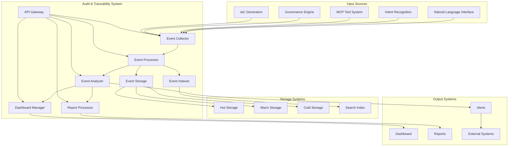

# Audit & Traceability System: Detailed Specification

## 1. Introduction

The Audit & Traceability System serves as the comprehensive record-keeping and accountability component of our AI-powered Internal Developer Platform. This system captures, stores, and analyzes all activities across the infrastructure lifecycle, from initial natural language requests through to deployed infrastructure. By maintaining a complete, immutable audit trail, the system enables organizations to meet compliance requirements, investigate issues, optimize processes, and maintain accountability throughout the infrastructure management process.

## 2. Component Overview

The Audit & Traceability System is responsible for:

1. **Event Capture**: Capturing events from all system components
2. **Record Management**: Storing and managing audit records
3. **Traceability**: Maintaining traceability across the entire infrastructure lifecycle
4. **Compliance Support**: Supporting compliance requirements and audits
5. **Analysis and Reporting**: Providing analysis and reporting capabilities
6. **Security and Integrity**: Ensuring the security and integrity of audit data

## 3. Audit Data Model

### 3.1 Event Types

The system captures various types of events:

1. **User Interaction Events**
   - Natural language requests
   - Parameter inputs
   - Clarification responses
   - Approval actions
   - Feedback submissions

2. **System Processing Events**
   - Intent recognition results
   - Parameter extraction results
   - Tool execution requests
   - Template selection events
   - Desired state generation

3. **Governance Events**
   - Policy validation results
   - Compliance check results
   - Approval workflow events
   - Cost validation events
   - Security validation events

4. **Infrastructure Events**
   - IaC generation events
   - Deployment events
   - Configuration changes
   - Resource lifecycle events
   - Performance metrics

### 3.2 Event Structure

Events follow a standardized structure:

```json
{
  "event": {
    "id": "evt-uuid-v4",
    "eventType": "infrastructure_request",
    "timestamp": "2024-01-15T10:30:00Z",
    "userId": "user-123",
    "teamId": "team-456",
    "sessionId": "session-789",
    "requestId": "req-uuid-v4",
    "source": "natural_language_interface",
    "category": "user_interaction",
    "action": "create_api_server",
    "data": {
      "naturalLanguageRequest": "I need a new API server for user management",
      "extractedParameters": {
        "name": "user-management-api",
        "runtime": "nodejs",
        "database": "postgres-small"
      },
      "confidence": 0.95,
      "tools": ["create_api_server", "create_database"]
    },
    "result": {
      "status": "success",
      "desiredStateId": "ds-uuid-v4",
      "estimatedCost": 85.00,
      "approvalRequired": false,
      "deploymentId": "dep-uuid-v4"
    },
    "metadata": {
      "clientIp": "192.168.1.100",
      "userAgent": "Mozilla/5.0...",
      "sessionId": "session-789",
      "processingTime": 1250,
      "resourceCount": 3
    },
    "traceId": "trace-uuid-v4",
    "spanId": "span-uuid-v4",
    "parentId": "parent-span-uuid-v4"
  }
}
```

### 3.3 Traceability Model

The system maintains traceability across the entire lifecycle:

- **Request Traceability**: Trace from natural language request to infrastructure
- **Component Traceability**: Trace events across system components
- **Time Traceability**: Trace events chronologically
- **Causal Traceability**: Trace cause-and-effect relationships
- **Compliance Traceability**: Trace compliance requirements to implementations

## 4. Event Capture and Processing

### 4.1 Event Sources

The system captures events from multiple sources:

1. **Direct Event Submission**
   - API-based event submission
   - Batch event submission
   - Real-time event streaming
   - Scheduled event collection

2. **System Integration**
   - Integration with Natural Language Interface
   - Integration with Intent Recognition System
   - Integration with MCP Tool System
   - Integration with Governance Engine
   - Integration with IaC Generation

3. **External Integration**
   - Integration with cloud provider APIs
   - Integration with CI/CD systems
   - Integration with monitoring systems
   - Integration with ticketing systems
   - Integration with identity providers

### 4.2 Event Processing Pipeline

The system processes events through a pipeline:

1. **Event Collection**: Collect events from various sources
2. **Event Validation**: Validate event structure and content
3. **Event Enrichment**: Enrich events with additional context
4. **Event Transformation**: Transform events to standard format
5. **Event Storage**: Store events in appropriate storage systems
6. **Event Indexing**: Index events for efficient retrieval
7. **Event Analysis**: Analyze events for insights and patterns

### 4.3 Event Enrichment

The system enriches events with additional context:

- **User Context**: User information, roles, permissions
- **Team Context**: Team information, quotas, budgets
- **Time Context**: Time-based context, business hours, maintenance windows
- **Resource Context**: Resource information, costs, compliance status
- **Business Context**: Business units, projects, cost centers

## 5. Storage and Retrieval

### 5.1 Storage Architecture

The system uses a multi-layered storage architecture:

1. **Hot Storage**
   - Recent events (0-30 days)
   - High-performance storage
   - Real-time access
   - Full-text search capabilities

2. **Warm Storage**
   - Medium-term events (30-180 days)
   - Balanced performance and cost
   - Fast access for common queries
   - Aggregated data available

3. **Cold Storage**
   - Long-term events (180+ days)
   - Cost-optimized storage
   - Batch access
   - Archived for compliance

### 5.2 Data Integrity

The system ensures data integrity:

- **Immutable Storage**: Events are stored immutably
- **Checksum Validation**: Validate data integrity with checksums
- **Replication**: Replicate data across multiple locations
- **Backup and Recovery**: Regular backup and recovery processes
- **Disaster Recovery**: Disaster recovery capabilities

### 5.3 Retrieval Mechanisms

The system provides multiple retrieval mechanisms:

- **Event ID Retrieval**: Retrieve events by unique ID
- **Time-based Retrieval**: Retrieve events by time range
- **User-based Retrieval**: Retrieve events by user or team
- **Resource-based Retrieval**: Retrieve events by resource
- **Trace-based Retrieval**: Retrieve events by trace ID

## 6. Analysis and Reporting

### 6.1 Analytical Capabilities

The system provides various analytical capabilities:

1. **Descriptive Analytics**
   - Event counts and trends
   - Resource utilization analysis
   - Cost analysis and optimization
   - Performance metrics
   - Error rates and patterns

2. **Diagnostic Analytics**
   - Root cause analysis
   - Correlation analysis
   - Anomaly detection
   - Performance bottleneck identification
   - Failure mode analysis

3. **Predictive Analytics**
   - Trend forecasting
   - Capacity planning
   - Cost predictions
   - Risk assessment
   - Resource optimization recommendations

### 6.2 Reporting Capabilities

The system provides comprehensive reporting:

1. **Standard Reports**
   - Activity summary reports
   - Compliance reports
   - Cost reports
   - Performance reports
   - Security reports

2. **Custom Reports**
   - Ad-hoc query capabilities
   - Custom report builder
   - Scheduled report generation
   - Report templates
   - Export capabilities

3. **Compliance Reports**
   - Regulatory compliance reports
   - Audit trail reports
   - Evidence collection reports
   - Gap analysis reports
   - Remediation reports

### 6.3 Visualization Capabilities

The system provides visualization capabilities:

- **Dashboards**: Interactive dashboards for monitoring
- **Charts and Graphs**: Various chart types for data visualization
- **Timelines**: Timeline views for event sequences
- **Relationship Maps**: Visualizations of relationships between events
- **Geographic Visualizations**: Geographic distribution of resources and activities

## 7. Compliance and Security

### 7.1 Compliance Support

The system supports compliance requirements:

1. **Regulatory Compliance**
   - GDPR compliance support
   - HIPAA compliance support
   - SOC2 compliance support
   - PCI-DSS compliance support
   - ISO 27001 compliance support

2. **Audit Support**
   - Audit trail maintenance
   - Evidence collection
   - Audit reporting
   - Auditor access
   - Audit preparation

3. **Retention Policies**
   - Configurable retention policies
   - Automated retention enforcement
   - Archive and purge capabilities
   - Legal hold capabilities
   - Data lifecycle management

### 7.2 Security Measures

The system implements robust security measures:

1. **Access Control**
   - Role-based access control
   - Attribute-based access control
   - Multi-factor authentication
   - Privileged access management
   - Session management

2. **Data Protection**
   - Encryption at rest
   - Encryption in transit
   - Data masking
   - Tokenization
   - Data loss prevention

3. **Security Monitoring**
   - Intrusion detection
   - Anomaly detection
   - Security event monitoring
   - Vulnerability scanning
   - Security incident response

### 7.3 Privacy Protection

The system protects privacy:

- **Data Minimization**: Collect only necessary data
- **Purpose Limitation**: Use data only for specified purposes
- **Consent Management**: Manage user consent
- **Data Subject Rights**: Support data subject rights
- **Privacy by Design**: Implement privacy by design principles

## 8. Integration and APIs

### 8.1 Integration Points

The system integrates with various systems:

1. **Internal Integration**
   - Integration with Natural Language Interface
   - Integration with Intent Recognition System
   - Integration with MCP Tool System
   - Integration with Governance Engine
   - Integration with IaC Generation

2. **External Integration**
   - Integration with cloud provider APIs
   - Integration with SIEM systems
   - Integration with compliance management systems
   - Integration with ticketing systems
   - Integration with identity providers

### 8.2 API Capabilities

The system provides comprehensive APIs:

1. **Event APIs**
   - Event submission API
   - Event retrieval API
   - Event search API
   - Event aggregation API
   - Event export API

2. **Analysis APIs**
   - Analytics query API
   - Report generation API
   - Dashboard data API
   - anomaly detection API
   - prediction API

3. **Management APIs**
   - Configuration management API
   - User management API
   - Retention policy API
   - Integration management API
   - Security configuration API

### 8.3 Webhook Support

The system supports webhooks:

- **Event Webhooks**: Notify external systems of events
- **Alert Webhooks**: Send alerts to external systems
- **Report Webhooks**: Deliver reports to external systems
- **Integration Webhooks**: Integrate with external workflows
- **Custom Webhooks**: Support for custom webhook configurations

## 9. Monitoring and Performance

### 9.1 System Monitoring

The system monitors its own performance:

- **Event Processing Metrics**: Monitor event processing performance
- **Storage Metrics**: Monitor storage performance and capacity
- **API Metrics**: Monitor API performance and usage
- **Query Performance**: Monitor query performance
- **System Health**: Monitor overall system health

### 9.2 Performance Optimization

The system optimizes performance:

- **Indexing Optimization**: Optimize indexes for query performance
- **Query Optimization**: Optimize queries for efficiency
- **Storage Optimization**: Optimize storage for cost and performance
- **Caching**: Implement caching for improved performance
- **Load Balancing**: Balance load across system components

### 9.3 Scalability

The system is designed for scalability:

- **Horizontal Scaling**: Scale horizontally to handle increased load
- **Vertical Scaling**: Scale vertically for improved performance
- **Elastic Scaling**: Scale elastically based on demand
- **Distributed Architecture**: Distributed architecture for scalability
- **Cloud-native Design**: Cloud-native design for scalability

## 10. Architecture Diagram



## 11. Conclusion

The Audit & Traceability System serves as the comprehensive record-keeping and accountability component of our AI-powered Internal Developer Platform. By capturing, storing, and analyzing all activities across the infrastructure lifecycle, the system enables organizations to meet compliance requirements, investigate issues, optimize processes, and maintain accountability.

Through robust event capture, processing, storage, and analysis capabilities, the Audit & Traceability System creates an environment where all infrastructure operations are transparent, traceable, and auditable. The system's focus on security, compliance, and integration ensures that audit data is protected, accessible, and useful for various stakeholders.

This component embodies our principle of transparency and accountability, ensuring that the convenience of AI-powered infrastructure management is balanced with the oversight and control required for enterprise operations. By providing a complete, immutable audit trail of all infrastructure activities, the Audit & Traceability System enables organizations to embrace AI-powered infrastructure management with confidence and trust.

The result is a system that empowers developers to be productive and innovative while ensuring that all infrastructure operations are transparent, accountable, and compliant with organizational and regulatory requirements.