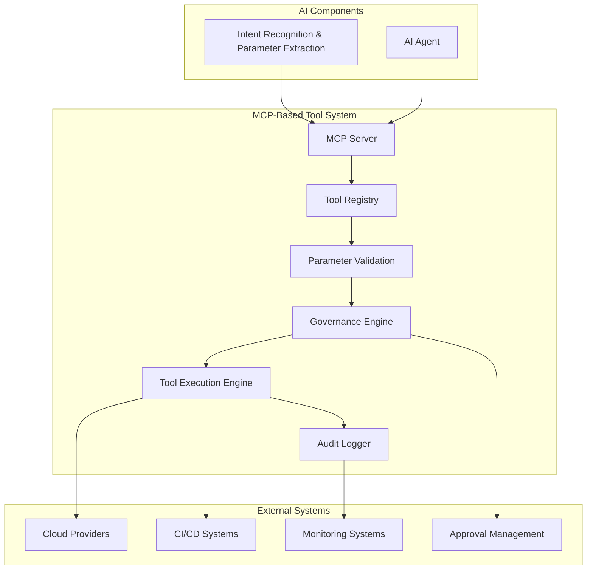

# MCP-Based Tool System: Detailed Specification

## 1. Introduction

The MCP-Based Tool System serves as the governance and execution layer of our AI-powered Internal Developer Platform. Leveraging the Model Context Protocol (MCP), this component provides a set of constrained tools that the AI agent can use to interact with infrastructure. By exposing only approved operations and configurations, the system ensures that all infrastructure creation adheres to organizational policies, governance requirements, and best practices.

## 2. Component Overview

The MCP-Based Tool System is responsible for:

1. **Tool Definition**: Creating and maintaining a catalog of approved infrastructure tools
2. **Constraint Enforcement**: Ensuring all tool usage stays within approved boundaries
3. **Parameter Validation**: Validating all input parameters against governance rules
4. **Execution Orchestration**: Coordinating the execution of infrastructure operations
5. **Result Standardization**: Providing consistent, structured responses from tool executions
6. **Audit Trail Generation**: Maintaining detailed logs of all tool usage and outcomes

## 3. MCP Architecture

### 3.1 MCP Server Implementation

The system implements an MCP server that exposes tools to the AI agent:

- **Tool Registry**: Central repository of all available tools and their schemas
- **Capability Discovery**: Dynamic discovery of available tools and their parameters
- **Session Management**: Handling multiple concurrent tool execution sessions
- **Protocol Compliance**: Full compliance with MCP specification for interoperability

### 3.2 Tool Categories

Tools are organized into logical categories based on functionality:

1. **Infrastructure Creation Tools**
   - create_api_server
   - create_database
   - create_cache
   - create_storage
   - create_kafka_consumer
   - create_kafka_producer

2. **Configuration Management Tools**
   - update_configuration
   - scale_resource
   - modify_networking
   - update_security_settings

3. **Monitoring and Operations Tools**
   - get_resource_status
   - get_metrics
   - get_logs
   - perform_health_check

4. **Utility Tools**
   - validate_configuration
   - estimate_cost
   - check_compliance
   - generate_documentation

### 3.3 Tool Schema Definition

Each tool is defined with a comprehensive schema:

```json
{
  "name": "create_api_server",
  "description": "Create a new API server with associated infrastructure",
  "parameters": {
    "name": {
      "type": "string",
      "description": "Name of the API server",
      "required": true,
      "pattern": "^[a-z][a-z0-9-]*[a-z0-9]$",
      "minLength": 3,
      "maxLength": 63
    },
    "runtime": {
      "type": "string",
      "description": "Runtime environment for the API server",
      "required": false,
      "enum": ["nodejs", "python", "java", "go"],
      "default": "nodejs"
    },
    "database": {
      "type": "string",
      "description": "Database configuration",
      "required": false,
      "enum": ["postgres-small", "postgres-medium", "mysql-small", "mysql-medium"],
      "default": "postgres-small"
    },
    "cache": {
      "type": "string",
      "description": "Cache configuration",
      "required": false,
      "enum": ["redis-standard", "redis-premium"],
      "default": "redis-standard"
    }
  },
  "returns": {
    "status": "string",
    "resource_id": "string",
    "configuration": "object",
    "endpoints": "array",
    "cost_estimate": "number"
  }
}
```

## 4. Governance and Constraint Enforcement

### 4.1 Parameter Validation

The system enforces strict parameter validation:

- **Type Checking**: Ensures parameters match expected types
- **Range Validation**: Validates numeric parameters against allowed ranges
- **Enum Enforcement**: Restricts string parameters to predefined values
- **Pattern Matching**: Validates string formats against regex patterns
- **Dependency Checking**: Validates parameter combinations and dependencies

### 4.2 Quota and Limit Management

The system enforces resource quotas and limits:

- **User Quotas**: Per-user limits on resource creation
- **Team Quotas**: Per-team resource allocation limits
- **Cost Thresholds**: Maximum cost limits for individual resources
- **Environment Limits**: Restrictions based on deployment environment
- **Time-based Limits**: Rate limiting and burst protection

### 4.3 Approval Workflow Integration

For high-impact operations, the system integrates with approval workflows:

- **Automatic Approval**: Low-risk operations are automatically approved
- **Manual Review**: High-risk operations require manual approval
- **Multi-level Approval**: Critical operations require multiple approvers
- **Conditional Approval**: Operations approved based on specific conditions
- **Emergency Bypass**: Emergency procedures for urgent requirements

## 5. Tool Execution Engine

### 5.1 Execution Pipeline

The tool execution follows a structured pipeline:

1. **Parameter Validation**: Validate all input parameters
2. **Policy Check**: Verify against governance policies
3. **Quota Verification**: Check resource quotas and limits
4. **Approval Check**: Determine if approval is required
5. **Resource Provisioning**: Execute the infrastructure creation
6. **Result Processing**: Process and standardize the response
7. **Audit Logging**: Record the operation details

### 5.2 Error Handling and Recovery

The system implements comprehensive error handling:

- **Input Validation Errors**: Clear feedback for invalid parameters
- **Policy Violations**: Detailed explanation of policy violations
- **Quota Exceeded**: Information about quota limits and usage
- **Execution Failures**: Detailed error messages and suggested fixes
- **Rollback Mechanisms**: Automatic rollback for failed operations
- **Retry Logic**: Intelligent retry for transient failures

### 5.3 Performance Optimization

The execution engine is optimized for performance:

- **Connection Pooling**: Reuse connections to backend services
- **Async Processing**: Non-blocking execution for long-running operations
- **Caching**: Cache frequently accessed configuration and metadata
- **Parallel Execution**: Execute independent operations in parallel
- **Result Streaming**: Stream results for large datasets

## 6. Integration with External Systems

### 6.1 Infrastructure Providers

The system integrates with multiple infrastructure providers:

- **Cloud Providers**: AWS, Azure, GCP integration
- **Container Platforms**: Kubernetes, OpenShift integration
- **Database Services**: RDS, Cosmos DB, Cloud SQL integration
- **Messaging Systems**: Kafka, RabbitMQ, SQS integration
- **Monitoring Systems**: Prometheus, Grafana, Datadog integration

### 6.2 CI/CD Pipeline Integration

The system integrates with CI/CD pipelines:

- **Source Control**: Git integration for version control
- **Build Systems**: Jenkins, GitHub Actions, GitLab CI integration
- **Artifact Repositories**: Nexus, Artifactory integration
- **Deployment Tools**: Helm, Terraform, Ansible integration
- **Testing Frameworks**: JUnit, pytest, integration testing tools

### 6.3 Monitoring and Observability

The system provides comprehensive monitoring:

- **Metrics Collection**: Performance and usage metrics
- **Log Aggregation**: Centralized log collection and analysis
- **Distributed Tracing**: End-to-end request tracing
- **Alert Management**: Configurable alerts and notifications
- **Dashboard Integration**: Integration with observability platforms

## 7. Security Implementation

### 7.1 Authentication and Authorization

The system implements robust security controls:

- **Token-based Authentication**: JWT tokens for service authentication
- **Role-based Access Control**: Granular permissions based on user roles
- **Service Account Management**: Secure management of service accounts
- **Temporary Credentials**: Short-lived credentials for enhanced security
- **Audit Logging**: Comprehensive audit trail of all access and operations

### 7.2 Data Protection

The system protects sensitive data:

- **Encryption at Rest**: All sensitive data encrypted at rest
- **Encryption in Transit**: TLS encryption for all network communications
- **Secret Management**: Integration with secret management systems
- **Data Masking**: Masking of sensitive data in logs and responses
- **Retention Policies**: Configurable data retention and deletion policies

### 7.3 Threat Prevention

The system includes threat prevention measures:

- **Input Sanitization**: Sanitization of all input parameters
- **Injection Prevention**: Protection against code injection attacks
- **Rate Limiting**: Protection against brute force attacks
- **Anomaly Detection**: Detection of unusual behavior patterns
- **Vulnerability Management**: Regular security scanning and patching

## 8. Monitoring and Observability

### 8.1 Metrics Collection

The system collects comprehensive metrics:

- **Tool Usage Metrics**: Frequency and patterns of tool usage
- **Performance Metrics**: Response times and throughput
- **Error Metrics**: Error rates and error types
- **Resource Metrics**: Resource utilization and capacity
- **Business Metrics**: Cost optimization and compliance metrics

### 8.2 Logging and Auditing

The system maintains detailed logs:

- **Structured Logging**: JSON-formatted structured logs
- **Correlation IDs**: Request correlation for end-to-end tracing
- **Log Levels**: Configurable log levels for different environments
- **Log Retention**: Configurable retention policies
- **Log Analysis**: Automated log analysis and alerting

### 8.3 Alerting and Notification

The system provides configurable alerting:

- **Threshold-based Alerts**: Alerts based on metric thresholds
- **Anomaly Detection**: Machine learning-based anomaly detection
- **Multi-channel Notifications**: Email, Slack, PagerDuty notifications
- **Escalation Policies**: Configurable escalation policies
- **Alert Suppression**: Suppression of non-critical alerts

## 9. Development and Deployment

### 9.1 Development Practices

The system follows modern development practices:

- **Test-Driven Development**: Comprehensive unit and integration tests
- **Code Reviews**: Peer review process for all code changes
- **Continuous Integration**: Automated builds and testing
- **Infrastructure as Code**: Version-controlled infrastructure configuration
- **Documentation**: Comprehensive documentation and API specs

### 9.2 Deployment Strategy

The system uses modern deployment strategies:

- **Containerization**: Docker containers for consistent deployment
- **Orchestration**: Kubernetes for container orchestration
- **Blue-Green Deployment**: Zero-downtime deployment strategy
- **Canary Releases**: Gradual rollout with monitoring
- **Rollback Capability**: Automated rollback on failure detection

### 9.3 Maintenance and Operations

The system includes comprehensive maintenance:

- **Health Checks**: Automated health monitoring
- **Backup and Recovery**: Regular backups and disaster recovery
- **Performance Tuning**: Ongoing performance optimization
- **Security Updates**: Regular security patching and updates
- **Capacity Planning**: Proactive capacity planning and scaling

## 10. Architecture Diagram



## 11. Conclusion

The MCP-Based Tool System serves as the critical governance and execution layer of our AI-powered Internal Developer Platform. By providing constrained, well-defined tools that the AI agent can use, the system ensures that all infrastructure operations adhere to organizational policies while maintaining the flexibility and efficiency that developers need.

Through comprehensive parameter validation, quota management, approval workflows, and integration with external systems, the MCP-Based Tool System creates a secure, governed, and efficient environment for infrastructure provisioning. The system's focus on security, monitoring, and observability ensures that operations are not only compliant but also reliable and performant.

This component embodies our principle of governance by design, ensuring that the convenience of natural language interfaces does not come at the expense of security, compliance, or operational excellence. By providing a structured, controlled approach to infrastructure execution, the MCP-Based Tool System enables organizations to embrace AI-powered infrastructure management with confidence.

The result is a system that empowers developers to express their needs naturally while ensuring that all infrastructure operations are secure, compliant, cost-effective, and operationally sound.