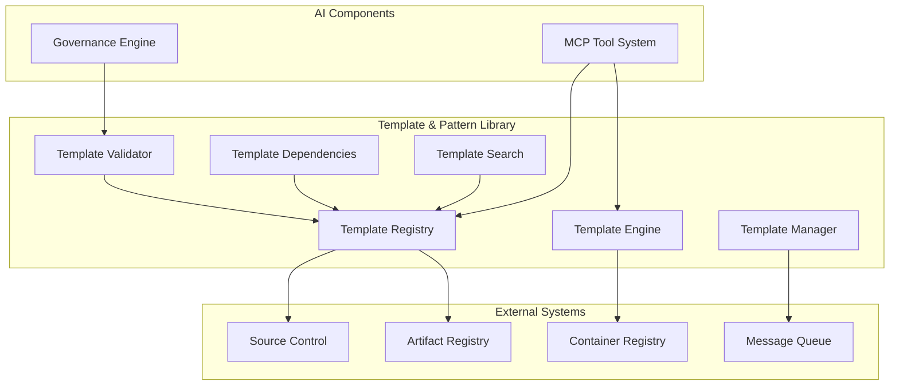

# Template & Pattern Library: Detailed Specification

## 1. Introduction

The Template & Pattern Library serves as the foundation for consistency and standardization in our AI-powered Internal Developer Platform. This component maintains a curated collection of templates for common application and infrastructure patterns, ensuring that all generated infrastructure follows organizational best practices, security standards, and operational requirements. By providing pre-defined, validated templates, the system accelerates development while maintaining governance and reducing the potential for configuration errors.

## 2. Component Overview

The Template & Pattern Library is responsible for:

1. **Template Curation**: Maintaining a collection of approved, high-quality templates
2. **Pattern Recognition**: Identifying and categorizing common infrastructure patterns
3. **Version Management**: Managing template versions and compatibility
4. **Template Validation**: Ensuring all templates meet security and compliance standards
5. **Dependency Management**: Handling template dependencies and relationships
6. **Template Discovery**: Enabling search and discovery of appropriate templates

## 3. Template Architecture

### 3.1 Template Categories

Templates are organized into logical categories based on their purpose and complexity:

1. **Application Templates**
   - API Server Templates (Node.js, Python, Java, Go)
   - Web Application Templates (React, Angular, Vue)
   - Background Worker Templates
   - CLI Application Templates

2. **Infrastructure Templates**
   - Database Templates (PostgreSQL, MySQL, MongoDB)
   - Cache Templates (Redis, Memcached)
   - Message Queue Templates (Kafka, RabbitMQ, SQS)
   - Storage Templates (S3, EFS, Blob Storage)

3. **Service Templates**
   - Microservice Templates
   - Serverless Function Templates
   - Container Service Templates
   - Batch Processing Templates

4. **Integration Templates**
   - API Gateway Templates
   - Event Processing Templates
   - Data Pipeline Templates
   - Monitoring Templates

### 3.2 Template Structure

Each template follows a standardized structure:

```json
{
  "metadata": {
    "name": "nodejs-api-server",
    "version": "1.2.0",
    "category": "application",
    "description": "Node.js API server with Express and TypeScript",
    "author": "platform-team",
    "tags": ["nodejs", "api", "typescript", "express"],
    "compatibility": {
      "runtime": "nodejs >= 16.x",
      "platforms": ["aws", "azure", "gcp"],
      "dependencies": ["postgres-small", "redis-standard"]
    }
  },
  "parameters": {
    "appName": {
      "type": "string",
      "description": "Name of the application",
      "required": true,
      "pattern": "^[a-z][a-z0-9-]*$"
    },
    "port": {
      "type": "integer",
      "description": "Port number for the API server",
      "required": false,
      "default": 3000,
      "minimum": 1024,
      "maximum": 65535
    },
    "enableMetrics": {
      "type": "boolean",
      "description": "Enable metrics collection",
      "required": false,
      "default": true
    }
  },
  "files": {
    "src/index.ts": "...",
    "src/routes": "...",
    "package.json": "...",
    "Dockerfile": "...",
    "terraform/main.tf": "..."
  },
  "outputs": {
    "dockerImage": "string",
    "serviceUrl": "string",
    "healthEndpoint": "string",
    "metricsEndpoint": "string"
  }
}
```

### 3.3 Template Inheritance and Composition

The system supports template inheritance and composition:

- **Base Templates**: Common functionality shared across multiple templates
- **Template Extensions**: Specialized templates that extend base templates
- **Template Composition**: Combining multiple templates to create complex solutions
- **Override Mechanisms**: Ability to override specific parts of inherited templates
- **Template Fragments**: Reusable template components that can be combined

## 4. Template Management

### 4.1 Template Lifecycle

Templates follow a defined lifecycle:

1. **Creation**: New templates are created by platform engineers or approved contributors
2. **Review**: Templates undergo technical and security review
3. **Testing**: Templates are tested across different environments and scenarios
4. **Approval**: Templates are approved by the platform governance board
5. **Publication**: Approved templates are published to the template registry
6. **Maintenance**: Templates are regularly updated and maintained
7. **Deprecation**: Outdated templates are marked for deprecation with migration paths
8. **Retirement**: Deprecated templates are eventually removed from the registry

### 4.2 Version Management

The system implements comprehensive version management:

- **Semantic Versioning**: Templates follow semantic versioning (major.minor.patch)
- **Version Compatibility**: Clear compatibility matrices between template versions
- **Migration Paths**: Automated migration paths between major versions
- **Rollback Capability**: Ability to rollback to previous template versions
- **Version Aliases**: Support for version aliases (latest, stable, etc.)

### 4.3 Template Validation

All templates undergo rigorous validation:

- **Schema Validation**: Templates must conform to defined schema standards
- **Security Scanning**: Automated security scanning for vulnerabilities
- **Compliance Checking**: Validation against organizational compliance requirements
- **Best Practices**: Adherence to coding and infrastructure best practices
- **Performance Testing**: Performance benchmarks and optimization validation

## 5. Template Registry and Discovery

### 5.1 Registry Architecture

The template registry provides centralized template management:

- **Metadata Store**: Database for template metadata and version information
- **Artifact Storage**: Storage for template files and associated resources
- **Index Service**: Search and indexing capabilities for template discovery
- **Dependency Graph**: Graph of template dependencies and relationships
- **Access Control**: Role-based access control for template management

### 5.2 Search and Discovery

The system provides powerful search and discovery capabilities:

- **Full-text Search**: Search across template descriptions, tags, and content
- **Category Filtering**: Filter templates by category and subcategory
- **Tag-based Search**: Search using tags and metadata
- **Compatibility Search**: Find templates compatible with specific platforms or runtimes
- **Usage Statistics**: Template popularity and usage statistics
- **Recommendation Engine**: AI-powered template recommendations based on context

### 5.3 Template Dependencies

The system manages complex template dependencies:

- **Dependency Resolution**: Automatic resolution of template dependencies
- **Version Constraints**: Support for version constraints and compatibility requirements
- **Circular Dependency Detection**: Detection and prevention of circular dependencies
- **Dependency Visualization**: Visual representation of template dependency graphs
- **Impact Analysis**: Analysis of the impact of template changes on dependent templates

## 6. Template Generation and Customization

### 6.1 Template Engine

The system includes a powerful template engine:

- **Parameter Substitution**: Dynamic substitution of template parameters
- **Conditional Logic**: Support for conditional template generation
- **Loop Constructs**: Support for loops and iterations in templates
- **Template Inheritance**: Inheritance and composition of templates
- **Custom Functions**: Extensible function library for template processing

### 6.2 Customization Capabilities

The system supports template customization:

- **Parameter Overrides**: Ability to override template parameters
- **File Overrides**: Ability to override specific files in templates
- **Template Extensions**: Ability to extend templates with additional functionality
- **Environment-specific Customization**: Customization based on deployment environment
- **Custom Validation**: Custom validation rules for template parameters

### 6.3 Template Testing

The system includes comprehensive template testing:

- **Unit Testing**: Testing of individual template components
- **Integration Testing**: Testing of template integration with external systems
- **End-to-end Testing**: Testing of complete template deployment workflows
- **Performance Testing**: Performance testing of generated applications
- **Security Testing**: Security testing of generated infrastructure

## 7. Integration with Other Components

### 7.1 Integration with MCP-Based Tool System

The Template & Pattern Library integrates closely with the MCP-Based Tool System:

- **Tool Parameter Mapping**: Template parameters are mapped to tool parameters
- **Template Selection**: Tools select appropriate templates based on user requirements
- **Result Processing**: Tool results are processed to generate template instances
- **Error Handling**: Template-related errors are handled and reported by tools
- **Audit Trail**: Template usage is logged and tracked through the tool system

### 7.2 Integration with Governance Engine

The system integrates with the Governance Engine for policy enforcement:

- **Policy Validation**: Templates are validated against governance policies
- **Compliance Checking**: Generated infrastructure is checked for compliance
- **Approval Workflows**: Template changes may require approval based on policies
- **Audit Logging**: Template usage and changes are logged for audit purposes
- **Policy Updates**: Templates are updated when governance policies change

### 7.3 Integration with CI/CD Systems

The system integrates with CI/CD pipelines:

- **Pipeline Templates**: Templates for CI/CD pipeline configuration
- **Build Integration**: Integration with build systems for template processing
- **Deployment Integration**: Integration with deployment tools for template deployment
- **Testing Integration**: Integration with testing frameworks for template testing
- **Artifact Management**: Integration with artifact repositories for template storage

## 8. Security and Compliance

### 8.1 Template Security

The system ensures template security:

- **Code Scanning**: Automated scanning of template code for vulnerabilities
- **Dependency Scanning**: Scanning of template dependencies for known vulnerabilities
- **Secret Detection**: Detection and prevention of secrets in template code
- **Access Control**: Role-based access control for template management
- **Audit Trail**: Comprehensive audit trail of template changes and usage

### 8.2 Compliance Management

The system manages compliance requirements:

- **Compliance Templates**: Templates that include compliance controls
- **Automated Compliance Checking**: Automated checking of generated infrastructure
- **Compliance Reporting**: Generation of compliance reports and evidence
- **Regulatory Updates**: Automatic updates to templates when regulations change
- **Compliance Certification**: Support for compliance certification processes

### 8.3 Content Security

The system ensures content security:

- **Digital Signatures**: Templates are signed to ensure integrity
- **Content Verification**: Verification of template content integrity
- **Tamper Detection**: Detection of unauthorized template modifications
- **Secure Storage**: Secure storage of template artifacts
- **Secure Distribution**: Secure distribution of templates to consumers

## 9. Monitoring and Observability

### 9.1 Template Usage Metrics

The system collects comprehensive usage metrics:

- **Usage Statistics**: Statistics on template usage and popularity
- **Performance Metrics**: Performance metrics for template generation
- **Error Metrics**: Error rates and types for template processing
- **Success Metrics**: Success rates for template deployments
- **User Feedback**: User feedback and ratings for templates

### 9.2 Template Health Monitoring

The system monitors template health:

- **Template Validation Status**: Status of template validation processes
- **Dependency Health**: Health of template dependencies
- **Version Compatibility**: Compatibility status between template versions
- **Security Status**: Security scanning results and vulnerability status
- **Compliance Status**: Compliance checking results and status

### 9.3 Alerting and Notification

The system provides comprehensive alerting:

- **Template Alerts**: Alerts for template-related issues and events
- **Security Alerts**: Alerts for security vulnerabilities and issues
- **Compliance Alerts**: Alerts for compliance violations and issues
- **Performance Alerts**: Alerts for performance degradation and issues
- **Maintenance Alerts**: Alerts for template maintenance and updates

## 10. Architecture Diagram



## 11. Conclusion

The Template & Pattern Library serves as the foundation for consistency and standardization in our AI-powered Internal Developer Platform. By providing a curated collection of validated, standardized templates, the system ensures that all generated infrastructure follows organizational best practices while maintaining the flexibility that developers need.

Through comprehensive template management, validation, and discovery capabilities, the Template & Pattern Library creates an environment where developers can quickly and confidently create infrastructure that is secure, compliant, and operationally sound. The system's focus on security, compliance, and monitoring ensures that templates remain high-quality and up-to-date with organizational requirements.

This component embodies our principle of consistency through standardization, ensuring that the convenience of AI-powered infrastructure generation does not come at the expense of quality, security, or compliance. By providing a rich library of templates that can be easily discovered, customized, and deployed, the Template & Pattern Library enables organizations to accelerate development while maintaining governance and control.

The result is a system that empowers developers to be more productive while ensuring that all infrastructure is built on a foundation of proven, validated patterns that meet organizational standards for security, compliance, and operational excellence.