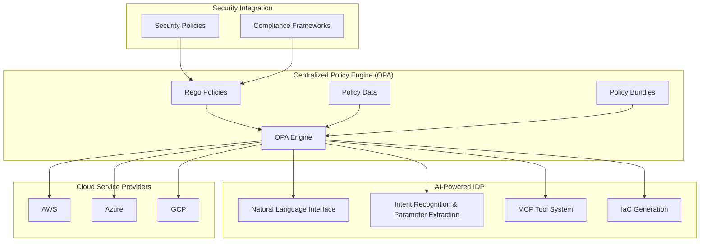

# Governance & Policy Engine: Detailed Specification

## 1. Introduction

The Governance & Policy Engine serves as the control center for our AI-powered Internal Developer Platform, ensuring that all infrastructure creation and modification adheres to organizational policies, compliance requirements, and best practices. This component acts as a gatekeeper, validating and enforcing rules across the entire infrastructure lifecycle, from initial request through deployment and ongoing operations. By providing comprehensive policy enforcement, the system enables organizations to maintain security, compliance, and operational excellence while empowering developers with self-service capabilities.

Our governance approach leverages Open Policy Agent (OPA) and the Rego policy language as the foundation for policy definition and enforcement. This technology choice provides significant advantages for our AI-powered Internal Developer Platform:

### Unified Governance Framework
- **Consistency Across Domains**: Enables the same policy engine and language for both security policies (already used in cyber) and infrastructure governance
- **Shared Expertise**: Leverages existing team knowledge of OPA and Rego across the organization
- **Reusable Components**: Security policies can inform infrastructure governance and vice versa

### Cloud-Native and Provider Agnostic
- **Multi-Cloud Support**: Works consistently across AWS, Azure, GCP, and on-premises environments
- **Future-Proof**: Protects against vendor lock-in and simplifies adoption of additional cloud providers
- **Native Integrations**: Out-of-the-box integrations with Kubernetes, Terraform, and other infrastructure tools

### Powerful and Expressive Policy Language
- **Declarative Approach**: Rego allows policies to be expressed as rules rather than procedural code, making them more readable and maintainable
- **Structured Decisions**: Generates rich decision documents that provide detailed feedback beyond simple allow/deny
- **Composable Policies**: Policies can be built from smaller, reusable modules for better organization

### Performance at Scale
- **Incremental Evaluation**: Optimizes performance by only evaluating rules that depend on changed inputs
- **Caching Mechanisms**: Decision results can be cached to improve response times
- **Bundle Distribution**: Efficient packaging and distribution of policies to multiple enforcement points

### Enhanced Developer Experience
- **Early Feedback**: Enables governance policies to be evaluated during initial natural language requests
- **Explainable Decisions**: Policies can generate human-readable explanations for governance decisions
- **Guided Refinement**: When potential violations are detected, provides clear guidance toward compliant alternatives

### Comprehensive Enforcement Capabilities
- **Multiple Enforcement Points**: Policies can be enforced at various stages from initial request through deployment
- **Flexible Actions**: Supports allow, deny, warn, modify, and require-approval actions
- **Auditability**: Built-in support for detailed audit trails of policy decisions

## 2. Component Overview

The Governance & Policy Engine is responsible for:

1. **Policy Definition**: Creating and managing organizational policies and rules
2. **Policy Validation**: Validating infrastructure configurations against policies
3. **Compliance Checking**: Ensuring compliance with regulatory and internal requirements
4. **Cost Governance**: Enforcing cost controls and budget constraints
5. **Security Enforcement**: Implementing security policies and best practices
6. **Approval Workflows**: Managing approval processes for infrastructure changes

## 3. Policy Architecture

### 3.1 Policy Types

The system supports various types of policies:

1. **Security Policies**
   - Network security policies (firewall rules, access controls)
   - Data encryption policies (at rest, in transit)
   - Authentication and authorization policies
   - Vulnerability management policies
   - Secret management policies

2. **Compliance Policies**
   - Regulatory compliance (GDPR, HIPAA, SOC2, PCI-DSS)
   - Industry standards (ISO 27001, NIST)
   - Data residency and sovereignty requirements
   - Audit trail and logging requirements
   - Data retention and deletion policies

3. **Cost Policies**
   - Resource sizing and cost limits
   - Budget allocation and enforcement
   - Cost optimization requirements
   - Reserved instance and commitment policies
   - Tagging and cost allocation policies

4. **Operational Policies**
   - High availability and redundancy requirements
   - Backup and disaster recovery policies
   - Monitoring and alerting requirements
   - Performance and SLA policies
   - Maintenance and update policies

### 3.2 Policy Structure

Policies follow a standardized structure:

```json
{
  "policy": {
    "id": "pol-uuid-v4",
    "name": "database-cost-limit",
    "version": "1.0.0",
    "category": "cost",
    "description": "Enforce cost limits for database resources",
    "severity": "high",
    "enabled": true,
    "implementation": {
      "engine": "opa",
      "language": "rego",
      "package": "idp.governance.cost"
    },
    "rego": "package idp.governance.cost\n\ndefault allow = false\n\nallow {\n  input.resource.type == \"database\"\n  input.estimated_cost <= 1000\n}\n\nviolation[msg] {\n  not allow\n  msg := sprintf(\"Database cost %v exceeds limit of 1000\", [input.estimated_cost])\n}"
  }
}
```

### 3.3 Policy Language: OPA and Rego

The system uses Open Policy Agent (OPA) with the Rego policy language for defining and evaluating governance policies:

- **OPA Integration**: Policies are evaluated using OPA's decision engine
- **Rego Syntax**: Policies are written in Rego, a declarative query language
- **Policy Packages**: Policies are organized into packages for modularity and reuse
- **Decision Documents**: OPA produces structured decision documents that guide system behavior

Example Rego policy for database cost limits:

```rego
package idp.governance.cost

default allow = false

# Allow database creation if cost is within limits
allow {
  input.resource.type == "database"
  input.estimated_cost <= 1000
}

# Generate violation messages
violation[msg] {
  not allow
  msg := sprintf("Database cost %v exceeds limit of 1000", [input.estimated_cost])
}

# Require approval for high-cost databases
approval_required {
  input.resource.type == "database"
  input.estimated_cost > 500
}
```

### 3.4 OPA Integration
The system integrates with OPA through:

- **Policy Bundles**: Policies are packaged and distributed as OPA bundles
- **Data Documents**: External data (quotas, resource catalogs) are provided to OPA as data documents
- **Decision API**: The system queries OPA via its decision API for policy evaluations
- **Caching**: OPA decisions are cached to improve performance
- **Versioning**: Policy versions are managed through OPA's bundle versioning

## 4. Policy Management

### 4.1 Policy Lifecycle

Policies follow a defined lifecycle:

1. **Draft**: New policies are created as drafts
2. **Review**: Policies undergo technical and business review
3. **Testing**: Policies are tested in non-production environments
4. **Approval**: Policies are approved by designated authorities
5. **Deployment**: Approved policies are deployed to enforcement points
6. **Monitoring**: Policy effectiveness is monitored
7. **Review**: Regular review and update of policies
8. **Retirement**: Outdated policies are retired

### 4.2 Version Management

The system manages policy versions:

- **Semantic Versioning**: Policies follow semantic versioning
- **Version History**: Complete history of policy versions
- **Rollback Capability**: Ability to rollback to previous versions
- **Change Tracking**: Track changes between policy versions
- **Impact Analysis**: Analyze impact of policy changes

### 4.3 Policy Distribution

The system distributes policies to enforcement points:

- **Policy Registry**: Central registry for all policies
- **Policy Caching**: Caching for improved performance
- **Incremental Updates**: Incremental updates to policy distributions
- **Validation**: Validation of policy syntax and semantics
- **Synchronization**: Synchronization across distributed systems

## 5. Policy Enforcement

### 5.1 Enforcement Points

Policies are enforced at multiple points:

1. **Request Validation**: Validate infrastructure requests against policies
2. **Template Validation**: Validate templates against policies
3. **Configuration Validation**: Validate generated configurations
4. **Deployment Validation**: Validate before deployment
5. **Runtime Validation**: Validate running infrastructure

### 5.2 Enforcement Actions

The system supports various enforcement actions:

- **Allow**: Allow the operation to proceed
- **Reject**: Reject the operation with explanation
- **Modify**: Automatically modify the configuration
- **Warn**: Allow with warning and logging
- **Require Approval**: Route for approval before proceeding

### 5.3 Enforcement Modes

The system supports different enforcement modes:

- **Strict Mode**: Strict enforcement with no exceptions
- **Audit Mode**: Log violations but allow operations
- **Advisory Mode**: Provide warnings but allow operations
- **Learning Mode**: Collect data without enforcement
- **Custom Mode**: Custom enforcement logic per policy

## 6. Compliance Management

### 6.1 Compliance Frameworks

The system supports multiple compliance frameworks:

- **GDPR**: General Data Protection Regulation
- **HIPAA**: Health Insurance Portability and Accountability Act
- **SOC2**: Service Organization Control 2
- **PCI-DSS**: Payment Card Industry Data Security Standard
- **ISO 27001**: International Organization for Standardization 27001

### 6.2 Compliance Mapping

The system maps policies to compliance requirements:

- **Requirement Mapping**: Map policies to specific compliance requirements
- **Evidence Collection**: Collect evidence for compliance audits
- **Gap Analysis**: Identify compliance gaps
- **Remediation**: Automated remediation of compliance issues
- **Reporting**: Generate compliance reports

### 6.3 Audit Support

The system supports compliance audits:

- **Audit Trails**: Comprehensive audit trails
- **Evidence Generation**: Generate evidence for auditors
- **Audit Reports**: Generate audit-ready reports
- **Questionnaire Support**: Support for audit questionnaires
- **Third-party Integration**: Integration with audit tools

## 7. Cost Governance

### 7.1 Cost Policies

The system enforces cost-related policies:

- **Resource Cost Limits**: Limits on individual resource costs
- **Budget Enforcement**: Enforcement of team and project budgets
- **Cost Optimization**: Automatic cost optimization recommendations
- **Reserved Instance Management**: Policies for reserved instances
- **Cost Allocation**: Policies for cost allocation and tagging

### 7.2 Cost Analysis

The system provides cost analysis capabilities:

- **Cost Estimation**: Estimate costs before deployment
- **Cost Monitoring**: Monitor costs in real-time
- **Cost Anomaly Detection**: Detect unusual cost patterns
- **Cost Optimization**: Identify cost optimization opportunities
- **Forecasting**: Cost forecasting and trending

### 7.3 Budget Management

The system manages budgets and allocations:

- **Budget Creation**: Create and manage budgets
- **Budget Tracking**: Track budget utilization
- **Alerting**: Alert on budget overruns
- **Forecasting**: Forecast budget exhaustion
- **Allocation**: Allocate budgets across teams and projects

## 8. Security Enforcement

### 8.1 Security Policies

The system enforces security policies:

- **Network Security**: Firewall rules, network segmentation
- **Access Control**: IAM policies, role-based access
- **Data Protection**: Encryption, data classification
- **Vulnerability Management**: Vulnerability scanning and patching
- **Secret Management**: Secret rotation and management

### 8.2 Security Validation

The system validates security configurations:

- **Configuration Scanning**: Scan for security misconfigurations
- **Vulnerability Assessment**: Assess vulnerabilities in configurations
- **Compliance Checking**: Check against security benchmarks
- **Threat Modeling**: Model potential threats
- **Penetration Testing**: Automated penetration testing

### 8.3 Incident Response

The system supports security incident response:

- **Incident Detection**: Detect security incidents
- **Incident Response**: Automated incident response
- **Forensics**: Support for security forensics
- **Reporting**: Generate security incident reports
- **Remediation**: Automated remediation of security issues

## 9. Approval Workflows

### 9.1 Workflow Engine

The system includes a workflow engine:

- **Workflow Definition**: Define approval workflows
- **Workflow Execution**: Execute approval workflows
- **Workflow Monitoring**: Monitor workflow progress
- **Workflow History**: Maintain workflow history
- **Workflow Analytics**: Analyze workflow performance

### 9.2 Approval Types

The system supports various approval types:

- **Automatic Approval**: Automatic approval for low-risk changes
- **Manual Approval**: Manual approval for high-risk changes
- **Multi-level Approval**: Multiple approval levels
- **Conditional Approval**: Approval based on conditions
- **Emergency Approval**: Emergency approval procedures

### 9.3 Approval Integration

The system integrates with approval systems:

- **Email Integration**: Email notifications and approvals
- **Chat Integration**: Chat-based approvals
- **Ticketing Integration**: Integration with ticketing systems
- **Calendar Integration**: Schedule approvals
- **Mobile Support**: Mobile approval capabilities

## 10. Monitoring and Reporting

### 10.1 Policy Monitoring

The system monitors policy enforcement:

- **Policy Effectiveness**: Monitor policy effectiveness
- **Violation Tracking**: Track policy violations
- **Trend Analysis**: Analyze policy violation trends
- **Performance Metrics**: Monitor enforcement performance
- **Resource Usage**: Monitor system resource usage

### 10.2 Reporting

The system provides comprehensive reporting:

- **Violation Reports**: Reports on policy violations
- **Compliance Reports**: Compliance status reports
- **Cost Reports**: Cost analysis and optimization reports
- **Security Reports**: Security posture reports
- **Operational Reports**: Operational efficiency reports

### 10.3 Dashboards

The system provides management dashboards:

- **Policy Dashboard**: Overview of policies and violations
- **Compliance Dashboard**: Compliance status and trends
- **Cost Dashboard**: Cost analysis and optimization
- **Security Dashboard**: Security posture and incidents
- **Operational Dashboard**: Operational metrics and KPIs

## 11. Architecture Diagram



## 12. Conclusion

The Governance & Policy Engine serves as the control center for our AI-powered Internal Developer Platform, ensuring that all infrastructure creation and modification adheres to organizational policies, compliance requirements, and best practices. By providing comprehensive policy enforcement across the entire infrastructure lifecycle, the system enables organizations to maintain security, compliance, and operational excellence while empowering developers with self-service capabilities.

Through robust policy management, enforcement, and monitoring capabilities, the Governance & Policy Engine creates an environment where infrastructure can be provisioned quickly and safely. The system's focus on automation, integration, and comprehensive coverage ensures that governance is not a bottleneck but an enabler of innovation and efficiency.

This component embodies our principle of governance by design, ensuring that the convenience of AI-powered infrastructure management is balanced with the control and oversight required for enterprise operations. By providing a comprehensive framework for policy definition, enforcement, and monitoring, the Governance & Policy Engine enables organizations to embrace modern infrastructure practices with confidence and control.

The result is a system that empowers developers to be productive and innovative while ensuring that all infrastructure operations are secure, compliant, cost-effective, and aligned with organizational standards and requirements.