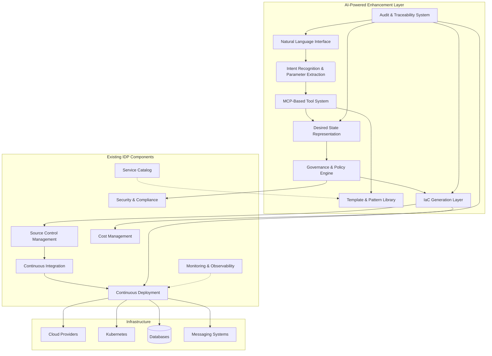
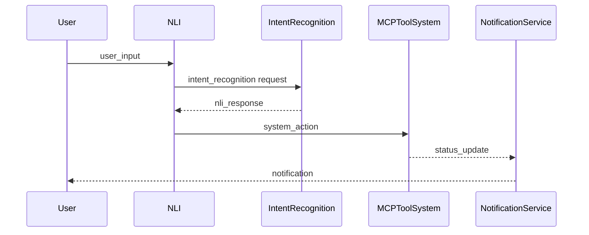
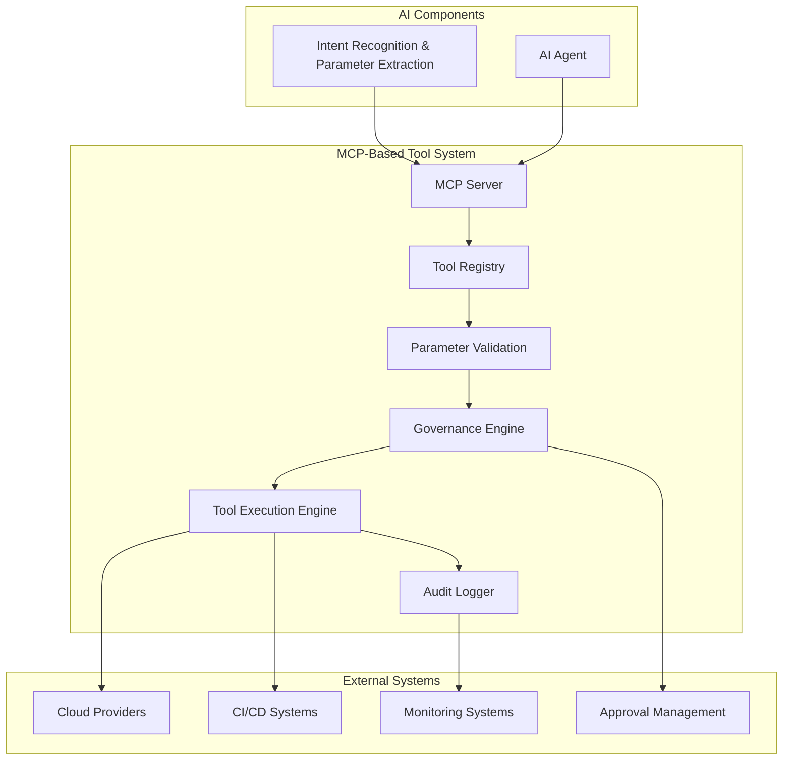
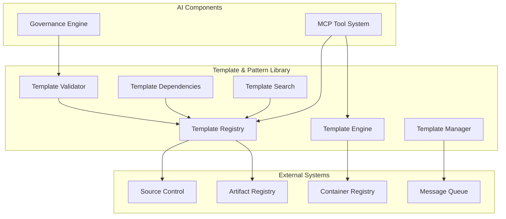
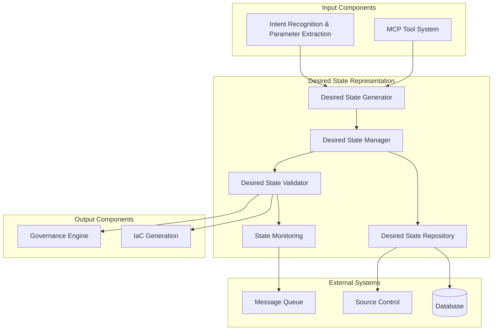
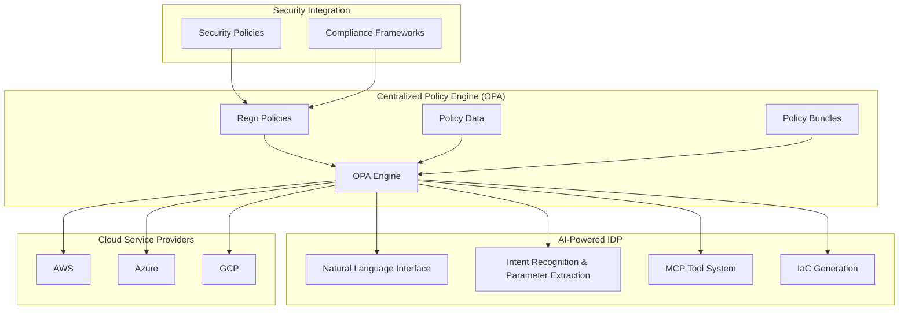
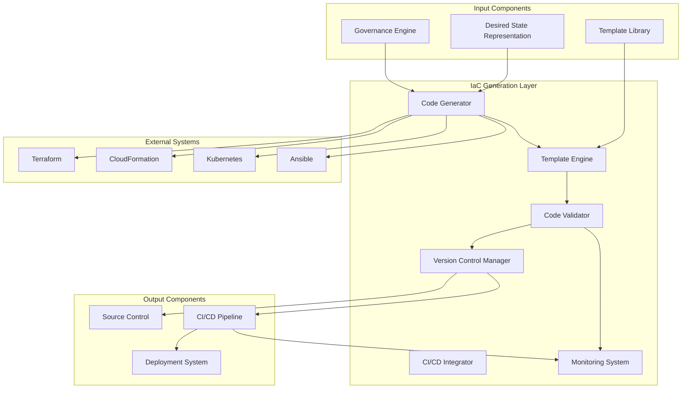
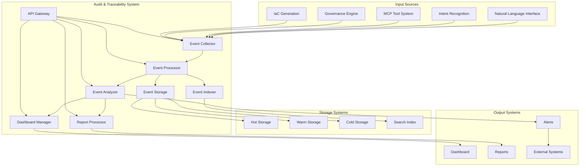

# AI-Powered Internal Developer Platform: Augmenting Existing IDP Investments

## 1. Introduction

This document outlines a vision for enhancing Internal Developer Platforms (IDPs) with agentic AI capabilities while preserving and extending existing infrastructure investments. Our approach addresses the growing demand for natural language interfaces in development workflows while solving critical challenges around reproducibility, governance, and integration with established infrastructure-as-code (IaC) practices.

## 2. Problem Statement

Today's developers increasingly leverage AI to generate code, yet still require robust platforms to host that code and manage underlying infrastructure. While natural language interfaces offer convenience, they introduce significant challenges:

- **Inconsistency**: AI systems may generate different outputs for similar prompts
- **Lack of Auditability**: Conversations and decisions can be lost or forgotten
- **Governance Gaps**: Unconstrained AI might create resources that violate organizational policies
- **Integration Complexity**: Bridging natural language requests with existing IaC toolchains

Traditional GUI-based infrastructure provisioning suffers from similar issues - it relies on human memory and lacks the codification, version control, and reproducibility that made IaC the standard for infrastructure management.

## 3. Proposed Solution Overview

We propose an AI-powered enhancement to existing IDPs that translates natural language requests into governed, version-controlled infrastructure definitions. Rather than replacing established systems, our approach augments them by adding a natural language interface that generates standardized, policy-compliant infrastructure code.

### Core Principles

1. **Intent-to-State Translation**: Convert natural language into structured desired state representations
2. **Early Governance Integration**: Embed governance policies at the earliest interaction points to provide immediate feedback and guide developers toward compliant solutions from the start.
3. **IaC Foundation**: Generate and maintain infrastructure as code that integrates with existing toolchains
4. **Template-Driven Consistency**: Leverage standardized patterns for common application architectures
5. **Full Auditability**: Maintain traceability from natural language request to deployed infrastructure
6. **Augmentation, Not Replacement**: Extend existing IDP investments rather than replacing them

## 4. Key Architectural Components

### 4.1 [Natural Language Interface](4.1.natural-language.md)

A conversational interface that allows developers to express infrastructure needs in natural language. This interface captures the developer's intent and context, providing a more accessible entry point than traditional GUIs or raw IaC.

Incorporates governance-aware prompting to prevent non-compliant requests.

### 4.2 [Intent Recognition & Parameter Extraction](4.2.intent-recognition.md)

This component analyzes natural language requests to:
- Identify the type of infrastructure or service being requested
- Leverages governance policies to guide conversations and validate parameters in real-time.
- Extract key parameters (names, sizes, configurations)
- Classify the request into known patterns (API servers, Kafka consumers, etc.)

### 4.3 [MCP-Based Tool Constrained System](4.3.mcp-tools.md)

Leveraging the Model Context Protocol (MCP), we define a set of tools that the AI agent can use to interact with the infrastructure. These tools enforce governance and consistency by:

- Exposing only approved resource types and configurations
- Providing clear parameters and validation
- Ensuring deterministic outputs for given inputs

Example MCP tools:
- `create_api_server(params)`
- `create_kafka_consumer(params)`
- `create_database(params)`
- `validate_configuration(params)`

### 4.4 [Template & Pattern Library](4.4.templates-patterns.md)

A curated collection of templates for common application patterns:
- **Code Templates**: Standardized starting points for different application types
- **Infrastructure Templates**: Pre-defined Terraform/CloudFormation modules
- **Configuration Schemas**: Structured definitions of customizable parameters

For example, an "API Server" pattern might include:
- Application code template (Node.js, Python, Java, etc.)
- Associated infrastructure (compute, networking, security groups)
- Default database (PostgreSQL)
- Default caching layer (Redis)

### 4.5 [Desired State Representation](4.5.desired-state.md)

A standardized, structured representation (JSON/YAML) that captures:
- The developer's intent
- Extracted parameters
- Selected templates and patterns
- Governance decisions

This representation becomes the "source of truth" that is version-controlled and linked to the original conversation.

### 4.6 [Governance & Policy Engine](4.6.governance.md)

Enforces organizational policies by:
- Validating requested resources against approved configurations
- Applying cost, security, and compliance constraints
- Auto-correcting or flagging violations
- Providing feedback to developers

### 4.7 [IaC Generation Layer](4.7.iac-generation.md)

Converts the governed desired state into executable infrastructure code:
- Generates Terraform, CloudFormation, or other IaC formats
- Uses versioned templates and modules
- Maintains consistency through standardized patterns
- Integrates with existing CI/CD pipelines

### 4.8 [Audit & Traceability System](4.8.audit.md)

Maintains a complete record of:
- Original natural language requests
- Generated desired state representations
- Governance decisions and policy applications
- Resulting infrastructure code
- Deployment status and outcomes

## 5. Integration with Wider IDP Ecosystem

Our AI-powered enhancement is designed to integrate seamlessly with existing IDP investments, extending their capabilities rather than replacing them. This approach preserves the value of current systems while adding new functionality.

### 5.1 Augmenting Existing IDP Components

The AI-powered components serve as an additional interface layer that enhances existing IDP functionality:

- **Source Control Management**: We continue to leverage existing SCM systems to store generated IaC code and desired state representations, maintaining established version control practices.
  
- **CI/CD Pipelines**: Generated infrastructure code feeds into existing CI/CD pipelines, preserving established deployment processes, approval gates, and environment management.
  
- **Service Catalog**: Our template library extends existing service catalogs by providing AI-generated templates that adhere to the same governance standards as manually created entries.
  
- **Security & Compliance**: The governance engine integrates with existing security and compliance frameworks, extending their reach to AI-generated infrastructure without creating new silos.
  
- **Cost Management**: AI-generated resources are tracked through existing cost management systems, maintaining unified financial oversight.

### 5.2 System Architecture Diagram



### 5.3 Integration Benefits
This augmentation approach provides several key advantages:

- **Preservation of Investment**: Existing IDP components continue to provide core functionality, protecting prior investments.
- **Gradual Adoption**: Teams can adopt the AI interface at their own pace while continuing to use traditional methods.
- **Unified Governance**: A single governance framework applies to both AI-generated and manually created infrastructure.
- **Consistent Experience**: Developers receive a consistent experience whether using the AI interface or traditional tools.
- **Operational Continuity**: Existing operational processes, monitoring, and support mechanisms remain unchanged.

## 6. Benefits
### For Developers
- **Lower Barrier to Entry**: Express infrastructure needs in natural language
- **Faster Provisioning**: Reduce time from request to deployed infrastructure
- **Consistent Environments**: Standardized templates ensure uniformity
- **Self-Service**: Reduce dependency on operations teams
- **Immediate Feedback**: Receive guidance on governance constraints during the initial request, eliminating late-stage rejections and wasted effort.

### For Organizations
- **Governance at Scale**: Enforce policies consistently across all infrastructure
- **Cost Control**: Limit resource options to approved, cost-effective configurations
- **Compliance**: Maintain audit trails from request to deployment
- **Knowledge Preservation**: Capture infrastructure decisions in a structured way
- **Investment Protection**: Extend existing IDP capabilities rather than replacing them
### For Operations
- **Reduced Toil**: Automate routine infrastructure provisioning
- **Standardization**: Enforce best practices through templates
- **Visibility**: Clear insight into what infrastructure is being created and why
- **Integration**: Leverage existing IaC toolchains and processes
- **Continuity**: Maintain operational processes while adding new capabilities

## 7. Next Steps
This document provides the high-level vision for augmenting existing IDPs with AI capabilities. The next phase will involve creating detailed specifications for each component:

1. **Intent Recognition & Parameter Extraction**: Detailed design for pattern recognition and parameter extraction
2. **MCP Tool Specification**: Complete definition of tools, parameters, and constraints
3. **Template Library Design**: Structure and content for common application patterns
4. **Governance Engine Implementation**: Policy definition, validation, and enforcement mechanisms
5. **Integration Architecture**: Detailed specifications for connecting with existing IDP components
Each of these documents will include implementation details, examples, and decision criteria to guide the development process.

## 8. Conclusion
By combining the convenience of natural language interfaces with the governance and consistency of IaC, our AI-powered enhancement represents the next evolution in developer platforms. This approach addresses the key challenges of AI-generated infrastructure while maintaining the principles that have made modern infrastructure management reliable and scalable.

Most importantly, this solution is designed to augment existing IDP investments rather than replace them. By extending current capabilities with a natural language interface, we provide a path for organizations to evolve their developer platforms incrementally, preserving the value of prior investments while embracing new technologies.

The result is a system that empowers developers to express their needs naturally while ensuring that the resulting infrastructure is secure, compliant, cost-effective, and operationally sound - all while building upon the foundation of existing IDP investments.

# Natural Language Interface: Detailed Specification

## 1. Introduction

The Natural Language Interface (NLI) is the user-facing component of our AI-powered Internal Developer Platform. It serves as the primary interaction point between developers and the system, allowing users to express their infrastructure needs in conversational natural language. This component is designed to be intuitive, responsive, and context-aware, providing a seamless experience that abstracts away the complexity of underlying infrastructure management.

## 2. Component Overview

The NLI is responsible for:

1. **User Interaction**: Providing a conversational interface for developers to express their infrastructure needs
2. **Context Management**: Maintaining conversation history and user context across multiple interactions
3. **Input Validation**: Ensuring user input is clean and appropriate for processing
4. **Output Presentation**: Displaying system responses in a clear, organized manner
5. **Error Handling**: Providing helpful feedback when system cannot understand or execute requests
6. **Progress Indication**: Showing status of long-running operations and tasks

## 3. Design Principles

### 3.1 Conversational Experience

The NLI adopts a chat-like interface that feels natural and intuitive to developers:

- **Multi-modal Communication**: Supports text, voice, and potential inputs where appropriate
- **Contextual Memory**: Remembers previous interactions within a session and across sessions
- **Prompt Templating**: Provides helpful suggestions and templates to guide user input
- **Interactive Clarification**: Asks follow-up questions when intent is unclear or parameters are missing

### 3.2 User Experience (UX) Design

The UX is designed to be clean, minimal, and functional:

1. **Input Area:**
   - Text input field with multi-line support
   - Voice input button (for supported browsers)
   - Suggested prompts and commands based on context
   - Attachment support for configuration files

2. **Conversation Area:**
   - Chronological display of messages
   - User and system messages distinguished by color and iconography
   - Scrollable history with clear separation between sessions
   - Search and filter capabilities for history

3. **Status Indicators:**
   - Typing indicator when system is processing
   - Read receipts when messages are delivered
   - System status notifications for long-running operations

4. **Help & Support:**
   - Context-sensitive help button
   - Quick commands for common actions
   - Feedback and reporting mechanisms

5. **Settings & Preferences:**
   - User profile management
   - Language and tone preferences
   - Notification preferences
   - Theme and display customization options

### 3.3 Accessibility

The interface is designed with accessibility as a core principle:

- **Keyboard Navigation**: Full keyboard navigation and shortcuts
- **Screen Reader Support**: Compatibility with screen readers
- **High Contrast Mode**: Clear visual indicators and large text
- **Responsive Design**: Adapts to different screen sizes and orientations
- **WCAG 2.1 Support**: Compliance with assistive technology standards

## 4. Technical Implementation

### 4.1 Frontend Technologies

The frontend is built using modern web technologies for maximum compatibility:

- **React.js** for the main interface components
- **TypeScript** for type safety and developer experience
- **WebSockets** for real-time communication with the backend
- **CSS-in-js** for styling and theming
- **Material-UI** or **Tailwind CSS** for consistent component design

### 4.2 Backend Architecture

The backend services manage conversation state, user authentication, and integration with other system components:

- **Node.js** or **Python** for the main application logic
- **Express** or **FastAPI** for the Web application framework
- **Socket.IO** for real-time communication
- **Redis** or **MongoDB** for conversation history storage
- **Auth** service for user identity and permission management

### 4.3 APIs and Endpoints

The NLI exposes several APIs for internal component communication:

1. **Conversation API**: Manages conversation state, messages, and sessions
   - POST /api/conversations - Start new conversation
   - GET /api/conversations/{id} - Get conversation details
   - PUT /api/conversations/{id} - Update conversation
   - DELETE /api/conversations/{id} - Delete conversation

2. **Message API**: Handles individual messages within a conversation
   - POST /api/messages - Send a new message
   - GET /api/messages/{id} - Get message details

3. **User API**: Manages user profiles and preferences
   - GET /api/user/profile - Get current user profile
   - PUT /api/user/profile - Update user profile
   - GET /api/user/preferences - Get user preferences

4. **Help API**: Provides help content and suggestions
   - GET /api/help/context - Get context-sensitive help
   - GET /api/help/suggestions - Get command suggestions

### 4.4 Data Models

Conversations and messages are stored using structured data models. The example below shows the structure of a conversation object:

```json
{
  "conversation": {
    "id": "uuid-value",
    "user_id": "user-id",
    "title": "New API for user management",
    "created_at": "2024-01-15T10:00:00Z",
    "updated_at": "2024-01-15T10:30:00Z",
    "status": "active",
    "messages": [
      {
        "id": "message-id-1",
        "type": "user",
        "content": "I need a new API server",
        "timestamp": "2024-01-15T10:00:00Z",
        "metadata": {
          "source": "web",
          "language": "en"
        }
      },
      {
        "id": "message-id-2",
        "type": "system",
        "content": "I can help you create a new API server. What would you like to name it?",
        "timestamp": "2024-01-15T10:01:50Z",
        "metadata": {
          "confidence": 0.95,
          "intent": "create_api_server"
        }
      }
    ]
  }
}
```

## 5. Integration with Other Components

### 5.1 Input Sources

The NLI receives input from:
- **User Interactions**: Direct input through the web interface
- **Voice Input**: Speech-to-text conversion for voice commands
- **File Uploads**: Configuration files and documentation
- **Contextual Help**: Context-sensitive help suggestions

### 5.2 Output Destinations

The NLI sends processed input to:
- **Intent Recognition & Parameter Extraction**: For intent analysis and parameter extraction
- **Audit & Traceability System**: For logging and audit trails
- **Governance & Policy Engine**: For permission checks and validation
- **MCP-Based Tool System**: For executing infrastructure operations

### 5.3 Event Flow

The NLI participates in an event-driven architecture. Add the following mermaid diagram when saving:



## 6. Security and Privacy

### 6.1 Authentication

The NLI implements robust authentication mechanisms:
- **Session Management**: Secure session creation and management
- **JWT Tokens**: Stateless authentication tokens for API access
- **Single Sign-On (SSO)**: Integration with organizational identity providers
- **Multi-Factor Authentication**: Support for additional authentication factors

### 6.2 Permissions

User permissions are enforced at multiple levels:
- **Role-Based Access**: Different permissions for developers, operators, and administrators
- **Resource Quotas**: Limits on the number and type of resources a user can create
- **Cost Controls**: Prevention of expensive infrastructure creation
- **Approval Workflows**: Requirement for approval for high-impact operations

### 6.3 Data Protection

The system protects user data and conversations:
- **Encryption**: All conversations are encrypted at rest
- **Data Retention**: Conversations are retained for a defined period
- **Anonymization**: User identities are protected and not linked to personal data
- **Compliance**: Regular audits to ensure compliance with data protection regulations

### 6.4 Security Monitoring

The system includes comprehensive security monitoring:
- **Audit Logging**: All user actions and system responses are logged
- **Intrusion Detection**: Monitoring for suspicious activity and potential security threats
- **Rate Limiting**: Protection against brute force attacks
- **Vulnerability Scanning**: Regular security scans to identify vulnerabilities

## 7. Performance Optimization

### 7.1 Frontend Optimization

The frontend is optimized for fast loading and responsiveness:
- **Code Splitting**: Bundles are split and lazy-loaded on demand
- **Caching**: Static assets are cached and served from CDN
- **Image Optimization**: Images are compressed and optimized for web delivery
- **Minification**: Unnecessary code is removed and assets are minified

### 7.2 Backend Optimization

The backend is optimized for scalability and performance:
- **Connection Pooling**: Database connections are pooled and reused
- **Redis Caching**: Frequently accessed data is cached in memory
- **Asynchronous Processing**: Long-running tasks are handled asynchronously
- **Load Balancing**: Requests are distributed across multiple instances for high availability

### 7.3 Monitoring and Alerting

The system includes comprehensive monitoring:
- **Performance Metrics**: Track response times, error rates, and usage patterns
- **Health Checks**: Monitor system health and performance
- **Alerting**: Configurable alerts for security events, performance issues, and system errors
- **Log Analysis**: Automated analysis of logs to identify issues and optimization opportunities

## 8. Testing Strategy

### 8.1 Unit Testing

Components are tested in isolation to ensure reliability:
- **Frontend Component Tests**: Unit tests for UI components, interaction logic, and state management
- **Backend API Tests**: Tests for API endpoints, data validation, and business logic
- **Integration Tests**: Tests for integration with other system components

### 8.2 Integration Testing

The system is tested end-to-end to ensure seamless integration:
- **End-to-End Test Suites**: Complete user journeys from input to infrastructure deployment
- **Performance Testing**: Load testing to ensure system can handle expected user load
- **Security Testing**: Penetration testing to identify vulnerabilities and security flaws
- **Acceptance Testing**: User acceptance testing to ensure the interface is intuitive and easy to use

### 8.3 User Acceptance Testing

Before deployment, the system undergoes user acceptance testing:
- **Alpha Testing**: Release to a small group of users for feedback and bug fixing
- **Beta Testing**: Continued testing with increasingly larger groups of users
- **Feedback Collection**: Regular collection of user feedback and suggestions
- **UX Research**: Continuous improvement based on user research and behavioral analysis

## 9. Deployment and Operations

### 9.1 Deployment Strategy

The NLI is designed for containerized deployment using modern DevOps practices:
- **Container Orchestration**: Docker containers for any environment deployment
- **Kubernetes Deployment**: Kubernetes manifests and helm charts for management
- **Configuration as Code**: All configuration is version-controlled and deployed with the application
- **Environment Variables**: Different configurations for development, staging, and production environments

### 9.2 Ongoing Operations

The system includes comprehensive ongoing operations and maintenance: 
- **Health Checks**: Monitoring of component health and performance
- **Log Management**: Centralized log collection and analysis
- **Metrics Collection**: Collection of usage and performance metrics
- **Backup and Recovery**: Regular backups and disaster recovery procedures
- **Updates and Patching**: Controlled update process with minimal downtime

### 9.3 Scaling Strategy

The system is designed to scale horizontally and vertically:
- **Horizontal Scaling**: Adding more instances to handle increased user load
- **Vertical Scaling**: Adding more layers of infrastructure to handle increased complexity
- **Database Scaling**: Adding more database instances to handle increased data volume
- **Caching Scaling**: Adding more caching layers to improve performance under heavy load

## 10. Conclusion

The Natural Language Interface serves as the critical entry point for developers into our AI-powered Internal Developer Platform. By providing an intuitive, context-aware, and responsive interface, it abstracts away the complexity of infrastructure provisioning while maintaining the governance and consistency required for enterprise deployment.

Through careful design of the user experience, robust technical implementation, and comprehensive security measures, the NLI ensures that developers can effectively communicate their infrastructure needs while providing the system with the structured input required for reliable and governed execution.

This component embodies our principle of making infrastructure management accessible while maintaining the standards and controls required for enterprise operations. It sets the stage for the entire system to transform natural language into actionable, governed infrastructure.

By focusing on user experience, technical excellence, and security, the NLI creates a foundation that enables developers to be more productive while ensuring that infrastructure remains compliant, cost-effective, and operationally sound.

# Intent Recognition & Parameter Extraction: Detailed Specification

## 1. Introduction

The Intent Recognition & Parameter Extraction component serves as the critical first step in our AI-powered IDP architecture. This component is responsible for transforming natural language requests from developers into structured data that the rest of the system can process. It bridges the gap between human expression and machine-understandable commands, ensuring that the system can reliably interpret and act upon developer requests.

## 2. Component Overview

This component performs three primary functions:

1. **Intent Recognition**: Identifying the type of infrastructure or service being requested
2. **Parameter Extraction**: Extracting specific values, configurations, and requirements from the natural language input
3. **Governance-Aware Guidance**: Leveraging organizational policies to guide conversations and validate parameters in real-time

Together, these functions convert unstructured developer requests into a structured intermediate representation that feeds into the MCP-based tool system.

## 3. Intent Recognition

### 3.1 Purpose

Intent recognition determines what the developer wants to create or modify. It classifies the request into known patterns that the system supports, such as "API server," "Kafka consumer," "database," etc.

### 3.2 Approach

We use a combination of techniques to ensure accurate intent recognition:

1. **LLM-based Classification**: A fine-tuned language model analyzes the conversation context and request to determine the most likely intent. 
 
2. **Pattern Matching**: For common, well-defined requests, we use pattern matching to quickly identify intents with high confidence.

3. **Contextual Analysis**: The system considers the conversation history to disambiguate requests that might have multiple interpretations.

4. **Confidence Scoring**: Each intent classification includes a confidence score, with low-confidence results triggering clarification questions.

### 3.3 Supported Intents

The system recognizes a predefined set of intents that map to available infrastructure patterns:

- `create_api_server`: Create a new API server
- `create_kafka_consumer`: Create a Kafka consumer application
- `create_kafka_producer`: Create a Kafka producer application
- `create_database`: Create a new database
- `create_cache`: Create a caching layer
- `create_storage`: Create storage resources
- `update_configuration`: Modify existing infrastructure
- `delete_resource`: Remove existing infrastructure

### 3.4 Implementation Details

The intent recognition process follows these steps:

1. **Conversation Preprocessing**: Clean and normalize the input text, removing irrelevant elements.

2. **Context Enrichment**: Add relevant context from the conversation history and user profile.

3. **Intent Classification**: Pass the enriched text to the classification model.

4. **Confidence Assessment**: Evaluate the model's confidence in its classification.

5. **Clarification (if needed)**: If confidence is below a threshold, ask clarifying questions.

6. **Intent Determination**: Finalize the intent based on classification and any clarifications.

### 3.5 Governance Integration

The intent recognition component incorporates governance policies at multiple points:

1. **Policy-Aware Prompting**: System prompts include relevant governance policies that guide the LLM's responses
2. **Real-time Validation**: Extracted parameters are validated against governance rules during the conversation
3. **Guided Refinement**: When potential policy violations are detected, the system guides users toward compliant alternatives
4. **Contextual Policy Retrieval**: Policies are dynamically retrieved based on user identity, team, and target environment

## 4. Parameter Extraction

### 4.1 Purpose

Parameter extraction identifies specific values, configurations, and requirements within the natural language request. While intent recognition tells us *what* the developer wants to create, parameter extraction tells us *how* they want it configured.

### 4.2 Approach

Parameter extraction uses a structured approach to identify and validate parameters:

1. **Schema-Guided Extraction**: Each intent has an associated parameter schema that defines what parameters can be extracted and their expected types.

6. **Entity Recognition**: The system identifies entities (names, numbers, technical terms) within the text.

7. **Relationship Mapping(*: The system maps extracted entities to specific parameters in the schema.

8. **Inference and Defaults**: For parameters not explicitly mentioned, the system infers values from context or applies sensible defaults.

9. **Validation**: Extracted parameters are validated against the schema and governance rules.

### 4.3 Parameter Types

The system handles various parameter types:

- **String Parameters**: Names, descriptions, identifiers
- **Numeric Parameters**: Sizes, quantities, limits
- **Boolean Parameters**: Flags, toggles
- **Enum Parameters**: Selections from predefined options
- **Complex Parameters**: Nested structures with multiple properties

### 4.4 Implementation Details

The parameter extraction process follows these steps:

1. **Schema Selection**: Based on the recognized intent, select the appropriate parameter schema.

2. **Entity Extraction**: Identify potential parameter values within the text.

3. **Entity Classification**: Classify each extracted entity according to the schema.

4. **Value Normalization**: Convert extracted values to the appropriate data types.

5. **Inference and Defaults**: Apply default values for missing parameters based on context and organizational standards.

6. **Validation**: Verify that all required parameters are present and that values are within acceptable ranges.

7. **Parameter Set Construction**: Assemble the final parameter set for processing.

## 5. Examples

### 5.1 Simple Example

**User Input**: "I need a new API server for user management called user-api"

**Processing**:
- **Intent Recognition**: `create_api_server` (confidence: 0.98)
- **Parameter Extraction**:
  - `name`: "user-api"
  - `purpose`: "user management"
  - `runtime`: (default: "nodejs")
  - `database`: (default: "postgres|-small")

**Output**:
```json
{
  "intent": "create_api_server",
  "confidence": 0.98,
  "parameters": {
    "name": "user-api",
    "purpose": "user management",
    "runtime": "nodejs",
    "database": "postgresq-small"
  }
}
```

##  5.2 Complex Example

**User Input**: "I need a Kafka consumer that processes orders from the `orders` topic. It should connect to our production Kafka cluster and use the Java runtime. Name it `order-processor`."

**Processing**:
- **Intent Recognition**: `create_kafka_consumer` (confidence: 0.96)
- **Parameter Extraction**:
  - `name`: "order-processor"
  - `topic`: "orders"
  - `cluster`: "production"
  - `runtime`: "java"
  - `consumer_group`: (inferred: "order-processor-group")
  - `auto_offset_reset`: (default: "latest")

**Output**:
```json
{
  "intent": "create_kafka_consumer",
  "confidence": 0.96,
  "parameters": {
    "name": "order-processor",
    "topic": "orders",
    "cluster": "production",
    "runtime": "java",
    "consumer_group": "order-processor-group",
    "auto_offset_reset": "latest"
  }
}
```

### 5.3 Example with Clarification

**User Input**: "I need a database"

**Processing**:
- **Intent Recognition**: `create_database` (confidence: 0.92)
- **Parameter Extraction**:
  - `name`: (missing - required)
  - `type`: (missing - required)
  - `size`: (missing - will use default)
  
**Clarification Question**: "I can help you create a database. What would you like to name it, and what type of database do you need? We support PostgreSQL, MySQL, and MongoDB."

**User Response**: "Call it product-catalog and use PostgreSQL"

**Updated Processing**:
- **Parameter Extraction**:
  - `name`: "product-catalog"
  - `type`: "postgresql"
  - `size`: (default: "small")

**Output**:
```json
{
  "intent": "create_database",
  "confidence": 0.92,
  "parameters": {
    "name": "product-catalog",
    "type": "postgresql",
    "size": "small"
  }
}
```

### 5.4 Governance-Aware Example

**User Input**: "I need a 500GB MongoDB database for production"

**Processing**:
- **Intent Recognition**: `create_database` (confidence: 0.95)
- **Parameter Extraction**:
  - `size`: "500GB"
  - `type`: "mongodb"
  - `environment`: "production"
- **Governance Check**: Size exceeds 100GB limit for production databases without approval

**System Response**: "I can help you create a MongoDB database for production. However, I should note that databases larger than 100GB require infrastructure team approval. Would you like to:
1. Request a 100GB database (no approval needed)
2. Proceed with the 500GB request and submit for approval
3. Discuss alternatives like sharding or data archival"

**Output** (if user chooses option 1):
```json
{
  "intent": "create_database",
  "confidence": 0.95,
  "parameters": {
    "name": "database-name",
    "type": "mongodb",
    "size": "100gb",
    "environment": "production"
  },
  "governance": {
    "status": "compliant",
    "warnings": [],
    "approvals_required": []
  }
}
```

## 6. Integration with Other Components

### 6.1 Input Sources

The component accepts input from:
- Natural Language Interface (direct user input)
- Conversation History (for context)
- User Profile (for defaults and preferences)

### 6.2 Output Destinations

The component sends its structured output to:
- MCP-Based Tool System (primary consumer)
- Audit & Traceability System (for logging)
- Conversation Manager (for maintaining context)

### 6.3 Error Handling

The component implements robust error handling:
- **Low Confidence Intents**: Trigger clarification questions
- **Missing Required Parameters**: Request additional information
- **Invalid Parameter Values**: Provide feedback and request correction
- **Unsupported Intents**: Inform the user and suggest alternatives

## 7. Technical Implementation

### 7.1 Technology Stack

- **Language Model**: Fine-tuned version of a capable LLM (e.g., GPT-4, Claude)
- **Entity Recognition**: Custom NER (Named Entity Recognition) model
- **Schema Management**: JSOn Schema for parameter definitions
- **Validation**: Custom validation engine with rule-based checks

### 7.2 Performance Considerations

- **Caching**: Cache common intent classifications to improve response time
- **Batch Processing(*: Process multiple messages in a conversation together for better context
- **Confidence Thresholds**: Adjust thresholds based on criticality of the operation
- **Fallback Mechanisms**: Simple rule-based processing when models are unavailable

### 7.3 Monitoring and Improvement

- **Accuracy Tracking**: Monitor intent recognition and parameter extraction accuracy
- **User Feedback**: Collect feedback on incorrect interpretations
- **Continuous Training**: Regularly update models with new examples
- **A/B Testing(*: Test different approaches to improve performance

### 7.4 Policy Integration Architecture
The component integrates with the governance system through:

- **Policy Cache**: In-memory cache of frequently accessed governance policies
- **Policy Retrieval Service**: API-based service for retrieving relevant policies based on context
- **Policy Translation Module**: Converts governance policies into LLM prompts and validation rules
- **Feedback Engine**: Generates user-friendly explanations of governance constraints

## 8. Governance and Security

### 8.1 Input Validation

- **Sanitization**: Remove potentially malicious input
- **Length Limits**: Restrict input size to prevent resource exhaustion
- **Rate Limiting(*: Prevent abuse through request throttling

### 8.2 Parameter Validation

- **Type Checking**: Verify parameter types match expected values
- **Range Checking**: Ensure numeric values are within acceptable ranges
- **Enumeration Validation**: Confirm enum values are from the allowed set
- **Pattern Matching**: Validate string formats (e.g., naming conventions)

### 8.3 Access Control

- **User Permissions**: Validate that the user has permission to request the intent
- **Resource Quotas**: Check against user/team resource quotas
- **Approval Workflows**: Route high-impact requests for approval

## 9. Conclusion

The Intent Recognition & Parameter Extraction component serves as the critical bridge between natural language developer requests and the structured processing required by the rest of the system. By accurately identifying what developers want to create and extracting the specific configuration parameters, this component enables the entire AI-powered IDP to function effectively.

Through a combination of advanced language models, structured schemas, and robust validation, this component ensures that developer intent is captured accurately and completely, setting the stage for successful infrastructure provisioning through the MCP-based tool system.

This component represents the first step in transforming natural language into governed infrastructure, embodying our principle of making infrastructure more accessible while maintaining the governance and consistency principles of modern infrastructure management.


# MCP-Based Tool System: Detailed Specification

## 1. Introduction

The MCP-Based Tool System serves as the governance and execution layer of our AI-powered Internal Developer Platform. Leveraging the Model Context Protocol (MCP), this component provides a set of constrained tools that the AI agent can use to interact with infrastructure. By exposing only approved operations and configurations, the system ensures that all infrastructure creation adheres to organizational policies, governance requirements, and best practices.

## 2. Component Overview

The MCP-Based Tool System is responsible for:

1. **Tool Definition**: Creating and maintaining a catalog of approved infrastructure tools
2. **Constraint Enforcement**: Ensuring all tool usage stays within approved boundaries
3. **Parameter Validation**: Validating all input parameters against governance rules
4. **Execution Orchestration**: Coordinating the execution of infrastructure operations
5. **Result Standardization**: Providing consistent, structured responses from tool executions
6. **Audit Trail Generation**: Maintaining detailed logs of all tool usage and outcomes

## 3. MCP Architecture

### 3.1 MCP Server Implementation

The system implements an MCP server that exposes tools to the AI agent:

- **Tool Registry**: Central repository of all available tools and their schemas
- **Capability Discovery**: Dynamic discovery of available tools and their parameters
- **Session Management**: Handling multiple concurrent tool execution sessions
- **Protocol Compliance**: Full compliance with MCP specification for interoperability

### 3.2 Tool Categories

Tools are organized into logical categories based on functionality:

1. **Infrastructure Creation Tools**
   - create_api_server
   - create_database
   - create_cache
   - create_storage
   - create_kafka_consumer
   - create_kafka_producer

2. **Configuration Management Tools**
   - update_configuration
   - scale_resource
   - modify_networking
   - update_security_settings

3. **Monitoring and Operations Tools**
   - get_resource_status
   - get_metrics
   - get_logs
   - perform_health_check

4. **Utility Tools**
   - validate_configuration
   - estimate_cost
   - check_compliance
   - generate_documentation

### 3.3 Tool Schema Definition

Each tool is defined with a comprehensive schema:

```json
{
  "name": "create_api_server",
  "description": "Create a new API server with associated infrastructure",
  "parameters": {
    "name": {
      "type": "string",
      "description": "Name of the API server",
      "required": true,
      "pattern": "^[a-z][a-z0-9-]*[a-z0-9]$",
      "minLength": 3,
      "maxLength": 63
    },
    "runtime": {
      "type": "string",
      "description": "Runtime environment for the API server",
      "required": false,
      "enum": ["nodejs", "python", "java", "go"],
      "default": "nodejs"
    },
    "database": {
      "type": "string",
      "description": "Database configuration",
      "required": false,
      "enum": ["postgres-small", "postgres-medium", "mysql-small", "mysql-medium"],
      "default": "postgres-small"
    },
    "cache": {
      "type": "string",
      "description": "Cache configuration",
      "required": false,
      "enum": ["redis-standard", "redis-premium"],
      "default": "redis-standard"
    }
  },
  "returns": {
    "status": "string",
    "resource_id": "string",
    "configuration": "object",
    "endpoints": "array",
    "cost_estimate": "number"
  }
}
```

## 4. Governance and Constraint Enforcement

### 4.1 Parameter Validation

The system enforces strict parameter validation:

- **Type Checking**: Ensures parameters match expected types
- **Range Validation**: Validates numeric parameters against allowed ranges
- **Enum Enforcement**: Restricts string parameters to predefined values
- **Pattern Matching**: Validates string formats against regex patterns
- **Dependency Checking**: Validates parameter combinations and dependencies

### 4.2 Quota and Limit Management

The system enforces resource quotas and limits:

- **User Quotas**: Per-user limits on resource creation
- **Team Quotas**: Per-team resource allocation limits
- **Cost Thresholds**: Maximum cost limits for individual resources
- **Environment Limits**: Restrictions based on deployment environment
- **Time-based Limits**: Rate limiting and burst protection

### 4.3 Approval Workflow Integration

For high-impact operations, the system integrates with approval workflows:

- **Automatic Approval**: Low-risk operations are automatically approved
- **Manual Review**: High-risk operations require manual approval
- **Multi-level Approval**: Critical operations require multiple approvers
- **Conditional Approval**: Operations approved based on specific conditions
- **Emergency Bypass**: Emergency procedures for urgent requirements

## 5. Tool Execution Engine

### 5.1 Execution Pipeline

The tool execution follows a structured pipeline:

1. **Parameter Validation**: Validate all input parameters
2. **Policy Check**: Verify against governance policies
3. **Quota Verification**: Check resource quotas and limits
4. **Approval Check**: Determine if approval is required
5. **Resource Provisioning**: Execute the infrastructure creation
6. **Result Processing**: Process and standardize the response
7. **Audit Logging**: Record the operation details

### 5.2 Error Handling and Recovery

The system implements comprehensive error handling:

- **Input Validation Errors**: Clear feedback for invalid parameters
- **Policy Violations**: Detailed explanation of policy violations
- **Quota Exceeded**: Information about quota limits and usage
- **Execution Failures**: Detailed error messages and suggested fixes
- **Rollback Mechanisms**: Automatic rollback for failed operations
- **Retry Logic**: Intelligent retry for transient failures

### 5.3 Performance Optimization

The execution engine is optimized for performance:

- **Connection Pooling**: Reuse connections to backend services
- **Async Processing**: Non-blocking execution for long-running operations
- **Caching**: Cache frequently accessed configuration and metadata
- **Parallel Execution**: Execute independent operations in parallel
- **Result Streaming**: Stream results for large datasets

## 6. Integration with External Systems

### 6.1 Infrastructure Providers

The system integrates with multiple infrastructure providers:

- **Cloud Providers**: AWS, Azure, GCP integration
- **Container Platforms**: Kubernetes, OpenShift integration
- **Database Services**: RDS, Cosmos DB, Cloud SQL integration
- **Messaging Systems**: Kafka, RabbitMQ, SQS integration
- **Monitoring Systems**: Prometheus, Grafana, Datadog integration

### 6.2 CI/CD Pipeline Integration

The system integrates with CI/CD pipelines:

- **Source Control**: Git integration for version control
- **Build Systems**: Jenkins, GitHub Actions, GitLab CI integration
- **Artifact Repositories**: Nexus, Artifactory integration
- **Deployment Tools**: Helm, Terraform, Ansible integration
- **Testing Frameworks**: JUnit, pytest, integration testing tools

### 6.3 Monitoring and Observability

The system provides comprehensive monitoring:

- **Metrics Collection**: Performance and usage metrics
- **Log Aggregation**: Centralized log collection and analysis
- **Distributed Tracing**: End-to-end request tracing
- **Alert Management**: Configurable alerts and notifications
- **Dashboard Integration**: Integration with observability platforms

## 7. Security Implementation

### 7.1 Authentication and Authorization

The system implements robust security controls:

- **Token-based Authentication**: JWT tokens for service authentication
- **Role-based Access Control**: Granular permissions based on user roles
- **Service Account Management**: Secure management of service accounts
- **Temporary Credentials**: Short-lived credentials for enhanced security
- **Audit Logging**: Comprehensive audit trail of all access and operations

### 7.2 Data Protection

The system protects sensitive data:

- **Encryption at Rest**: All sensitive data encrypted at rest
- **Encryption in Transit**: TLS encryption for all network communications
- **Secret Management**: Integration with secret management systems
- **Data Masking**: Masking of sensitive data in logs and responses
- **Retention Policies**: Configurable data retention and deletion policies

### 7.3 Threat Prevention

The system includes threat prevention measures:

- **Input Sanitization**: Sanitization of all input parameters
- **Injection Prevention**: Protection against code injection attacks
- **Rate Limiting**: Protection against brute force attacks
- **Anomaly Detection**: Detection of unusual behavior patterns
- **Vulnerability Management**: Regular security scanning and patching

## 8. Monitoring and Observability

### 8.1 Metrics Collection

The system collects comprehensive metrics:

- **Tool Usage Metrics**: Frequency and patterns of tool usage
- **Performance Metrics**: Response times and throughput
- **Error Metrics**: Error rates and error types
- **Resource Metrics**: Resource utilization and capacity
- **Business Metrics**: Cost optimization and compliance metrics

### 8.2 Logging and Auditing

The system maintains detailed logs:

- **Structured Logging**: JSON-formatted structured logs
- **Correlation IDs**: Request correlation for end-to-end tracing
- **Log Levels**: Configurable log levels for different environments
- **Log Retention**: Configurable retention policies
- **Log Analysis**: Automated log analysis and alerting

### 8.3 Alerting and Notification

The system provides configurable alerting:

- **Threshold-based Alerts**: Alerts based on metric thresholds
- **Anomaly Detection**: Machine learning-based anomaly detection
- **Multi-channel Notifications**: Email, Slack, PagerDuty notifications
- **Escalation Policies**: Configurable escalation policies
- **Alert Suppression**: Suppression of non-critical alerts

## 9. Development and Deployment

### 9.1 Development Practices

The system follows modern development practices:

- **Test-Driven Development**: Comprehensive unit and integration tests
- **Code Reviews**: Peer review process for all code changes
- **Continuous Integration**: Automated builds and testing
- **Infrastructure as Code**: Version-controlled infrastructure configuration
- **Documentation**: Comprehensive documentation and API specs

### 9.2 Deployment Strategy

The system uses modern deployment strategies:

- **Containerization**: Docker containers for consistent deployment
- **Orchestration**: Kubernetes for container orchestration
- **Blue-Green Deployment**: Zero-downtime deployment strategy
- **Canary Releases**: Gradual rollout with monitoring
- **Rollback Capability**: Automated rollback on failure detection

### 9.3 Maintenance and Operations

The system includes comprehensive maintenance:

- **Health Checks**: Automated health monitoring
- **Backup and Recovery**: Regular backups and disaster recovery
- **Performance Tuning**: Ongoing performance optimization
- **Security Updates**: Regular security patching and updates
- **Capacity Planning**: Proactive capacity planning and scaling

## 10. Architecture Diagram



## 11. Conclusion

The MCP-Based Tool System serves as the critical governance and execution layer of our AI-powered Internal Developer Platform. By providing constrained, well-defined tools that the AI agent can use, the system ensures that all infrastructure operations adhere to organizational policies while maintaining the flexibility and efficiency that developers need.

Through comprehensive parameter validation, quota management, approval workflows, and integration with external systems, the MCP-Based Tool System creates a secure, governed, and efficient environment for infrastructure provisioning. The system's focus on security, monitoring, and observability ensures that operations are not only compliant but also reliable and performant.

This component embodies our principle of governance by design, ensuring that the convenience of natural language interfaces does not come at the expense of security, compliance, or operational excellence. By providing a structured, controlled approach to infrastructure execution, the MCP-Based Tool System enables organizations to embrace AI-powered infrastructure management with confidence.

The result is a system that empowers developers to express their needs naturally while ensuring that all infrastructure operations are secure, compliant, cost-effective, and operationally sound.

# Template & Pattern Library: Detailed Specification

## 1. Introduction

The Template & Pattern Library serves as the foundation for consistency and standardization in our AI-powered Internal Developer Platform. This component maintains a curated collection of templates for common application and infrastructure patterns, ensuring that all generated infrastructure follows organizational best practices, security standards, and operational requirements. By providing pre-defined, validated templates, the system accelerates development while maintaining governance and reducing the potential for configuration errors.

## 2. Component Overview

The Template & Pattern Library is responsible for:

1. **Template Curation**: Maintaining a collection of approved, high-quality templates
2. **Pattern Recognition**: Identifying and categorizing common infrastructure patterns
3. **Version Management**: Managing template versions and compatibility
4. **Template Validation**: Ensuring all templates meet security and compliance standards
5. **Dependency Management**: Handling template dependencies and relationships
6. **Template Discovery**: Enabling search and discovery of appropriate templates

## 3. Template Architecture

### 3.1 Template Categories

Templates are organized into logical categories based on their purpose and complexity:

1. **Application Templates**
   - API Server Templates (Node.js, Python, Java, Go)
   - Web Application Templates (React, Angular, Vue)
   - Background Worker Templates
   - CLI Application Templates

2. **Infrastructure Templates**
   - Database Templates (PostgreSQL, MySQL, MongoDB)
   - Cache Templates (Redis, Memcached)
   - Message Queue Templates (Kafka, RabbitMQ, SQS)
   - Storage Templates (S3, EFS, Blob Storage)

3. **Service Templates**
   - Microservice Templates
   - Serverless Function Templates
   - Container Service Templates
   - Batch Processing Templates

4. **Integration Templates**
   - API Gateway Templates
   - Event Processing Templates
   - Data Pipeline Templates
   - Monitoring Templates

### 3.2 Template Structure

Each template follows a standardized structure:

```json
{
  "metadata": {
    "name": "nodejs-api-server",
    "version": "1.2.0",
    "category": "application",
    "description": "Node.js API server with Express and TypeScript",
    "author": "platform-team",
    "tags": ["nodejs", "api", "typescript", "express"],
    "compatibility": {
      "runtime": "nodejs >= 16.x",
      "platforms": ["aws", "azure", "gcp"],
      "dependencies": ["postgres-small", "redis-standard"]
    }
  },
  "parameters": {
    "appName": {
      "type": "string",
      "description": "Name of the application",
      "required": true,
      "pattern": "^[a-z][a-z0-9-]*$"
    },
    "port": {
      "type": "integer",
      "description": "Port number for the API server",
      "required": false,
      "default": 3000,
      "minimum": 1024,
      "maximum": 65535
    },
    "enableMetrics": {
      "type": "boolean",
      "description": "Enable metrics collection",
      "required": false,
      "default": true
    }
  },
  "files": {
    "src/index.ts": "...",
    "src/routes": "...",
    "package.json": "...",
    "Dockerfile": "...",
    "terraform/main.tf": "..."
  },
  "outputs": {
    "dockerImage": "string",
    "serviceUrl": "string",
    "healthEndpoint": "string",
    "metricsEndpoint": "string"
  }
}
```

### 3.3 Template Inheritance and Composition

The system supports template inheritance and composition:

- **Base Templates**: Common functionality shared across multiple templates
- **Template Extensions**: Specialized templates that extend base templates
- **Template Composition**: Combining multiple templates to create complex solutions
- **Override Mechanisms**: Ability to override specific parts of inherited templates
- **Template Fragments**: Reusable template components that can be combined

## 4. Template Management

### 4.1 Template Lifecycle

Templates follow a defined lifecycle:

1. **Creation**: New templates are created by platform engineers or approved contributors
2. **Review**: Templates undergo technical and security review
3. **Testing**: Templates are tested across different environments and scenarios
4. **Approval**: Templates are approved by the platform governance board
5. **Publication**: Approved templates are published to the template registry
6. **Maintenance**: Templates are regularly updated and maintained
7. **Deprecation**: Outdated templates are marked for deprecation with migration paths
8. **Retirement**: Deprecated templates are eventually removed from the registry

### 4.2 Version Management

The system implements comprehensive version management:

- **Semantic Versioning**: Templates follow semantic versioning (major.minor.patch)
- **Version Compatibility**: Clear compatibility matrices between template versions
- **Migration Paths**: Automated migration paths between major versions
- **Rollback Capability**: Ability to rollback to previous template versions
- **Version Aliases**: Support for version aliases (latest, stable, etc.)

### 4.3 Template Validation

All templates undergo rigorous validation:

- **Schema Validation**: Templates must conform to defined schema standards
- **Security Scanning**: Automated security scanning for vulnerabilities
- **Compliance Checking**: Validation against organizational compliance requirements
- **Best Practices**: Adherence to coding and infrastructure best practices
- **Performance Testing**: Performance benchmarks and optimization validation

## 5. Template Registry and Discovery

### 5.1 Registry Architecture

The template registry provides centralized template management:

- **Metadata Store**: Database for template metadata and version information
- **Artifact Storage**: Storage for template files and associated resources
- **Index Service**: Search and indexing capabilities for template discovery
- **Dependency Graph**: Graph of template dependencies and relationships
- **Access Control**: Role-based access control for template management

### 5.2 Search and Discovery

The system provides powerful search and discovery capabilities:

- **Full-text Search**: Search across template descriptions, tags, and content
- **Category Filtering**: Filter templates by category and subcategory
- **Tag-based Search**: Search using tags and metadata
- **Compatibility Search**: Find templates compatible with specific platforms or runtimes
- **Usage Statistics**: Template popularity and usage statistics
- **Recommendation Engine**: AI-powered template recommendations based on context

### 5.3 Template Dependencies

The system manages complex template dependencies:

- **Dependency Resolution**: Automatic resolution of template dependencies
- **Version Constraints**: Support for version constraints and compatibility requirements
- **Circular Dependency Detection**: Detection and prevention of circular dependencies
- **Dependency Visualization**: Visual representation of template dependency graphs
- **Impact Analysis**: Analysis of the impact of template changes on dependent templates

## 6. Template Generation and Customization

### 6.1 Template Engine

The system includes a powerful template engine:

- **Parameter Substitution**: Dynamic substitution of template parameters
- **Conditional Logic**: Support for conditional template generation
- **Loop Constructs**: Support for loops and iterations in templates
- **Template Inheritance**: Inheritance and composition of templates
- **Custom Functions**: Extensible function library for template processing

### 6.2 Customization Capabilities

The system supports template customization:

- **Parameter Overrides**: Ability to override template parameters
- **File Overrides**: Ability to override specific files in templates
- **Template Extensions**: Ability to extend templates with additional functionality
- **Environment-specific Customization**: Customization based on deployment environment
- **Custom Validation**: Custom validation rules for template parameters

### 6.3 Template Testing

The system includes comprehensive template testing:

- **Unit Testing**: Testing of individual template components
- **Integration Testing**: Testing of template integration with external systems
- **End-to-end Testing**: Testing of complete template deployment workflows
- **Performance Testing**: Performance testing of generated applications
- **Security Testing**: Security testing of generated infrastructure

## 7. Integration with Other Components

### 7.1 Integration with MCP-Based Tool System

The Template & Pattern Library integrates closely with the MCP-Based Tool System:

- **Tool Parameter Mapping**: Template parameters are mapped to tool parameters
- **Template Selection**: Tools select appropriate templates based on user requirements
- **Result Processing**: Tool results are processed to generate template instances
- **Error Handling**: Template-related errors are handled and reported by tools
- **Audit Trail**: Template usage is logged and tracked through the tool system

### 7.2 Integration with Governance Engine

The system integrates with the Governance Engine for policy enforcement:

- **Policy Validation**: Templates are validated against governance policies
- **Compliance Checking**: Generated infrastructure is checked for compliance
- **Approval Workflows**: Template changes may require approval based on policies
- **Audit Logging**: Template usage and changes are logged for audit purposes
- **Policy Updates**: Templates are updated when governance policies change

### 7.3 Integration with CI/CD Systems

The system integrates with CI/CD pipelines:

- **Pipeline Templates**: Templates for CI/CD pipeline configuration
- **Build Integration**: Integration with build systems for template processing
- **Deployment Integration**: Integration with deployment tools for template deployment
- **Testing Integration**: Integration with testing frameworks for template testing
- **Artifact Management**: Integration with artifact repositories for template storage

## 8. Security and Compliance

### 8.1 Template Security

The system ensures template security:

- **Code Scanning**: Automated scanning of template code for vulnerabilities
- **Dependency Scanning**: Scanning of template dependencies for known vulnerabilities
- **Secret Detection**: Detection and prevention of secrets in template code
- **Access Control**: Role-based access control for template management
- **Audit Trail**: Comprehensive audit trail of template changes and usage

### 8.2 Compliance Management

The system manages compliance requirements:

- **Compliance Templates**: Templates that include compliance controls
- **Automated Compliance Checking**: Automated checking of generated infrastructure
- **Compliance Reporting**: Generation of compliance reports and evidence
- **Regulatory Updates**: Automatic updates to templates when regulations change
- **Compliance Certification**: Support for compliance certification processes

### 8.3 Content Security

The system ensures content security:

- **Digital Signatures**: Templates are signed to ensure integrity
- **Content Verification**: Verification of template content integrity
- **Tamper Detection**: Detection of unauthorized template modifications
- **Secure Storage**: Secure storage of template artifacts
- **Secure Distribution**: Secure distribution of templates to consumers

## 9. Monitoring and Observability

### 9.1 Template Usage Metrics

The system collects comprehensive usage metrics:

- **Usage Statistics**: Statistics on template usage and popularity
- **Performance Metrics**: Performance metrics for template generation
- **Error Metrics**: Error rates and types for template processing
- **Success Metrics**: Success rates for template deployments
- **User Feedback**: User feedback and ratings for templates

### 9.2 Template Health Monitoring

The system monitors template health:

- **Template Validation Status**: Status of template validation processes
- **Dependency Health**: Health of template dependencies
- **Version Compatibility**: Compatibility status between template versions
- **Security Status**: Security scanning results and vulnerability status
- **Compliance Status**: Compliance checking results and status

### 9.3 Alerting and Notification

The system provides comprehensive alerting:

- **Template Alerts**: Alerts for template-related issues and events
- **Security Alerts**: Alerts for security vulnerabilities and issues
- **Compliance Alerts**: Alerts for compliance violations and issues
- **Performance Alerts**: Alerts for performance degradation and issues
- **Maintenance Alerts**: Alerts for template maintenance and updates

## 10. Architecture Diagram



## 11. Conclusion

The Template & Pattern Library serves as the foundation for consistency and standardization in our AI-powered Internal Developer Platform. By providing a curated collection of validated, standardized templates, the system ensures that all generated infrastructure follows organizational best practices while maintaining the flexibility that developers need.

Through comprehensive template management, validation, and discovery capabilities, the Template & Pattern Library creates an environment where developers can quickly and confidently create infrastructure that is secure, compliant, and operationally sound. The system's focus on security, compliance, and monitoring ensures that templates remain high-quality and up-to-date with organizational requirements.

This component embodies our principle of consistency through standardization, ensuring that the convenience of AI-powered infrastructure generation does not come at the expense of quality, security, or compliance. By providing a rich library of templates that can be easily discovered, customized, and deployed, the Template & Pattern Library enables organizations to accelerate development while maintaining governance and control.

The result is a system that empowers developers to be more productive while ensuring that all infrastructure is built on a foundation of proven, validated patterns that meet organizational standards for security, compliance, and operational excellence.

# Desired State Representation: Detailed Specification

## 1. Introduction

The Desired State Representation serves as the critical bridge between natural language developer requests and executable infrastructure code. This component transforms the structured output from the Intent Recognition & Parameter Extraction component into a standardized, machine-readable representation of the desired infrastructure state. By creating an intermediate representation that is both human-readable and machine-processable, the system enables governance, validation, and consistent infrastructure generation while maintaining a clear audit trail from the original developer request.

## 2. Component Overview

The Desired State Representation is responsible for:

1. **State Modeling**: Creating structured models of desired infrastructure states
2. **Intent Translation**: Converting developer intent into standardized representations
3. **Parameter Normalization**: Normalizing and validating extracted parameters
4. **Dependency Resolution**: Resolving dependencies between infrastructure components
5. **State Validation**: Ensuring the desired state is valid and complete
6. **Version Control**: Managing versions of desired state representations

## 3. State Representation Model

### 3.1 Core Data Structure

The desired state is represented using a standardized data structure:

```json
{
  "desiredState": {
    "id": "ds-uuid-v4",
    "version": "1.0.0",
    "timestamp": "2024-01-15T10:30:00Z",
    "requestId": "req-uuid-v4",
    "userId": "user-123",
    "teamId": "team-456",
    "environment": "development",
    "components": [
      {
        "type": "api-server",
        "name": "user-management-api",
        "template": "nodejs-api-server@1.2.0",
        "parameters": {
          "appName": "user-management-api",
          "port": 3000,
          "enableMetrics": true,
          "runtime": "nodejs",
          "database": "postgres-small",
          "cache": "redis-standard"
        },
        "dependencies": [
          {
            "type": "database",
            "name": "user-management-db"
          },
          {
            "type": "cache",
            "name": "user-management-cache"
          }
        ],
        "metadata": {
          "source": "natural-language",
          "confidence": 0.95,
          "estimatedCost": 45.00,
          "complianceLevel": "standard"
        }
      },
      {
        "type": "database",
        "name": "user-management-db",
        "template": "postgres-small@2.1.0",
        "parameters": {
          "instanceSize": "small",
          "storageSize": 100,
          "backupEnabled": true
        },
        "dependencies": [],
        "metadata": {
          "source": "inferred",
          "confidence": 0.90,
          "estimatedCost": 25.00,
          "complianceLevel": "standard"
        }
      },
      {
        "type": "cache",
        "name": "user-management-cache",
        "template": "redis-standard@1.5.0",
        "parameters": {
          "instanceSize": "standard",
          "enableClustering": false
        },
        "dependencies": [],
        "metadata": {
          "source": "inferred",
          "confidence": 0.90,
          "estimatedCost": 15.00,
          "complianceLevel": "standard"
        }
      }
    ],
    "relationships": [
      {
        "from": "user-management-api",
        "to": "user-management-db",
        "type": "connects-to"
      },
      {
        "from": "user-management-api",
        "to": "user-management-cache",
        "type": "uses"
      }
    ],
    "metadata": {
      "totalEstimatedCost": 85.00,
      "complianceStatus": "pending",
      "approvalStatus": "pending",
      "createdBy": "user-123",
      "createdAt": "2024-01-15T10:30:00Z",
      "lastModified": "2024-01-15T10:30:00Z"
    }
  }
}
```

### 3.2 Component Types

The system supports various component types:

1. **Application Components**
   - api-server: REST API servers
   - web-app: Web applications
   - background-worker: Background processing services
   - cli-tool: Command line tools
   - serverless-function: Serverless functions

2. **Data Components**
   - database: SQL and NoSQL databases
   - cache: In-memory caching systems
   - data-lake: Data lake storage
   - data-warehouse: Data warehouse systems

3. **Infrastructure Components**
   - load-balancer: Load balancing services
   - cdn: Content delivery networks
   - storage: Object and file storage
   - network: Networking components

4. **Messaging Components**
   - message-queue: Message queue systems
   - event-stream: Event streaming platforms
   - notification: Notification services

### 3.3 Relationship Types

Components can have various relationships:

- **connects-to**: Application connects to data store
- **uses**: Application uses infrastructure service
- **depends-on**: Component depends on another component
- **routes-to**: Load balancer routes to application
- **publishes-to**: Component publishes to message system
- **subscribes-to**: Component subscribes to message system

## 4. State Generation Process

### 4.1 Intent to State Translation

The system translates intent into desired state:

1. **Intent Analysis**: Analyze the recognized intent and extracted parameters
2. **Template Selection**: Select appropriate templates based on intent
3. **Parameter Mapping**: Map extracted parameters to template parameters
4. **Dependency Inference**: Infer required dependencies based on patterns
5. **State Construction**: Construct the complete desired state representation
6. **Validation**: Validate the constructed state for completeness and consistency

### 4.2 Parameter Normalization

The system normalizes parameters:

- **Type Conversion**: Convert parameters to appropriate types
- **Value Standardization**: Standardize values to common formats
- **Default Application**: Apply appropriate default values
- **Constraint Validation**: Validate against parameter constraints
- **Unit Conversion**: Convert units to standard units (e.g., GB, MB)

### 4.3 Dependency Resolution

The system resolves component dependencies:

- **Explicit Dependencies**: Handle explicitly defined dependencies
- **Implicit Dependencies**: Infer dependencies based on component types
- **Circular Dependency Detection**: Detect and prevent circular dependencies
- **Dependency Ordering**: Order components based on dependencies
- **Dependency Validation**: Validate that dependencies can be satisfied

## 5. State Validation

### 5.1 Structural Validation

The system validates the structure of the desired state:

- **Schema Validation**: Validate against the desired state schema
- **Required Fields**: Ensure all required fields are present
- **Data Types**: Validate data types of all fields
- **Format Validation**: Validate formats of specific fields (e.g., names, IDs)
- **Cardinality Validation**: Validate cardinality of relationships

### 5.2 Semantic Validation

The system validates the semantic meaning of the desired state:

- **Component Compatibility**: Validate compatibility between components
- **Parameter Consistency**: Ensure parameter values are consistent
- **Resource Availability**: Validate that requested resources are available
- **Naming Conflicts**: Detect and prevent naming conflicts
- **Environment Constraints**: Validate against environment constraints

### 5.3 Business Validation

The system validates business rules and policies:

- **Cost Validation**: Validate against cost budgets and limits
- **Compliance Validation**: Validate against compliance requirements
- **Security Validation**: Validate against security policies
- **Operational Validation**: Validate against operational constraints
- **Governance Validation**: Validate against governance policies

## 6. State Management

### 6.1 Version Control

The system manages versions of desired states:

- **Versioning Strategy**: Semantic versioning for desired states
- **Change Tracking**: Track changes between versions
- **Branching Support**: Support for branching desired states
- **Merge Capabilities**: Merge different versions of desired states
- **Rollback Support**: Rollback to previous versions

### 6.2 State Persistence

The system persists desired states:

- **Storage Backend**: Database or file-based storage for desired states
- **Indexing**: Indexing for efficient querying and retrieval
- **Backup and Recovery**: Backup and recovery of desired states
- **Retention Policies**: Configurable retention policies
- **Archival**: Archival of old or unused desired states

### 6.3 State Lifecycle

The system manages the lifecycle of desired states:

- **Creation**: Creation of new desired states
- **Modification**: Modification of existing desired states
- **Validation**: Validation of desired states
- **Approval**: Approval workflow for desired states
- **Deployment**: Deployment of desired states to infrastructure
- **Decommissioning**: Decommissioning of desired states

## 7. Integration with Other Components

### 7.1 Integration with Intent Recognition

The system integrates with Intent Recognition & Parameter Extraction:

- **Intent Consumption**: Consume structured intent from the recognition system
- **Parameter Extraction**: Extract parameters from intent data
- **Confidence Scoring**: Use confidence scores for validation
- **Context Preservation**: Preserve context from the original request
- **Error Handling**: Handle errors from intent recognition gracefully

### 7.2 Integration with Governance Engine

The system integrates with the Governance Engine:

- **Policy Validation**: Validate desired states against governance policies
- **Compliance Checking**: Check compliance requirements
- **Cost Analysis**: Analyze costs and validate against budgets
- **Approval Workflows**: Integrate with approval workflows
- **Audit Logging**: Log validation results and decisions

### 7.3 Integration with IaC Generation

The system integrates with IaC Generation:

- **State Translation**: Translate desired state to IaC format
- **Template Selection**: Select appropriate IaC templates
- **Parameter Mapping**: Map desired state parameters to IaC parameters
- **Output Generation**: Generate IaC code from desired state
- **Validation**: Validate generated IaC against desired state

## 8. Monitoring and Observability

### 8.1 State Metrics

The system collects metrics on desired state processing:

- **Generation Metrics**: Metrics on state generation performance
- **Validation Metrics**: Metrics on validation results and performance
- **Error Metrics**: Metrics on errors and error rates
- **Usage Metrics**: Metrics on usage patterns and frequency
- **Performance Metrics**: Metrics on system performance and resource usage

### 8.2 State Monitoring

The system monitors desired state processing:

- **Generation Monitoring**: Monitor state generation processes
- **Validation Monitoring**: Monitor validation processes and results
- **Error Monitoring**: Monitor errors and exceptions
- **Performance Monitoring**: Monitor system performance
- **Resource Monitoring**: Monitor resource usage and capacity

### 8.3 Alerting and Notification

The system provides alerting and notification:

- **Error Alerts**: Alerts for errors and exceptions
- **Performance Alerts**: Alerts for performance degradation
- **Validation Alerts**: Alerts for validation failures
- **Compliance Alerts**: Alerts for compliance violations
- **Cost Alerts**: Alerts for cost overruns and budget issues

## 9. Security and Compliance

### 9.1 Access Control

The system implements access control:

- **Authentication**: Authenticate users and systems
- **Authorization**: Authorize access to desired states
- **Role-based Access**: Role-based access control
- **Resource-based Access**: Resource-based access control
- **Audit Logging**: Audit all access and modifications

### 9.2 Data Protection

The system protects desired state data:

- **Encryption**: Encrypt data at rest and in transit
- **Data Masking**: Mask sensitive data in logs and displays
- **Retention Policies**: Implement data retention policies
- **Data Classification**: Classify data based on sensitivity
- **Backup and Recovery**: Backup and recover data

### 9.3 Compliance

The system ensures compliance:

- **Compliance Validation**: Validate against compliance requirements
- **Audit Trails**: Maintain comprehensive audit trails
- **Reporting**: Generate compliance reports
- **Policy Enforcement**: Enforce compliance policies
- **Regulatory Updates**: Update for regulatory changes

## 10. Architecture Diagram



## 11. Conclusion

The Desired State Representation serves as the critical bridge between natural language developer requests and executable infrastructure code. By creating a structured, standardized representation of the desired infrastructure state, the system enables governance, validation, and consistent infrastructure generation while maintaining a clear audit trail from the original developer request.

Through comprehensive state modeling, validation, and management capabilities, the Desired State Representation creates an environment where developer intent is accurately translated into machine-readable specifications that can be validated, governed, and executed. The system's focus on validation, monitoring, and security ensures that desired states are accurate, complete, and compliant with organizational requirements.

This component embodies our principle of structured intent representation, ensuring that the convenience of natural language interfaces is backed by rigorous validation and governance. By providing a clear, auditable trail from developer request to infrastructure specification, the Desired State Representation enables organizations to embrace AI-powered infrastructure management with confidence and control.

The result is a system that empowers developers to express their needs naturally while ensuring that all infrastructure is based on well-defined, validated specifications that meet organizational standards for security, compliance, and operational excellence.

# Governance & Policy Engine: Detailed Specification

## 1. Introduction

The Governance & Policy Engine serves as the control center for our AI-powered Internal Developer Platform, ensuring that all infrastructure creation and modification adheres to organizational policies, compliance requirements, and best practices. This component acts as a gatekeeper, validating and enforcing rules across the entire infrastructure lifecycle, from initial request through deployment and ongoing operations. By providing comprehensive policy enforcement, the system enables organizations to maintain security, compliance, and operational excellence while empowering developers with self-service capabilities.

Our governance approach leverages Open Policy Agent (OPA) and the Rego policy language as the foundation for policy definition and enforcement. This technology choice provides significant advantages for our AI-powered Internal Developer Platform:

### Unified Governance Framework
- **Consistency Across Domains**: Enables the same policy engine and language for both security policies (already used in cyber) and infrastructure governance
- **Shared Expertise**: Leverages existing team knowledge of OPA and Rego across the organization
- **Reusable Components**: Security policies can inform infrastructure governance and vice versa

### Cloud-Native and Provider Agnostic
- **Multi-Cloud Support**: Works consistently across AWS, Azure, GCP, and on-premises environments
- **Future-Proof**: Protects against vendor lock-in and simplifies adoption of additional cloud providers
- **Native Integrations**: Out-of-the-box integrations with Kubernetes, Terraform, and other infrastructure tools

### Powerful and Expressive Policy Language
- **Declarative Approach**: Rego allows policies to be expressed as rules rather than procedural code, making them more readable and maintainable
- **Structured Decisions**: Generates rich decision documents that provide detailed feedback beyond simple allow/deny
- **Composable Policies**: Policies can be built from smaller, reusable modules for better organization

### Performance at Scale
- **Incremental Evaluation**: Optimizes performance by only evaluating rules that depend on changed inputs
- **Caching Mechanisms**: Decision results can be cached to improve response times
- **Bundle Distribution**: Efficient packaging and distribution of policies to multiple enforcement points

### Enhanced Developer Experience
- **Early Feedback**: Enables governance policies to be evaluated during initial natural language requests
- **Explainable Decisions**: Policies can generate human-readable explanations for governance decisions
- **Guided Refinement**: When potential violations are detected, provides clear guidance toward compliant alternatives

### Comprehensive Enforcement Capabilities
- **Multiple Enforcement Points**: Policies can be enforced at various stages from initial request through deployment
- **Flexible Actions**: Supports allow, deny, warn, modify, and require-approval actions
- **Auditability**: Built-in support for detailed audit trails of policy decisions

## 2. Component Overview

The Governance & Policy Engine is responsible for:

1. **Policy Definition**: Creating and managing organizational policies and rules
2. **Policy Validation**: Validating infrastructure configurations against policies
3. **Compliance Checking**: Ensuring compliance with regulatory and internal requirements
4. **Cost Governance**: Enforcing cost controls and budget constraints
5. **Security Enforcement**: Implementing security policies and best practices
6. **Approval Workflows**: Managing approval processes for infrastructure changes

## 3. Policy Architecture

### 3.1 Policy Types

The system supports various types of policies:

1. **Security Policies**
   - Network security policies (firewall rules, access controls)
   - Data encryption policies (at rest, in transit)
   - Authentication and authorization policies
   - Vulnerability management policies
   - Secret management policies

2. **Compliance Policies**
   - Regulatory compliance (GDPR, HIPAA, SOC2, PCI-DSS)
   - Industry standards (ISO 27001, NIST)
   - Data residency and sovereignty requirements
   - Audit trail and logging requirements
   - Data retention and deletion policies

3. **Cost Policies**
   - Resource sizing and cost limits
   - Budget allocation and enforcement
   - Cost optimization requirements
   - Reserved instance and commitment policies
   - Tagging and cost allocation policies

4. **Operational Policies**
   - High availability and redundancy requirements
   - Backup and disaster recovery policies
   - Monitoring and alerting requirements
   - Performance and SLA policies
   - Maintenance and update policies

### 3.2 Policy Structure

Policies follow a standardized structure:

```json
{
  "policy": {
    "id": "pol-uuid-v4",
    "name": "database-cost-limit",
    "version": "1.0.0",
    "category": "cost",
    "description": "Enforce cost limits for database resources",
    "severity": "high",
    "enabled": true,
    "implementation": {
      "engine": "opa",
      "language": "rego",
      "package": "idp.governance.cost"
    },
    "rego": "package idp.governance.cost\n\ndefault allow = false\n\nallow {\n  input.resource.type == \"database\"\n  input.estimated_cost <= 1000\n}\n\nviolation[msg] {\n  not allow\n  msg := sprintf(\"Database cost %v exceeds limit of 1000\", [input.estimated_cost])\n}"
  }
}
```

### 3.3 Policy Language: OPA and Rego

The system uses Open Policy Agent (OPA) with the Rego policy language for defining and evaluating governance policies:

- **OPA Integration**: Policies are evaluated using OPA's decision engine
- **Rego Syntax**: Policies are written in Rego, a declarative query language
- **Policy Packages**: Policies are organized into packages for modularity and reuse
- **Decision Documents**: OPA produces structured decision documents that guide system behavior

Example Rego policy for database cost limits:

```rego
package idp.governance.cost

default allow = false

# Allow database creation if cost is within limits
allow {
  input.resource.type == "database"
  input.estimated_cost <= 1000
}

# Generate violation messages
violation[msg] {
  not allow
  msg := sprintf("Database cost %v exceeds limit of 1000", [input.estimated_cost])
}

# Require approval for high-cost databases
approval_required {
  input.resource.type == "database"
  input.estimated_cost > 500
}
```

### 3.4 OPA Integration
The system integrates with OPA through:

- **Policy Bundles**: Policies are packaged and distributed as OPA bundles
- **Data Documents**: External data (quotas, resource catalogs) are provided to OPA as data documents
- **Decision API**: The system queries OPA via its decision API for policy evaluations
- **Caching**: OPA decisions are cached to improve performance
- **Versioning**: Policy versions are managed through OPA's bundle versioning

## 4. Policy Management

### 4.1 Policy Lifecycle

Policies follow a defined lifecycle:

1. **Draft**: New policies are created as drafts
2. **Review**: Policies undergo technical and business review
3. **Testing**: Policies are tested in non-production environments
4. **Approval**: Policies are approved by designated authorities
5. **Deployment**: Approved policies are deployed to enforcement points
6. **Monitoring**: Policy effectiveness is monitored
7. **Review**: Regular review and update of policies
8. **Retirement**: Outdated policies are retired

### 4.2 Version Management

The system manages policy versions:

- **Semantic Versioning**: Policies follow semantic versioning
- **Version History**: Complete history of policy versions
- **Rollback Capability**: Ability to rollback to previous versions
- **Change Tracking**: Track changes between policy versions
- **Impact Analysis**: Analyze impact of policy changes

### 4.3 Policy Distribution

The system distributes policies to enforcement points:

- **Policy Registry**: Central registry for all policies
- **Policy Caching**: Caching for improved performance
- **Incremental Updates**: Incremental updates to policy distributions
- **Validation**: Validation of policy syntax and semantics
- **Synchronization**: Synchronization across distributed systems

## 5. Policy Enforcement

### 5.1 Enforcement Points

Policies are enforced at multiple points:

1. **Request Validation**: Validate infrastructure requests against policies
2. **Template Validation**: Validate templates against policies
3. **Configuration Validation**: Validate generated configurations
4. **Deployment Validation**: Validate before deployment
5. **Runtime Validation**: Validate running infrastructure

### 5.2 Enforcement Actions

The system supports various enforcement actions:

- **Allow**: Allow the operation to proceed
- **Reject**: Reject the operation with explanation
- **Modify**: Automatically modify the configuration
- **Warn**: Allow with warning and logging
- **Require Approval**: Route for approval before proceeding

### 5.3 Enforcement Modes

The system supports different enforcement modes:

- **Strict Mode**: Strict enforcement with no exceptions
- **Audit Mode**: Log violations but allow operations
- **Advisory Mode**: Provide warnings but allow operations
- **Learning Mode**: Collect data without enforcement
- **Custom Mode**: Custom enforcement logic per policy

## 6. Compliance Management

### 6.1 Compliance Frameworks

The system supports multiple compliance frameworks:

- **GDPR**: General Data Protection Regulation
- **HIPAA**: Health Insurance Portability and Accountability Act
- **SOC2**: Service Organization Control 2
- **PCI-DSS**: Payment Card Industry Data Security Standard
- **ISO 27001**: International Organization for Standardization 27001

### 6.2 Compliance Mapping

The system maps policies to compliance requirements:

- **Requirement Mapping**: Map policies to specific compliance requirements
- **Evidence Collection**: Collect evidence for compliance audits
- **Gap Analysis**: Identify compliance gaps
- **Remediation**: Automated remediation of compliance issues
- **Reporting**: Generate compliance reports

### 6.3 Audit Support

The system supports compliance audits:

- **Audit Trails**: Comprehensive audit trails
- **Evidence Generation**: Generate evidence for auditors
- **Audit Reports**: Generate audit-ready reports
- **Questionnaire Support**: Support for audit questionnaires
- **Third-party Integration**: Integration with audit tools

## 7. Cost Governance

### 7.1 Cost Policies

The system enforces cost-related policies:

- **Resource Cost Limits**: Limits on individual resource costs
- **Budget Enforcement**: Enforcement of team and project budgets
- **Cost Optimization**: Automatic cost optimization recommendations
- **Reserved Instance Management**: Policies for reserved instances
- **Cost Allocation**: Policies for cost allocation and tagging

### 7.2 Cost Analysis

The system provides cost analysis capabilities:

- **Cost Estimation**: Estimate costs before deployment
- **Cost Monitoring**: Monitor costs in real-time
- **Cost Anomaly Detection**: Detect unusual cost patterns
- **Cost Optimization**: Identify cost optimization opportunities
- **Forecasting**: Cost forecasting and trending

### 7.3 Budget Management

The system manages budgets and allocations:

- **Budget Creation**: Create and manage budgets
- **Budget Tracking**: Track budget utilization
- **Alerting**: Alert on budget overruns
- **Forecasting**: Forecast budget exhaustion
- **Allocation**: Allocate budgets across teams and projects

## 8. Security Enforcement

### 8.1 Security Policies

The system enforces security policies:

- **Network Security**: Firewall rules, network segmentation
- **Access Control**: IAM policies, role-based access
- **Data Protection**: Encryption, data classification
- **Vulnerability Management**: Vulnerability scanning and patching
- **Secret Management**: Secret rotation and management

### 8.2 Security Validation

The system validates security configurations:

- **Configuration Scanning**: Scan for security misconfigurations
- **Vulnerability Assessment**: Assess vulnerabilities in configurations
- **Compliance Checking**: Check against security benchmarks
- **Threat Modeling**: Model potential threats
- **Penetration Testing**: Automated penetration testing

### 8.3 Incident Response

The system supports security incident response:

- **Incident Detection**: Detect security incidents
- **Incident Response**: Automated incident response
- **Forensics**: Support for security forensics
- **Reporting**: Generate security incident reports
- **Remediation**: Automated remediation of security issues

## 9. Approval Workflows

### 9.1 Workflow Engine

The system includes a workflow engine:

- **Workflow Definition**: Define approval workflows
- **Workflow Execution**: Execute approval workflows
- **Workflow Monitoring**: Monitor workflow progress
- **Workflow History**: Maintain workflow history
- **Workflow Analytics**: Analyze workflow performance

### 9.2 Approval Types

The system supports various approval types:

- **Automatic Approval**: Automatic approval for low-risk changes
- **Manual Approval**: Manual approval for high-risk changes
- **Multi-level Approval**: Multiple approval levels
- **Conditional Approval**: Approval based on conditions
- **Emergency Approval**: Emergency approval procedures

### 9.3 Approval Integration

The system integrates with approval systems:

- **Email Integration**: Email notifications and approvals
- **Chat Integration**: Chat-based approvals
- **Ticketing Integration**: Integration with ticketing systems
- **Calendar Integration**: Schedule approvals
- **Mobile Support**: Mobile approval capabilities

## 10. Monitoring and Reporting

### 10.1 Policy Monitoring

The system monitors policy enforcement:

- **Policy Effectiveness**: Monitor policy effectiveness
- **Violation Tracking**: Track policy violations
- **Trend Analysis**: Analyze policy violation trends
- **Performance Metrics**: Monitor enforcement performance
- **Resource Usage**: Monitor system resource usage

### 10.2 Reporting

The system provides comprehensive reporting:

- **Violation Reports**: Reports on policy violations
- **Compliance Reports**: Compliance status reports
- **Cost Reports**: Cost analysis and optimization reports
- **Security Reports**: Security posture reports
- **Operational Reports**: Operational efficiency reports

### 10.3 Dashboards

The system provides management dashboards:

- **Policy Dashboard**: Overview of policies and violations
- **Compliance Dashboard**: Compliance status and trends
- **Cost Dashboard**: Cost analysis and optimization
- **Security Dashboard**: Security posture and incidents
- **Operational Dashboard**: Operational metrics and KPIs

## 11. Architecture Diagram



## 12. Conclusion

The Governance & Policy Engine serves as the control center for our AI-powered Internal Developer Platform, ensuring that all infrastructure creation and modification adheres to organizational policies, compliance requirements, and best practices. By providing comprehensive policy enforcement across the entire infrastructure lifecycle, the system enables organizations to maintain security, compliance, and operational excellence while empowering developers with self-service capabilities.

Through robust policy management, enforcement, and monitoring capabilities, the Governance & Policy Engine creates an environment where infrastructure can be provisioned quickly and safely. The system's focus on automation, integration, and comprehensive coverage ensures that governance is not a bottleneck but an enabler of innovation and efficiency.

This component embodies our principle of governance by design, ensuring that the convenience of AI-powered infrastructure management is balanced with the control and oversight required for enterprise operations. By providing a comprehensive framework for policy definition, enforcement, and monitoring, the Governance & Policy Engine enables organizations to embrace modern infrastructure practices with confidence and control.

The result is a system that empowers developers to be productive and innovative while ensuring that all infrastructure operations are secure, compliant, cost-effective, and aligned with organizational standards and requirements.

# IaC Generation Layer: Detailed Specification

## 1. Introduction

The IaC Generation Layer serves as the translation engine that converts structured desired state representations into executable infrastructure-as-code (IaC). This component bridges the gap between the abstract, validated infrastructure specifications and the concrete implementation code that can be deployed to cloud platforms or on-premises environments. By generating standardized, version-controlled IaC, the system ensures consistency, reproducibility, and maintainability of all infrastructure while leveraging existing IaC tools and workflows.

## 2. Component Overview

The IaC Generation Layer is responsible for:

1. **Code Generation**: Converting desired state into IaC code
2. **Template Processing**: Applying templates to generate consistent code
3. **Parameter Substitution**: Injecting parameters into generated code
4. **Code Validation**: Validating generated IaC for correctness and best practices
5. **Version Control**: Managing generated code in version control systems
6. **Integration**: Integrating with existing IaC tools and workflows

## 3. IaC Generation Architecture

### 3.1 Supported IaC Formats

The system supports multiple IaC formats:

1. **Terraform**
   - HCL (HashiCorp Configuration Language)
   - JSON configuration
   - Module-based architecture
   - Provider integration

2. **CloudFormation**
   - YAML templates
   - JSON templates
   - Nested stacks
   - Custom resources

3. **Kubernetes**
   - YAML manifests
   - Helm charts
   - Kustomize configurations
   - Operators

4. **Ansible**
   - YAML playbooks
   - Roles and collections
   - Dynamic inventories
   - Variable management

### 3.2 Generation Process

The IaC generation follows a structured process:

```json
{
  "generationRequest": {
    "desiredStateId": "ds-uuid-v4",
    "targetPlatform": "aws",
    "iacFormat": "terraform",
    "outputFormat": "hcl",
    "options": {
      "includeComments": true,
      "includeDocumentation": true,
      "formatCode": true,
      "validateSyntax": true,
      "runTests": false
    }
  },
  "generationResult": {
    "success": true,
    "files": [
      {
        "path": "terraform/main.tf",
        "content": "terraform {\n  required_providers {\n    aws = {\n      source  = \"hashicorp/aws\"\n      version = \"~> 4.0\"\n    }\n  }\n}\n\nprovider \"aws\" {\n  region = var.region\n}\n\nmodule \"api_server\" {\n  source = \"./modules/api-server\"\n  name   = var.app_name\n  port   = var.app_port\n  runtime = var.runtime\n}\n\nmodule \"database\" {\n  source     = \"./modules/database\"\n  instance_size = var.db_size\n  backup_enabled = var.db_backup\n}\n\nmodule \"cache\" {\n  source     = \"./modules/cache\"\n  instance_size = var.cache_size\n  enable_clustering = var.cache_clustering\n}\n",
        "type": "terraform"
      },
      {
        "path": "terraform/variables.tf",
        "content": "variable \"region\" {\n  description = \"AWS region\"\n  type        = string\n  default     = \"us-east-1\"\n}\n\nvariable \"app_name\" {\n  description = \"Application name\"\n  type        = string\n}\n\nvariable \"app_port\" {\n  description = \"Application port\"\n  type        = number\n  default     = 3000\n}\n\nvariable \"runtime\" {\n  description = \"Application runtime\"\n  type        = string\n  default     = \"nodejs\"\n}\n\nvariable \"db_size\" {\n  description = \"Database instance size\"\n  type        = string\n  default     = \"small\"\n}\n\nvariable \"db_backup\" {\n  description = \"Enable database backup\"\n  type        = bool\n  default     = true\n}\n\nvariable \"cache_size\" {\n  description = \"Cache instance size\"\n  type        = string\n  default     = \"standard\"\n}\n\nvariable \"cache_clustering\" {\n  description = \"Enable cache clustering\"\n  type        = bool\n  default     = false\n}\n",
        "type": "terraform"
      },
      {
        "path": "terraform/outputs.tf",
        "content": "output \"api_endpoint\" {\n  description = \"API server endpoint\"\n  value       = module.api_server.endpoint\n}\n\noutput \"database_endpoint\" {\n  description = \"Database endpoint\"\n  value       = module.database.endpoint\n}\n\noutput \"cache_endpoint\" {\n  description = \"Cache endpoint\"\n  value       = module.cache.endpoint\n}\n",
        "type": "terraform"
      }
    ],
    "metadata": {
      "generatedAt": "2024-01-15T10:30:00Z",
      "generatorVersion": "1.2.0",
      "templateVersion": "terraform-aws-1.0.0",
      "validationResults": {
        "syntaxValid": true,
        "bestPracticesValid": true,
        "securityValid": true,
        "costValid": true
      }
    }
  }
}
```

### 3.3 Template Engine

The system includes a powerful template engine:

- **Parameter Substitution**: Dynamic substitution of parameters
- **Conditional Logic**: Support for conditional code generation
- **Loop Constructs**: Support for loops and iterations
- **Template Inheritance**: Inheritance and composition of templates
- **Custom Functions**: Extensible function library for template processing

## 4. Code Generation Strategies

### 4.1 Module-based Generation

The system uses a module-based approach:

- **Reusable Modules**: Pre-built, tested modules for common patterns
- **Module Composition**: Combine modules to create complex infrastructure
- **Module Versioning**: Version control for modules
- **Module Registry**: Central registry for module discovery
- **Module Testing**: Automated testing of modules

### 4.2 Pattern-based Generation

The system generates code based on patterns:

- **Infrastructure Patterns**: Common infrastructure patterns (e.g., web app + database)
- **Best Practice Patterns**: Patterns that follow best practices
- **Security Patterns**: Patterns that include security controls
- **Cost Optimization Patterns**: Patterns optimized for cost
- **Compliance Patterns**: Patterns that ensure compliance

### 4.3 Platform-specific Generation

The system generates platform-specific code:

- **Cloud-specific Code**: Code optimized for specific cloud providers
- **Multi-cloud Support**: Support for multi-cloud deployments
- **Hybrid Cloud Support**: Support for hybrid cloud deployments
- **On-premises Support**: Support for on-premises deployments
- **Edge Computing Support**: Support for edge computing deployments

## 5. Code Validation and Quality

### 5.1 Syntax Validation

The system validates syntax:

- **Format-specific Validation**: Validation for each IaC format
- **Syntax Checking**: Check for syntax errors
- **Schema Validation**: Validate against IaC schemas
- **Dependency Validation**: Validate dependencies between resources
- **Reference Validation**: Validate resource references

### 5.2 Best Practice Validation

The system validates best practices:

- **Naming Conventions**: Validate naming conventions
- **Resource Tagging**: Validate resource tagging
- **Security Best Practices**: Validate security configurations
- **Cost Best Practices**: Validate cost optimizations
- **Operational Best Practices**: Validate operational configurations

### 5.3 Security Validation

The system validates security:

- **Security Configuration**: Validate security configurations
- **Vulnerability Scanning**: Scan for vulnerabilities
- **Compliance Validation**: Validate compliance requirements
- **Secret Detection**: Detect secrets in generated code
- **Access Control**: Validate access control configurations

## 6. Version Control Integration

### 6.1 Repository Management

The system manages repositories:

- **Repository Creation**: Automatic repository creation
- **Repository Structure**: Standardized repository structure
- **Branch Management**: Manage branches for different environments
- **Tag Management**: Manage tags for releases
- **Repository Permissions**: Manage repository permissions

### 6.2 Commit Management

The system manages commits:

- **Commit Generation**: Automatic commit generation
- **Commit Messages**: Standardized commit messages
- **Commit Signing**: Commit signing for security
- **Commit Validation**: Validate commits before push
- **Commit History**: Maintain commit history

### 6.3 Pull Request Management

The system manages pull requests:

- **PR Creation**: Automatic PR creation
- **PR Validation**: Validate PRs
- **PR Approval**: Manage PR approval workflows
- **PR Merging**: Manage PR merging
- **PR Notifications**: PR notifications and updates

## 7. Integration with CI/CD

### 7.1 Pipeline Integration

The system integrates with CI/CD pipelines:

- **Pipeline Generation**: Generate CI/CD pipelines
- **Pipeline Configuration**: Configure pipeline parameters
- **Pipeline Execution**: Execute pipelines
- **Pipeline Monitoring**: Monitor pipeline execution
- **Pipeline Optimization**: Optimize pipeline performance

### 7.2 Testing Integration

The system integrates with testing:

- **Unit Testing**: Generate unit tests
- **Integration Testing**: Generate integration tests
- **End-to-end Testing**: Generate end-to-end tests
- **Performance Testing**: Generate performance tests
- **Security Testing**: Generate security tests

### 7.3 Deployment Integration

The system integrates with deployment:

- **Deployment Configuration**: Generate deployment configurations
- **Deployment Execution**: Execute deployments
- **Deployment Monitoring**: Monitor deployments
- **Rollback Management**: Manage rollbacks
- **Deployment Validation**: Validate deployments

## 8. Monitoring and Observability

### 8.1 Generation Metrics

The system collects generation metrics:

- **Generation Performance**: Metrics on code generation performance
- **Code Quality Metrics**: Metrics on code quality
- **Error Metrics**: Metrics on errors and error rates
- **Usage Metrics**: Metrics on usage patterns
- **Resource Usage**: Metrics on resource usage

### 8.2 Code Quality Monitoring

The system monitors code quality:

- **Code Complexity**: Monitor code complexity
- **Code Duplication**: Monitor code duplication
- **Code Coverage**: Monitor code coverage
- **Code Smells**: Monitor code smells
- **Technical Debt**: Monitor technical debt

### 8.3 Performance Monitoring

The system monitors performance:

- **Generation Time**: Monitor code generation time
- **Validation Time**: Monitor validation time
- **Resource Usage**: Monitor resource usage
- **Throughput**: Monitor throughput
- **Latency**: Monitor latency

## 9. Security and Compliance

### 9.1 Code Security

The system ensures code security:

- **Secure Coding Practices**: Enforce secure coding practices
- **Vulnerability Scanning**: Scan for vulnerabilities
- **Secret Management**: Manage secrets in generated code
- **Access Control**: Control access to generated code
- **Audit Logging**: Audit code generation and access

### 9.2 Compliance

The system ensures compliance:

- **Compliance Validation**: Validate compliance requirements
- **Audit Trails**: Maintain audit trails
- **Reporting**: Generate compliance reports
- **Evidence Collection**: Collect evidence for audits
- **Remediation**: Remediate compliance issues

### 9.3 Data Protection

The system protects data:

- **Data Encryption**: Encrypt sensitive data
- **Data Masking**: Mask sensitive data
- **Data Retention**: Manage data retention
- **Data Classification**: Classify data
- **Data Access Control**: Control data access

## 10. Architecture Diagram



## 11. Conclusion

The IaC Generation Layer serves as the critical translation engine that converts structured desired state representations into executable infrastructure-as-code. By generating standardized, version-controlled IaC, the system ensures consistency, reproducibility, and maintainability of all infrastructure while leveraging existing IaC tools and workflows.

Through comprehensive code generation, validation, and integration capabilities, the IaC Generation Layer creates an environment where infrastructure can be provisioned quickly and safely. The system's focus on quality, security, and integration ensures that generated code is not only functional but also follows best practices and meets organizational requirements.

This component embodies our principle of infrastructure as code, ensuring that the convenience of AI-powered infrastructure management is backed by the rigor and reliability of traditional IaC practices. By generating high-quality, maintainable code that integrates seamlessly with existing tools and workflows, the IaC Generation Layer enables organizations to embrace AI-powered infrastructure management while maintaining the benefits of IaC.

The result is a system that empowers developers to express their infrastructure needs naturally while ensuring that all infrastructure is implemented as high-quality, version-controlled, and maintainable code that meets organizational standards for security, compliance, and operational excellence.

# Audit & Traceability System: Detailed Specification

## 1. Introduction

The Audit & Traceability System serves as the comprehensive record-keeping and accountability component of our AI-powered Internal Developer Platform. This system captures, stores, and analyzes all activities across the infrastructure lifecycle, from initial natural language requests through to deployed infrastructure. By maintaining a complete, immutable audit trail, the system enables organizations to meet compliance requirements, investigate issues, optimize processes, and maintain accountability throughout the infrastructure management process.

## 2. Component Overview

The Audit & Traceability System is responsible for:

1. **Event Capture**: Capturing events from all system components
2. **Record Management**: Storing and managing audit records
3. **Traceability**: Maintaining traceability across the entire infrastructure lifecycle
4. **Compliance Support**: Supporting compliance requirements and audits
5. **Analysis and Reporting**: Providing analysis and reporting capabilities
6. **Security and Integrity**: Ensuring the security and integrity of audit data

## 3. Audit Data Model

### 3.1 Event Types

The system captures various types of events:

1. **User Interaction Events**
   - Natural language requests
   - Parameter inputs
   - Clarification responses
   - Approval actions
   - Feedback submissions

2. **System Processing Events**
   - Intent recognition results
   - Parameter extraction results
   - Tool execution requests
   - Template selection events
   - Desired state generation

3. **Governance Events**
   - Policy validation results
   - Compliance check results
   - Approval workflow events
   - Cost validation events
   - Security validation events

4. **Infrastructure Events**
   - IaC generation events
   - Deployment events
   - Configuration changes
   - Resource lifecycle events
   - Performance metrics

### 3.2 Event Structure

Events follow a standardized structure:

```json
{
  "event": {
    "id": "evt-uuid-v4",
    "eventType": "infrastructure_request",
    "timestamp": "2024-01-15T10:30:00Z",
    "userId": "user-123",
    "teamId": "team-456",
    "sessionId": "session-789",
    "requestId": "req-uuid-v4",
    "source": "natural_language_interface",
    "category": "user_interaction",
    "action": "create_api_server",
    "data": {
      "naturalLanguageRequest": "I need a new API server for user management",
      "extractedParameters": {
        "name": "user-management-api",
        "runtime": "nodejs",
        "database": "postgres-small"
      },
      "confidence": 0.95,
      "tools": ["create_api_server", "create_database"]
    },
    "result": {
      "status": "success",
      "desiredStateId": "ds-uuid-v4",
      "estimatedCost": 85.00,
      "approvalRequired": false,
      "deploymentId": "dep-uuid-v4"
    },
    "metadata": {
      "clientIp": "192.168.1.100",
      "userAgent": "Mozilla/5.0...",
      "sessionId": "session-789",
      "processingTime": 1250,
      "resourceCount": 3
    },
    "traceId": "trace-uuid-v4",
    "spanId": "span-uuid-v4",
    "parentId": "parent-span-uuid-v4"
  }
}
```

### 3.3 Traceability Model

The system maintains traceability across the entire lifecycle:

- **Request Traceability**: Trace from natural language request to infrastructure
- **Component Traceability**: Trace events across system components
- **Time Traceability**: Trace events chronologically
- **Causal Traceability**: Trace cause-and-effect relationships
- **Compliance Traceability**: Trace compliance requirements to implementations

## 4. Event Capture and Processing

### 4.1 Event Sources

The system captures events from multiple sources:

1. **Direct Event Submission**
   - API-based event submission
   - Batch event submission
   - Real-time event streaming
   - Scheduled event collection

2. **System Integration**
   - Integration with Natural Language Interface
   - Integration with Intent Recognition System
   - Integration with MCP Tool System
   - Integration with Governance Engine
   - Integration with IaC Generation

3. **External Integration**
   - Integration with cloud provider APIs
   - Integration with CI/CD systems
   - Integration with monitoring systems
   - Integration with ticketing systems
   - Integration with identity providers

### 4.2 Event Processing Pipeline

The system processes events through a pipeline:

1. **Event Collection**: Collect events from various sources
2. **Event Validation**: Validate event structure and content
3. **Event Enrichment**: Enrich events with additional context
4. **Event Transformation**: Transform events to standard format
5. **Event Storage**: Store events in appropriate storage systems
6. **Event Indexing**: Index events for efficient retrieval
7. **Event Analysis**: Analyze events for insights and patterns

### 4.3 Event Enrichment

The system enriches events with additional context:

- **User Context**: User information, roles, permissions
- **Team Context**: Team information, quotas, budgets
- **Time Context**: Time-based context, business hours, maintenance windows
- **Resource Context**: Resource information, costs, compliance status
- **Business Context**: Business units, projects, cost centers

## 5. Storage and Retrieval

### 5.1 Storage Architecture

The system uses a multi-layered storage architecture:

1. **Hot Storage**
   - Recent events (0-30 days)
   - High-performance storage
   - Real-time access
   - Full-text search capabilities

2. **Warm Storage**
   - Medium-term events (30-180 days)
   - Balanced performance and cost
   - Fast access for common queries
   - Aggregated data available

3. **Cold Storage**
   - Long-term events (180+ days)
   - Cost-optimized storage
   - Batch access
   - Archived for compliance

### 5.2 Data Integrity

The system ensures data integrity:

- **Immutable Storage**: Events are stored immutably
- **Checksum Validation**: Validate data integrity with checksums
- **Replication**: Replicate data across multiple locations
- **Backup and Recovery**: Regular backup and recovery processes
- **Disaster Recovery**: Disaster recovery capabilities

### 5.3 Retrieval Mechanisms

The system provides multiple retrieval mechanisms:

- **Event ID Retrieval**: Retrieve events by unique ID
- **Time-based Retrieval**: Retrieve events by time range
- **User-based Retrieval**: Retrieve events by user or team
- **Resource-based Retrieval**: Retrieve events by resource
- **Trace-based Retrieval**: Retrieve events by trace ID

## 6. Analysis and Reporting

### 6.1 Analytical Capabilities

The system provides various analytical capabilities:

1. **Descriptive Analytics**
   - Event counts and trends
   - Resource utilization analysis
   - Cost analysis and optimization
   - Performance metrics
   - Error rates and patterns

2. **Diagnostic Analytics**
   - Root cause analysis
   - Correlation analysis
   - Anomaly detection
   - Performance bottleneck identification
   - Failure mode analysis

3. **Predictive Analytics**
   - Trend forecasting
   - Capacity planning
   - Cost predictions
   - Risk assessment
   - Resource optimization recommendations

### 6.2 Reporting Capabilities

The system provides comprehensive reporting:

1. **Standard Reports**
   - Activity summary reports
   - Compliance reports
   - Cost reports
   - Performance reports
   - Security reports

2. **Custom Reports**
   - Ad-hoc query capabilities
   - Custom report builder
   - Scheduled report generation
   - Report templates
   - Export capabilities

3. **Compliance Reports**
   - Regulatory compliance reports
   - Audit trail reports
   - Evidence collection reports
   - Gap analysis reports
   - Remediation reports

### 6.3 Visualization Capabilities

The system provides visualization capabilities:

- **Dashboards**: Interactive dashboards for monitoring
- **Charts and Graphs**: Various chart types for data visualization
- **Timelines**: Timeline views for event sequences
- **Relationship Maps**: Visualizations of relationships between events
- **Geographic Visualizations**: Geographic distribution of resources and activities

## 7. Compliance and Security

### 7.1 Compliance Support

The system supports compliance requirements:

1. **Regulatory Compliance**
   - GDPR compliance support
   - HIPAA compliance support
   - SOC2 compliance support
   - PCI-DSS compliance support
   - ISO 27001 compliance support

2. **Audit Support**
   - Audit trail maintenance
   - Evidence collection
   - Audit reporting
   - Auditor access
   - Audit preparation

3. **Retention Policies**
   - Configurable retention policies
   - Automated retention enforcement
   - Archive and purge capabilities
   - Legal hold capabilities
   - Data lifecycle management

### 7.2 Security Measures

The system implements robust security measures:

1. **Access Control**
   - Role-based access control
   - Attribute-based access control
   - Multi-factor authentication
   - Privileged access management
   - Session management

2. **Data Protection**
   - Encryption at rest
   - Encryption in transit
   - Data masking
   - Tokenization
   - Data loss prevention

3. **Security Monitoring**
   - Intrusion detection
   - Anomaly detection
   - Security event monitoring
   - Vulnerability scanning
   - Security incident response

### 7.3 Privacy Protection

The system protects privacy:

- **Data Minimization**: Collect only necessary data
- **Purpose Limitation**: Use data only for specified purposes
- **Consent Management**: Manage user consent
- **Data Subject Rights**: Support data subject rights
- **Privacy by Design**: Implement privacy by design principles

## 8. Integration and APIs

### 8.1 Integration Points

The system integrates with various systems:

1. **Internal Integration**
   - Integration with Natural Language Interface
   - Integration with Intent Recognition System
   - Integration with MCP Tool System
   - Integration with Governance Engine
   - Integration with IaC Generation

2. **External Integration**
   - Integration with cloud provider APIs
   - Integration with SIEM systems
   - Integration with compliance management systems
   - Integration with ticketing systems
   - Integration with identity providers

### 8.2 API Capabilities

The system provides comprehensive APIs:

1. **Event APIs**
   - Event submission API
   - Event retrieval API
   - Event search API
   - Event aggregation API
   - Event export API

2. **Analysis APIs**
   - Analytics query API
   - Report generation API
   - Dashboard data API
   - anomaly detection API
   - prediction API

3. **Management APIs**
   - Configuration management API
   - User management API
   - Retention policy API
   - Integration management API
   - Security configuration API

### 8.3 Webhook Support

The system supports webhooks:

- **Event Webhooks**: Notify external systems of events
- **Alert Webhooks**: Send alerts to external systems
- **Report Webhooks**: Deliver reports to external systems
- **Integration Webhooks**: Integrate with external workflows
- **Custom Webhooks**: Support for custom webhook configurations

## 9. Monitoring and Performance

### 9.1 System Monitoring

The system monitors its own performance:

- **Event Processing Metrics**: Monitor event processing performance
- **Storage Metrics**: Monitor storage performance and capacity
- **API Metrics**: Monitor API performance and usage
- **Query Performance**: Monitor query performance
- **System Health**: Monitor overall system health

### 9.2 Performance Optimization

The system optimizes performance:

- **Indexing Optimization**: Optimize indexes for query performance
- **Query Optimization**: Optimize queries for efficiency
- **Storage Optimization**: Optimize storage for cost and performance
- **Caching**: Implement caching for improved performance
- **Load Balancing**: Balance load across system components

### 9.3 Scalability

The system is designed for scalability:

- **Horizontal Scaling**: Scale horizontally to handle increased load
- **Vertical Scaling**: Scale vertically for improved performance
- **Elastic Scaling**: Scale elastically based on demand
- **Distributed Architecture**: Distributed architecture for scalability
- **Cloud-native Design**: Cloud-native design for scalability

## 10. Architecture Diagram



## 11. Conclusion

The Audit & Traceability System serves as the comprehensive record-keeping and accountability component of our AI-powered Internal Developer Platform. By capturing, storing, and analyzing all activities across the infrastructure lifecycle, the system enables organizations to meet compliance requirements, investigate issues, optimize processes, and maintain accountability.

Through robust event capture, processing, storage, and analysis capabilities, the Audit & Traceability System creates an environment where all infrastructure operations are transparent, traceable, and auditable. The system's focus on security, compliance, and integration ensures that audit data is protected, accessible, and useful for various stakeholders.

This component embodies our principle of transparency and accountability, ensuring that the convenience of AI-powered infrastructure management is balanced with the oversight and control required for enterprise operations. By providing a complete, immutable audit trail of all infrastructure activities, the Audit & Traceability System enables organizations to embrace AI-powered infrastructure management with confidence and trust.

The result is a system that empowers developers to be productive and innovative while ensuring that all infrastructure operations are transparent, accountable, and compliant with organizational and regulatory requirements.

