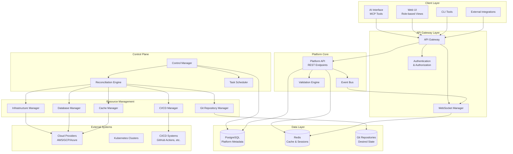

# IDP Platform Layer: Core Infrastructure and Developer Experience

## 1. Introduction

This document defines the platform layer that sits beneath the AI interface, providing the core infrastructure for developer self-service, resource management, and operational control. The platform layer is designed to scale to 4,000+ developers while maintaining extensibility for future commercial multi-tenant offerings.

## 2. Architecture Principles

### 2.1 Core Design Principles
- **Desired State Driven**: Everything operates through desired state declarations that are reconciled to actual state
- **Git as Source of Truth**: All desired state is stored in git repositories with full version control
- **API-First**: All functionality exposed through REST APIs with real-time update capabilities
- **Role-Based Access**: Different interfaces and capabilities for developers, admins, and product owners
- **Extensible by Design**: Pluggable resource managers allow for easy extension of supported resource types
- **Multi-Tenant Ready**: Architecture designed to support commercial multi-tenant deployments

### 2.2 Scaling Considerations
- **Custom Control Plane**: PostgreSQL-based metadata storage to avoid etcd scaling limitations
- **Horizontal Scaling**: All components designed for horizontal scaling
- **Async Processing**: Long-running operations processed asynchronously with real-time status updates
- **Resource Isolation**: Tenant and team-level resource isolation

## 3. High-Level Architecture

## 4. Key Components Overview

### 4.1 API Gateway Layer
- **API Gateway**: Routes requests, handles rate limiting, and provides unified entry point
- **WebSocket Manager**: Enables real-time updates for UI and external integrations
- **Authentication & Authorization**: Role-based access control with tenant isolation

### 4.2 Platform Core
- **Platform API**: REST endpoints for all platform functionality
- **Event Bus**: Handles asynchronous communication between components
- **Validation Engine**: Validates desired state changes against governance policies

### 4.3 Control Plane
- **Control Manager**: Orchestrates reconciliation operations
- **Reconciliation Engine**: Continuously reconciles desired state with actual state
- **Task Scheduler**: Manages long-running and scheduled operations

### 4.4 Resource Management
- **Pluggable Resource Managers**: Each resource type has a dedicated manager
- **Git Repository Manager**: Manages application repositories and desired state storage
- **Infrastructure Manager**: Handles cloud resource provisioning
- **CI/CD Manager**: Manages pipeline creation and configuration
- **Database Manager**: Abstracts database provisioning (PostgreSQL, MySQL, etc.)
- **Cache Manager**: Manages cache layer provisioning (Redis, Memcached, etc.)

### 4.5 Data Layer
- **PostgreSQL Platform Database**: Single database with component-specific schemas for platform operations
- **PostgreSQL Tenant Databases**: Isolated database per tenant for strong data separation
- **Redis**: Handles caching, session management, and real-time event distribution
- **Git Repositories**: Stores desired state configurations and application code

## 5. Integration Points

### 5.1 AI Layer Integration
The platform layer integrates with the AI layer through:
- **MCP Tool Implementation**: Platform provides MCP tools that the AI can invoke
- **Desired State Translation**: AI-generated desired state is validated and stored
- **Feedback Loop**: Platform status and validation results inform AI responses

### 5.2 External System Integration
- **Cloud Provider APIs**: Direct integration with AWS, GCP, Azure for resource provisioning
- **Git Providers**: Integration with GitHub, GitLab, or other git providers
- **CI/CD Systems**: Integration with existing CI/CD infrastructure
- **Monitoring Systems**: Integration with observability platforms

## 6. Multi-Tenant Architecture

The platform is designed with multi-tenancy as a first-class concern:

### 6.1 Tenant Isolation
- **Database**: Tenant-scoped data with row-level security
- **Resources**: Cloud resources tagged and isolated by tenant
- **Git**: Separate organizations or namespaced repositories per tenant

### 6.2 Resource Quotas
- **Per-Tenant Limits**: CPU, memory, storage, and service limits
- **Cost Controls**: Budget limits and usage tracking
- **Rate Limiting**: API and resource creation rate limits per tenant

## 7. Next Steps

This overview provides the foundation for detailed component design. The following documents will dive deep into each major component:

1. **API Gateway & Authentication** - REST API design, WebSocket implementation, and auth patterns
2. **Custom Control Plane** - PostgreSQL schema design and reconciliation engine architecture  
3. **Resource Managers** - Pluggable architecture and individual manager implementations
4. **UI Layer Design** - Role-based interfaces and user experience design
5. **Git Integration** - Auto-commit workflows and PR validation mechanisms
6. **Multi-Tenant Implementation** - Detailed tenant isolation and commercial considerations

Each component is designed to scale independently while maintaining consistency and reliability across the entire platform.
