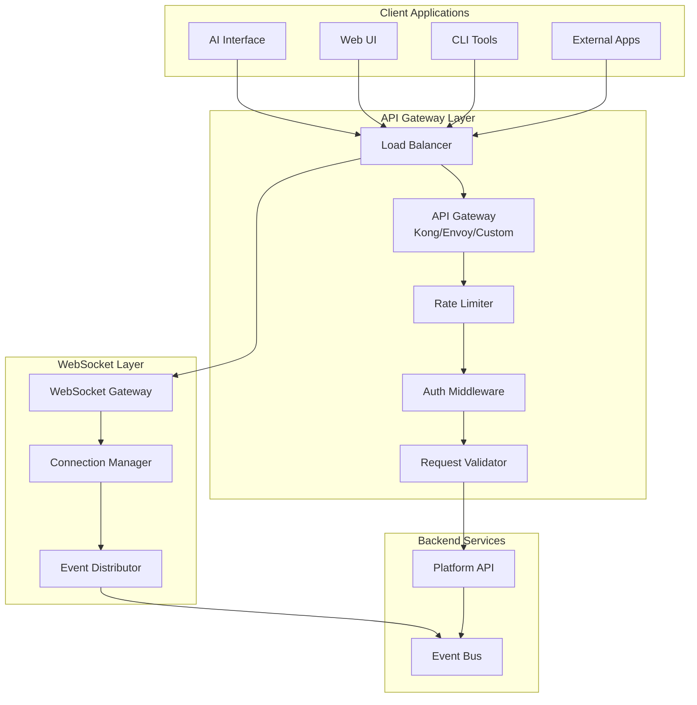

# API Gateway & Real-Time Communication Layer

## 1. Overview

The API Gateway serves as the unified entry point for all interactions with the IDP platform, providing REST APIs for synchronous operations and WebSocket connections for real-time updates. This layer handles authentication, authorization, rate limiting, and request routing while enabling real-time communication for long-running operations.

## 2. Architecture Components

### 2.1 API Gateway


## 3. REST API Design

### 3.1 API Versioning and Structure
```
Base URL: https://platform.company.com/api/v1
WebSocket: wss://platform.company.com/ws/v1
```

### 3.2 Core API Endpoints

#### 3.2.1 Application Management
```http
# Application CRUD operations
GET    /api/v1/applications                    # List applications
POST   /api/v1/applications                    # Create application
GET    /api/v1/applications/{id}               # Get application details
PUT    /api/v1/applications/{id}               # Update application
DELETE /api/v1/applications/{id}               # Delete application

# Application desired state management
GET    /api/v1/applications/{id}/desired-state # Get current desired state
PUT    /api/v1/applications/{id}/desired-state # Update desired state
GET    /api/v1/applications/{id}/actual-state  # Get current actual state
GET    /api/v1/applications/{id}/diff          # Compare desired vs actual

# Application operations
POST   /api/v1/applications/{id}/deploy        # Deploy application
POST   /api/v1/applications/{id}/rollback      # Rollback to previous version
POST   /api/v1/applications/{id}/restart       # Restart application services
```

#### 3.2.2 Resource Management
```http
# Generic resource operations
GET    /api/v1/resources                       # List all resources
GET    /api/v1/resources/{type}                # List resources by type
POST   /api/v1/resources/{type}                # Create resource
GET    /api/v1/resources/{type}/{id}           # Get resource details
PUT    /api/v1/resources/{type}/{id}           # Update resource
DELETE /api/v1/resources/{type}/{id}           # Delete resource

# Specific resource types
GET    /api/v1/resources/databases             # List databases
GET    /api/v1/resources/caches                # List cache instances
GET    /api/v1/resources/git-repositories      # List git repositories
GET    /api/v1/resources/ci-pipelines          # List CI/CD pipelines
```

#### 3.2.3 Operations & Status
```http
# Operation tracking
GET    /api/v1/operations                      # List operations
GET    /api/v1/operations/{id}                 # Get operation status
POST   /api/v1/operations/{id}/cancel          # Cancel operation
GET    /api/v1/operations/{id}/logs            # Get operation logs

# Platform status
GET    /api/v1/status                          # Platform health status
GET    /api/v1/status/applications/{id}        # Application health status
GET    /api/v1/metrics                         # Platform metrics
```

#### 3.2.4 User & Team Management
```http
# User management
GET    /api/v1/users/me                        # Current user profile
PUT    /api/v1/users/me                        # Update user profile
GET    /api/v1/users/me/permissions            # User permissions

# Team management
GET    /api/v1/teams                           # List teams
GET    /api/v1/teams/{id}                      # Get team details
GET    /api/v1/teams/{id}/members              # List team members
GET    /api/v1/teams/{id}/applications         # List team applications
```

### 3.3 Request/Response Patterns

#### 3.3.1 Standard Response Format
```json
{
  "success": true,
  "data": { ... },
  "meta": {
    "request_id": "req_123456789",
    "timestamp": "2024-01-15T10:30:00Z",
    "api_version": "v1"
  },
  "pagination": {
    "page": 1,
    "per_page": 50,
    "total": 150,
    "total_pages": 3
  }
}
```

#### 3.3.2 Error Response Format
```json
{
  "success": false,
  "error": {
    "code": "VALIDATION_ERROR",
    "message": "Invalid configuration provided",
    "details": {
      "field": "database.size",
      "reason": "Size 'xl' is not allowed for free tier"
    }
  },
  "meta": {
    "request_id": "req_123456789",
    "timestamp": "2024-01-15T10:30:00Z",
    "api_version": "v1"
  }
}
```

#### 3.3.3 Long-Running Operation Response
```json
{
  "success": true,
  "data": {
    "operation_id": "op_987654321",
    "status": "in_progress",
    "message": "Creating database instance...",
    "progress": 25,
    "estimated_completion": "2024-01-15T10:35:00Z"
  },
  "meta": {
    "request_id": "req_123456789",
    "timestamp": "2024-01-15T10:30:00Z"
  }
}
```

## 4. WebSocket Real-Time Updates

### 4.1 Connection Management
```javascript
// WebSocket connection with authentication
const ws = new WebSocket('wss://platform.company.com/ws/v1?token=jwt_token');

// Subscribe to specific event types
ws.send(JSON.stringify({
  type: 'subscribe',
  topics: [
    'application:app_123:status',
    'operation:op_456:progress',
    'user:notifications'
  ]
}));
```

### 4.2 Event Message Format
```json
{
  "type": "event",
  "topic": "application:app_123:status",
  "event": "status_changed",
  "timestamp": "2024-01-15T10:30:00Z",
  "data": {
    "application_id": "app_123",
    "status": "deployed",
    "previous_status": "deploying",
    "details": {
      "version": "v1.2.3",
      "deployment_time": "2024-01-15T10:29:45Z"
    }
  }
}
```

### 4.3 Real-Time Event Types

#### 4.3.1 Application Events
```json
{
  "type": "event",
  "topic": "application:app_123:status",
  "event": "deployment_started",
  "data": {
    "application_id": "app_123",
    "deployment_id": "dep_789",
    "version": "v1.2.3",
    "stages": ["build", "test", "deploy", "verify"]
  }
}
```

#### 4.3.2 Operation Progress Events
```json
{
  "type": "event",
  "topic": "operation:op_456:progress",
  "event": "progress_updated",
  "data": {
    "operation_id": "op_456",
    "progress": 75,
    "current_stage": "configuring_database",
    "message": "Setting up database connections...",
    "logs": ["Database instance created", "Configuring security groups"]
  }
}
```

#### 4.3.3 Resource Status Events
```json
{
  "type": "event",
  "topic": "resource:db_123:health",
  "event": "health_check_failed",
  "data": {
    "resource_id": "db_123",
    "resource_type": "database",
    "health_status": "unhealthy",
    "error": "Connection timeout",
    "timestamp": "2024-01-15T10:30:00Z"
  }
}
```

## 5. Authentication & Authorization

### 5.1 Authentication Methods
- **JWT Tokens**: For API requests and WebSocket connections
- **API Keys**: For service-to-service communication
- **OIDC Integration**: Support for enterprise SSO providers
- **Service Account Tokens**: For CI/CD and automation

### 5.2 Role-Based Access Control (RBAC)
```json
{
  "user_id": "user_123",
  "roles": [
    {
      "role": "developer",
      "scope": "team:frontend",
      "permissions": [
        "application:read",
        "application:create",
        "application:update",
        "resource:database:read",
        "resource:cache:read"
      ]
    },
    {
      "role": "admin",
      "scope": "tenant:company_abc",
      "permissions": [
        "*:*"
      ]
    }
  ]
}
```

### 5.3 Multi-Tenant Isolation
- **Tenant Context**: Every request includes tenant context
- **Data Isolation**: Database queries scoped by tenant_id
- **Resource Tagging**: All cloud resources tagged with tenant information
- **Rate Limiting**: Per-tenant rate limits and quotas

## 6. Rate Limiting & Throttling

### 6.1 Rate Limiting Strategies
```yaml
rate_limits:
  global:
    requests_per_minute: 1000
  per_user:
    requests_per_minute: 100
  per_tenant:
    requests_per_minute: 500
  by_endpoint:
    POST /api/v1/applications:
      requests_per_hour: 50
    PUT /api/v1/applications/*/desired-state:
      requests_per_hour: 200
```

### 6.2 Throttling Response
```json
{
  "success": false,
  "error": {
    "code": "RATE_LIMIT_EXCEEDED",
    "message": "Rate limit exceeded. Try again in 60 seconds."
  },
  "meta": {
    "retry_after": 60,
    "limit": 100,
    "remaining": 0,
    "reset": "2024-01-15T10:31:00Z"
  }
}
```

## 7. API Gateway Implementation Considerations

### 7.1 Technology Options
- **Kong**: Feature-rich, plugin ecosystem, good for microservices
- **Envoy Proxy**: High performance, service mesh integration
- **AWS API Gateway**: Managed service, good cloud integration
- **Custom Gateway**: Using Go/Rust for specific requirements

### 7.2 Scalability Features
- **Horizontal Scaling**: Stateless gateway instances
- **Connection Pooling**: Efficient backend connections
- **Caching**: Response caching for read-heavy operations
- **Circuit Breaker**: Protection against downstream failures

### 7.3 Monitoring & Observability
- **Request Tracing**: Distributed tracing with correlation IDs
- **Metrics Collection**: Request rates, latency, error rates
- **Logging**: Structured logging for all requests
- **Health Checks**: Gateway and backend service health monitoring

## 8. Security Considerations

### 8.1 API Security
- **TLS Termination**: All traffic encrypted in transit
- **Input Validation**: Comprehensive request validation
- **SQL Injection Protection**: Parameterized queries
- **Cross-Origin Resource Sharing (CORS)**: Proper CORS configuration

### 8.2 WebSocket Security
- **Connection Authentication**: JWT token validation on connect
- **Message Validation**: All WebSocket messages validated
- **Rate Limiting**: Per-connection message rate limiting
- **Automatic Disconnection**: Disconnect idle or suspicious connections

This API Gateway design provides a robust, scalable foundation for the platform layer, enabling both traditional REST interactions and real-time communication while maintaining security and multi-tenant isolation.
