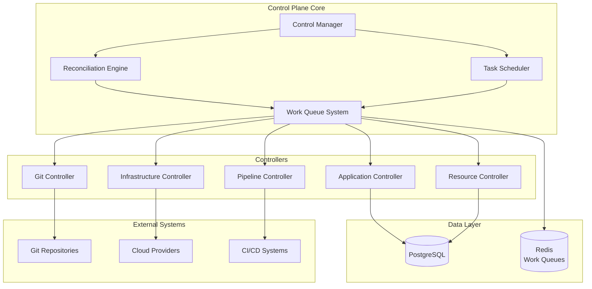
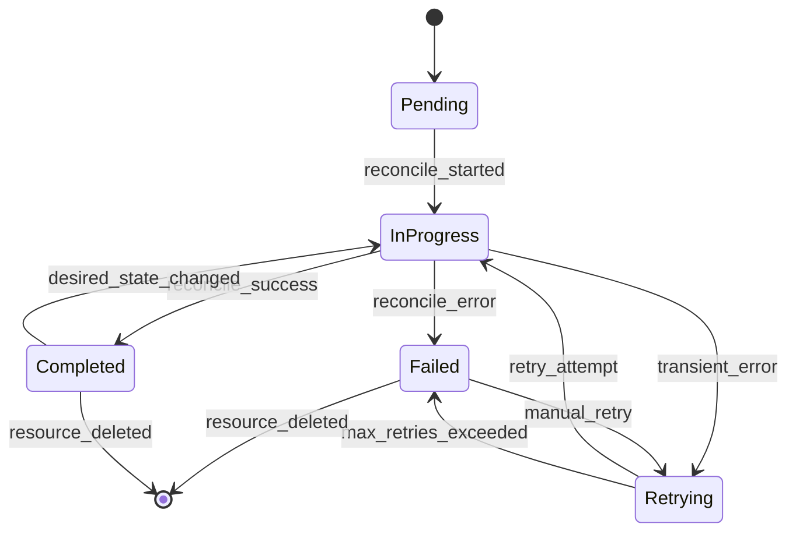

# Custom Control Plane: PostgreSQL-Based Reconciliation Engine

## 1. Overview

The custom control plane is the heart of the IDP platform, responsible for continuously reconciling desired state with actual state across all managed resources. Built on PostgreSQL for scalability and reliability, it provides a robust alternative to Kubernetes' etcd-based approach while maintaining the same declarative, controller-pattern principles.

## 2. Architecture Design

### 2.1 Control Plane Components


### 2.2 PostgreSQL Schema Design

#### 2.2.1 Platform Database Schema Design

The platform uses a single PostgreSQL database with component-specific schemas for operational simplicity and performance.

```sql
-- Create component schemas
CREATE SCHEMA control_plane;
CREATE SCHEMA api_gateway;
CREATE SCHEMA resource_management;  
CREATE SCHEMA git_integration;
CREATE SCHEMA user_management;
CREATE SCHEMA audit_system;

-- Tenants table (in control_plane schema)
CREATE TABLE control_plane.tenants (
    id UUID PRIMARY KEY DEFAULT gen_random_uuid(),
    name VARCHAR(255) NOT NULL UNIQUE,
    settings JSONB NOT NULL DEFAULT '{}',
    resource_limits JSONB NOT NULL DEFAULT '{}',
    created_at TIMESTAMP WITH TIME ZONE DEFAULT NOW(),
    updated_at TIMESTAMP WITH TIME ZONE DEFAULT NOW()
);

-- Applications table (in resource_management schema)
CREATE TABLE resource_management.applications (
    id UUID PRIMARY KEY DEFAULT gen_random_uuid(),
    tenant_id UUID NOT NULL REFERENCES tenants(id) ON DELETE CASCADE,
    name VARCHAR(255) NOT NULL,
    team VARCHAR(255) NOT NULL,
    git_repository VARCHAR(512),
    desired_state JSONB NOT NULL DEFAULT '{}',
    actual_state JSONB NOT NULL DEFAULT '{}',
    status VARCHAR(50) NOT NULL DEFAULT 'pending',
    last_reconciled_at TIMESTAMP WITH TIME ZONE,
    created_at TIMESTAMP WITH TIME ZONE DEFAULT NOW(),
    updated_at TIMESTAMP WITH TIME ZONE DEFAULT NOW(),
    UNIQUE(tenant_id, name)
);

-- Resources table (databases, caches, etc.)  
CREATE TABLE resource_management.resources (
    id UUID PRIMARY KEY DEFAULT gen_random_uuid(),
    tenant_id UUID NOT NULL REFERENCES tenants(id) ON DELETE CASCADE,
    application_id UUID REFERENCES applications(id) ON DELETE CASCADE,
    type VARCHAR(100) NOT NULL,
    name VARCHAR(255) NOT NULL,
    desired_config JSONB NOT NULL DEFAULT '{}',
    actual_config JSONB NOT NULL DEFAULT '{}',
    status VARCHAR(50) NOT NULL DEFAULT 'pending',
    provider_resource_id VARCHAR(512),
    last_reconciled_at TIMESTAMP WITH TIME ZONE,
    created_at TIMESTAMP WITH TIME ZONE DEFAULT NOW(),
    updated_at TIMESTAMP WITH TIME ZONE DEFAULT NOW(),
    UNIQUE(tenant_id, name, type)
);

-- Reconciliation operations table
CREATE TABLE control_plane.reconciliation_operations (
    id UUID PRIMARY KEY DEFAULT gen_random_uuid(),
    resource_type VARCHAR(100) NOT NULL,
    resource_id UUID NOT NULL,
    operation_type VARCHAR(50) NOT NULL, -- create, update, delete
    status VARCHAR(50) NOT NULL DEFAULT 'pending',
    priority INTEGER DEFAULT 0,
    retry_count INTEGER DEFAULT 0,
    max_retries INTEGER DEFAULT 3,
    error_message TEXT,
    started_at TIMESTAMP WITH TIME ZONE,
    completed_at TIMESTAMP WITH TIME ZONE,
    created_at TIMESTAMP WITH TIME ZONE DEFAULT NOW()
);

-- Audit log for all changes
CREATE TABLE audit_system.audit_log (
    id UUID PRIMARY KEY DEFAULT gen_random_uuid(),
    tenant_id UUID NOT NULL REFERENCES tenants(id),
    user_id VARCHAR(255),
    resource_type VARCHAR(100) NOT NULL,
    resource_id UUID NOT NULL,
    operation VARCHAR(50) NOT NULL,
    old_state JSONB,
    new_state JSONB,
    metadata JSONB DEFAULT '{}',
    created_at TIMESTAMP WITH TIME ZONE DEFAULT NOW()
);
```

#### 2.2.2 Indexes for Performance
```sql
-- Application indexes
CREATE INDEX idx_applications_tenant_id ON applications(tenant_id);
CREATE INDEX idx_applications_status ON applications(status);
CREATE INDEX idx_applications_last_reconciled ON applications(last_reconciled_at);

-- Resource indexes
CREATE INDEX idx_resources_tenant_id ON resources(tenant_id);
CREATE INDEX idx_resources_application_id ON resources(application_id);
CREATE INDEX idx_resources_type_status ON resources(type, status);
CREATE INDEX idx_resources_last_reconciled ON resources(last_reconciled_at);

-- Operations indexes
CREATE INDEX idx_operations_status_priority ON reconciliation_operations(status, priority DESC);
CREATE INDEX idx_operations_resource ON reconciliation_operations(resource_type, resource_id);
CREATE INDEX idx_operations_created_at ON reconciliation_operations(created_at);

-- Audit log indexes
CREATE INDEX idx_audit_log_tenant_resource ON audit_log(tenant_id, resource_type, resource_id);
CREATE INDEX idx_audit_log_created_at ON audit_log(created_at);
```

## 3. Reconciliation Engine Design

### 3.1 Reconciliation Loop Architecture
```go
type ReconciliationEngine struct {
    db          *sql.DB
    controllers map[string]Controller
    workQueue   WorkQueue
    eventBus    EventBus
}

type Controller interface {
    Reconcile(ctx context.Context, req ReconcileRequest) error
    GetReconcileInterval() time.Duration
    CanHandle(resourceType string) bool
}

type ReconcileRequest struct {
    ResourceType string
    ResourceID   uuid.UUID
    TenantID     uuid.UUID
    Operation    OperationType
}
```

### 3.2 Work Queue System
```go
// Work queue manages reconciliation tasks
type WorkQueue interface {
    Add(item ReconcileRequest) error
    Get() (ReconcileRequest, error)
    Done(item ReconcileRequest) error
    Retry(item ReconcileRequest, delay time.Duration) error
}

// Redis-based work queue implementation
type RedisWorkQueue struct {
    client     *redis.Client
    queueName  string
    retryQueue string
}
```

### 3.3 Reconciliation States and Transitions


## 4. Controller Implementation Patterns

### 4.1 Application Controller
```go
type ApplicationController struct {
    db           *sql.DB
    gitManager   GitManager
    eventBus     EventBus
}

func (c *ApplicationController) Reconcile(ctx context.Context, req ReconcileRequest) error {
    app, err := c.getApplication(ctx, req.ResourceID)
    if err != nil {
        return err
    }
    
    // Compare desired vs actual state
    diff := c.calculateDiff(app.DesiredState, app.ActualState)
    
    if diff.HasChanges() {
        // Generate reconciliation tasks for each change
        for _, change := range diff.Changes {
            task := ReconcileRequest{
                ResourceType: change.ResourceType,
                ResourceID:   change.ResourceID,
                TenantID:     req.TenantID,
                Operation:    change.Operation,
            }
            c.workQueue.Add(task)
        }
        
        // Update application status
        err = c.updateApplicationStatus(ctx, req.ResourceID, "reconciling")
        if err != nil {
            return err
        }
    }
    
    return nil
}
```

### 4.2 Resource Controller Pattern
```go
type DatabaseController struct {
    db           *sql.DB
    cloudManager CloudManager
    eventBus     EventBus
}

func (c *DatabaseController) Reconcile(ctx context.Context, req ReconcileRequest) error {
    resource, err := c.getResource(ctx, req.ResourceID)
    if err != nil {
        return err
    }
    
    switch req.Operation {
    case OperationCreate:
        return c.createDatabase(ctx, resource)
    case OperationUpdate:
        return c.updateDatabase(ctx, resource)
    case OperationDelete:
        return c.deleteDatabase(ctx, resource)
    default:
        return fmt.Errorf("unknown operation: %s", req.Operation)
    }
}

func (c *DatabaseController) createDatabase(ctx context.Context, resource *Resource) error {
    // Create database instance in cloud provider
    instance, err := c.cloudManager.CreateDatabase(ctx, DatabaseConfig{
        Type:     resource.DesiredConfig["type"].(string),
        Size:     resource.DesiredConfig["size"].(string),
        Name:     resource.Name,
        TenantID: resource.TenantID.String(),
    })
    if err != nil {
        return err
    }
    
    // Update actual state in database
    actualConfig := map[string]interface{}{
        "type":       instance.Type,
        "size":       instance.Size,
        "endpoint":   instance.Endpoint,
        "status":     instance.Status,
        "created_at": instance.CreatedAt,
    }
    
    err = c.updateResourceActualState(ctx, resource.ID, actualConfig)
    if err != nil {
        return err
    }
    
    // Emit event for real-time updates
    c.eventBus.Emit(Event{
        Type:     "resource.created",
        Resource: resource.ID,
        Data:     actualConfig,
    })
    
    return nil
}
```

## 5. Task Scheduling and Priority Management

### 5.1 Priority Queue System
```go
type Priority int

const (
    PriorityLow Priority = iota
    PriorityNormal
    PriorityHigh
    PriorityCritical
)

type PriorityWorkQueue struct {
    queues map[Priority]WorkQueue
    redis  *redis.Client
}

func (q *PriorityWorkQueue) Add(item ReconcileRequest, priority Priority) error {
    return q.queues[priority].Add(item)
}

func (q *PriorityWorkQueue) Get() (ReconcileRequest, Priority, error) {
    // Check queues in priority order
    for priority := PriorityCritical; priority >= PriorityLow; priority-- {
        if item, err := q.queues[priority].Get(); err == nil {
            return item, priority, nil
        }
    }
    return ReconcileRequest{}, PriorityLow, errors.New("no items available")
}
```

### 5.2 Scheduling Strategies
```yaml
scheduling_policies:
  application_deployment:
    priority: high
    max_concurrent: 5
    retry_policy:
      max_retries: 3
      backoff: exponential
      base_delay: 30s
  
  database_creation:
    priority: normal
    max_concurrent: 2
    retry_policy:
      max_retries: 5
      backoff: exponential
      base_delay: 60s
  
  cache_provisioning:
    priority: normal
    max_concurrent: 3
    retry_policy:
      max_retries: 3
      backoff: linear
      base_delay: 30s
```

## 6. Event System and State Management

### 6.1 Event Bus Architecture
```go
type EventBus interface {
    Emit(event Event) error
    Subscribe(topic string, handler EventHandler) error
    Unsubscribe(topic string, handler EventHandler) error
}

type Event struct {
    ID        string                 `json:"id"`
    Type      string                 `json:"type"`
    Topic     string                 `json:"topic"`
    Resource  uuid.UUID             `json:"resource"`
    Data      map[string]interface{} `json:"data"`
    Timestamp time.Time             `json:"timestamp"`
}

type EventHandler func(event Event) error
```

### 6.2 State Change Events
```json
{
  "id": "evt_123456",
  "type": "reconciliation.started",
  "topic": "application:app_456",
  "resource": "app_456",
  "data": {
    "operation": "update",
    "changes": [
      {
        "field": "desired_state.database.size",
        "old_value": "small",
        "new_value": "medium"
      }
    ]
  },
  "timestamp": "2024-01-15T10:30:00Z"
}
```

## 7. Error Handling and Recovery

### 7.1 Retry Policies
```go
type RetryPolicy struct {
    MaxRetries  int           `json:"max_retries"`
    BackoffType BackoffType   `json:"backoff_type"`
    BaseDelay   time.Duration `json:"base_delay"`
    MaxDelay    time.Duration `json:"max_delay"`
}

type BackoffType string

const (
    BackoffLinear      BackoffType = "linear"
    BackoffExponential BackoffType = "exponential"
    BackoffFixed       BackoffType = "fixed"
)

func (p RetryPolicy) GetDelay(attempt int) time.Duration {
    switch p.BackoffType {
    case BackoffExponential:
        delay := p.BaseDelay * time.Duration(1<<uint(attempt))
        if delay > p.MaxDelay {
            return p.MaxDelay
        }
        return delay
    case BackoffLinear:
        return p.BaseDelay * time.Duration(attempt+1)
    default:
        return p.BaseDelay
    }
}
```

### 7.2 Dead Letter Queue
```go
type DeadLetterQueue struct {
    redis     *redis.Client
    queueName string
}

func (dlq *DeadLetterQueue) Add(item ReconcileRequest, error string) error {
    deadLetter := DeadLetter{
        Item:        item,
        Error:       error,
        Timestamp:   time.Now(),
        RetryCount:  item.RetryCount,
    }
    
    data, err := json.Marshal(deadLetter)
    if err != nil {
        return err
    }
    
    return dlq.redis.LPush(context.Background(), dlq.queueName, data).Err()
}
```

## 8. Monitoring and Observability

### 8.1 Metrics Collection
```go
type ControlPlaneMetrics struct {
    ReconciliationDuration prometheus.HistogramVec
    ReconciliationErrors   prometheus.CounterVec
    QueueSize             prometheus.GaugeVec
    ActiveControllers     prometheus.Gauge
}

func (m *ControlPlaneMetrics) RecordReconciliation(controller string, duration time.Duration, success bool) {
    m.ReconciliationDuration.WithLabelValues(controller).Observe(duration.Seconds())
    
    if !success {
        m.ReconciliationErrors.WithLabelValues(controller).Inc()
    }
}
```

### 8.2 Health Checks
```go
type HealthChecker struct {
    db          *sql.DB
    redis       *redis.Client
    controllers map[string]Controller
}

func (h *HealthChecker) CheckHealth() HealthStatus {
    status := HealthStatus{
        Status: "healthy",
        Checks: make(map[string]ComponentHealth),
    }
    
    // Check database connectivity
    if err := h.db.Ping(); err != nil {
        status.Checks["database"] = ComponentHealth{
            Status: "unhealthy",
            Error:  err.Error(),
        }
        status.Status = "unhealthy"
    }
    
    // Check Redis connectivity
    if err := h.redis.Ping(context.Background()).Err(); err != nil {
        status.Checks["redis"] = ComponentHealth{
            Status: "unhealthy",
            Error:  err.Error(),
        }
        status.Status = "unhealthy"
    }
    
    return status
}
```

This custom control plane design provides a scalable, reliable alternative to Kubernetes-based solutions while maintaining the same declarative principles and controller patterns that make infrastructure management robust and predictable.
