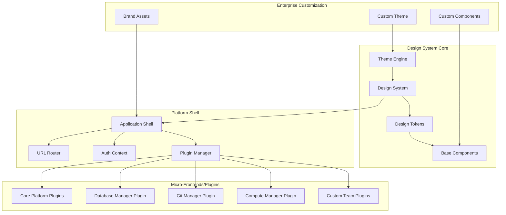

# Extensible UI Layer: Design System and Micro-Frontend Architecture

## 1. Overview

The UI layer provides a Backstage-inspired, extensible frontend architecture that enables different teams to contribute micro-frontends while maintaining design consistency and user experience coherence. Built on vanilla JavaScript and Web Components, it supports configurable theming, component injection, and role-based access control to accommodate diverse enterprise requirements.

## 2. Micro-Frontend Architecture

### 2.1 Design System and Plugin Architecture


### 2.2 Technology Stack for Extensibility
```yaml
core_architecture:
  approach: Vanilla JavaScript + Web Components
  design_system: CSS Custom Properties + Design Tokens
  micro_frontends: Native Web Components (framework-agnostic)
  plugin_system: Dynamic module loading with ES modules
  theming: CSS Custom Properties + Theme switching
  state_management: Event-driven with Custom Events
  routing: Native History API with plugin-aware routing
  
component_system:
  base_components: "Themeable Web Components"
  design_tokens: "CSS Custom Properties for consistency"
  component_injection: "Runtime component replacement"
  plugin_components: "Isolated micro-frontend components"
  
development_experience:
  plugin_dev_kit: "SDK for building plugins"
  design_system_docs: "Storybook-like component documentation"
  hot_reload: "Plugin hot-swapping in development"
  testing: "Component testing with Vitest"
  
deployment:
  core_shell: "Base application shell"
  plugin_bundles: "Individually deployable plugin packages"
  cdn_distribution: "Micro-frontend CDN delivery"
  version_management: "Plugin versioning and compatibility"
```

## 3. Design System and Theming Architecture

### 3.1 Design Token System
```javascript
// Design tokens defined as CSS Custom Properties
class DesignSystem {
  constructor(theme = 'default') {
    this.currentTheme = theme;
    this.loadTheme(theme);
  }
  
  loadTheme(themeName) {
    const themes = {
      default: {
        '--color-primary': '#2563eb',
        '--color-secondary': '#64748b',
        '--color-success': '#059669',
        '--color-warning': '#d97706',
        '--color-error': '#dc2626',
        '--spacing-xs': '0.25rem',
        '--spacing-sm': '0.5rem',
        '--spacing-md': '1rem',
        '--spacing-lg': '1.5rem',
        '--spacing-xl': '3rem',
        '--border-radius': '0.375rem',
        '--shadow-sm': '0 1px 2px 0 rgb(0 0 0 / 0.05)',
        '--shadow-md': '0 4px 6px -1px rgb(0 0 0 / 0.1)',
        '--font-family': 'Inter, system-ui, sans-serif',
        '--font-size-sm': '0.875rem',
        '--font-size-base': '1rem',
        '--font-size-lg': '1.125rem',
        '--font-size-xl': '1.25rem'
      },
      enterprise: {
        // Enterprise customer can override any token
        '--color-primary': '#1f2937',
        '--color-secondary': '#6b7280',
        '--border-radius': '0.25rem',
        '--font-family': '"Corporate Sans", Arial, sans-serif'
      }
    };
    
    const themeTokens = { ...themes.default, ...themes[themeName] };
    this.applyTheme(themeTokens);
  }
  
  applyTheme(tokens) {
    const root = document.documentElement;
    Object.entries(tokens).forEach(([property, value]) => {
      root.style.setProperty(property, value);
    });
  }
}

// Themeable base components using design tokens
class ThemedButton extends HTMLElement {
  constructor() {
    super();
    this.attachShadow({ mode: 'open' });
  }
  
  connectedCallback() {
    this.render();
  }
  
  render() {
    const variant = this.getAttribute('variant') || 'primary';
    
    this.shadowRoot.innerHTML = `
      <style>
        :host {
          display: inline-block;
        }
        
        button {
          background: var(--color-${variant});
          color: white;
          border: none;
          padding: var(--spacing-sm) var(--spacing-md);
          border-radius: var(--border-radius);
          font-family: var(--font-family);
          font-size: var(--font-size-base);
          cursor: pointer;
          transition: all 0.2s ease;
        }
        
        button:hover {
          opacity: 0.9;
          transform: translateY(-1px);
          box-shadow: var(--shadow-md);
        }
        
        button:disabled {
          opacity: 0.5;
          cursor: not-allowed;
          transform: none;
        }
      </style>
      <button><slot></slot></button>
    `;
  }
}

customElements.define('themed-button', ThemedButton);
```

### 3.2 Component Injection System
```javascript
// Component registry for runtime replacement
class ComponentRegistry {
  constructor() {
    this.components = new Map();
    this.overrides = new Map();
  }
  
  // Register base platform component
  register(name, component) {
    this.components.set(name, component);
  }
  
  // Allow enterprise customers to override components
  override(name, customComponent) {
    this.overrides.set(name, customComponent);
  }
  
  // Get component (returns override if exists)
  get(name) {
    return this.overrides.get(name) || this.components.get(name);
  }
  
  // Enterprise customer component injection
  injectCustomComponents(customComponents) {
    Object.entries(customComponents).forEach(([name, component]) => {
      this.override(name, component);
    });
  }
}

// Usage example
const registry = new ComponentRegistry();

// Platform registers base components
registry.register('data-table', PlatformDataTable);
registry.register('card', PlatformCard);
registry.register('accordion', PlatformAccordion);

// Enterprise customer injects their own components
registry.injectCustomComponents({
  'data-table': EnterpriseDataTable,  // Custom table with enterprise features
  'card': EnterpriseCard,             // Custom card with company branding
  // accordion uses platform default
});
```

## 4. Plugin Architecture and Micro-Frontends

### 4.1 Plugin Development Framework
```javascript
// Base plugin interface
class PlatformPlugin {
  constructor(config) {
    this.id = config.id;
    this.name = config.name;
    this.version = config.version;
    this.routes = config.routes || [];
    this.navigation = config.navigation || [];
    this.permissions = config.permissions || [];
  }
  
  // Plugin lifecycle methods
  async initialize(context) {
    this.context = context;
    await this.onInitialize();
  }
  
  async onInitialize() {
    // Override in plugin implementation
  }
  
  // Register plugin components
  registerComponents(registry) {
    // Override to register components
  }
  
  // Define plugin routes
  getRoutes() {
    return this.routes;
  }
  
  // Define navigation entries
  getNavigation(userPermissions) {
    return this.navigation.filter(nav => 
      this.hasPermission(userPermissions, nav.requiredPermission)
    );
  }
}

// Example: Database Manager Plugin
class DatabaseManagerPlugin extends PlatformPlugin {
  constructor() {
    super({
      id: 'database-manager',
      name: 'Database Manager',
      version: '1.0.0',
      routes: [
        { path: '/databases', component: 'database-list' },
        { path: '/databases/:id', component: 'database-detail' },
        { path: '/databases/new', component: 'database-create' }
      ],
      navigation: [
        {
          label: 'Databases',
          icon: 'database',
          path: '/databases',
          requiredPermission: { resource: 'database', action: 'read' }
        }
      ]
    });
  }
  
  registerComponents(registry) {
    registry.register('database-list', DatabaseListComponent);
    registry.register('database-detail', DatabaseDetailComponent);
    registry.register('database-create', DatabaseCreateComponent);
  }
  
  async onInitialize() {
    // Setup database manager specific initialization
    this.dbClient = new DatabaseClient(this.context.apiClient);
    this.setupRealTimeUpdates();
  }
}

// Plugin manager handles loading and lifecycle
class PluginManager {
  constructor(context) {
    this.context = context;
    this.plugins = new Map();
    this.componentRegistry = new ComponentRegistry();
  }
  
  async loadPlugin(pluginClass) {
    const plugin = new pluginClass();
    await plugin.initialize(this.context);
    
    // Register plugin components
    plugin.registerComponents(this.componentRegistry);
    
    // Register plugin routes
    plugin.getRoutes().forEach(route => {
      this.context.router.addRoute(route);
    });
    
    this.plugins.set(plugin.id, plugin);
    return plugin;
  }
  
  getNavigationItems(userPermissions) {
    const navItems = [];
    for (const plugin of this.plugins.values()) {
      navItems.push(...plugin.getNavigation(userPermissions));
    }
    return navItems;
  }
}
```

### 4.2 Dynamic Plugin Loading
```javascript
// Plugin loader for dynamic micro-frontend loading
class PluginLoader {
  constructor() {
    this.loadedPlugins = new Map();
  }
  
  async loadPluginFromURL(pluginUrl) {
    try {
      // Load plugin module dynamically
      const module = await import(pluginUrl);
      const PluginClass = module.default;
      
      // Validate plugin interface
      if (!this.isValidPlugin(PluginClass)) {
        throw new Error('Invalid plugin interface');
      }
      
      return PluginClass;
    } catch (error) {
      console.error(`Failed to load plugin from ${pluginUrl}:`, error);
      throw error;
    }
  }
  
  async loadPluginsFromConfig(pluginConfig) {
    const loadPromises = pluginConfig.map(async config => {
      const PluginClass = await this.loadPluginFromURL(config.url);
      return { config, PluginClass };
    });
    
    return Promise.allSettled(loadPromises);
  }
  
  isValidPlugin(PluginClass) {
    const prototype = PluginClass.prototype;
    return (
      typeof prototype.initialize === 'function' &&
      typeof prototype.registerComponents === 'function' &&
      typeof prototype.getRoutes === 'function'
    );
  }
}

// Application shell loads plugins dynamically
class ApplicationShell {
  constructor() {
    this.pluginManager = new PluginManager(this.createContext());
    this.pluginLoader = new PluginLoader();
  }
  
  createContext() {
    return {
      apiClient: new ApiClient(),
      router: new URLRouter(),
      auth: new AuthContext(),
      designSystem: new DesignSystem(),
      eventBus: new EventBus()
    };
  }
  
  async initialize() {
    // Load plugin configuration (could come from API)
    const pluginConfig = await this.getPluginConfiguration();
    
    // Load core platform plugins
    await this.loadCorePlugins();
    
    // Load configured plugins
    const pluginResults = await this.pluginLoader.loadPluginsFromConfig(pluginConfig);
    
    for (const result of pluginResults) {
      if (result.status === 'fulfilled') {
        await this.pluginManager.loadPlugin(result.value.PluginClass);
      } else {
        console.error('Plugin load failed:', result.reason);
      }
    }
    
    // Initialize navigation
    this.initializeNavigation();
  }
  
  async loadCorePlugins() {
    // Load essential platform plugins
    await this.pluginManager.loadPlugin(ApplicationManagerPlugin);
    await this.pluginManager.loadPlugin(DatabaseManagerPlugin);
    await this.pluginManager.loadPlugin(GitManagerPlugin);
    await this.pluginManager.loadPlugin(UserManagementPlugin);
  }
}
```

## 5. Enterprise Customization and Theming

### 5.1 Multi-Tenant Theme System
```javascript
// Tenant-specific theme configuration
class TenantThemeManager {
  constructor() {
    this.themes = new Map();
    this.currentTenant = null;
  }
  
  // Load tenant-specific theme configuration
  async loadTenantTheme(tenantId) {
    try {
      const themeConfig = await fetch(`/api/v1/tenants/${tenantId}/theme`).then(r => r.json());
      this.themes.set(tenantId, themeConfig);
      this.applyTenantTheme(tenantId);
    } catch (error) {
      console.warn(`Failed to load theme for tenant ${tenantId}, using default`);
      this.applyDefaultTheme();
    }
  }
  
  applyTenantTheme(tenantId) {
    const theme = this.themes.get(tenantId);
    if (!theme) return;
    
    // Apply CSS custom properties
    if (theme.tokens) {
      Object.entries(theme.tokens).forEach(([key, value]) => {
        document.documentElement.style.setProperty(key, value);
      });
    }
    
    // Load custom CSS if provided
    if (theme.customCSS) {
      this.loadCustomCSS(theme.customCSS);
    }
    
    // Apply custom logo and branding
    if (theme.branding) {
      this.applyBranding(theme.branding);
    }
    
    this.currentTenant = tenantId;
  }
  
  loadCustomCSS(cssUrl) {
    const existingLink = document.getElementById('tenant-custom-css');
    if (existingLink) {
      existingLink.remove();
    }
    
    const link = document.createElement('link');
    link.id = 'tenant-custom-css';
    link.rel = 'stylesheet';
    link.href = cssUrl;
    document.head.appendChild(link);
  }
  
  applyBranding(branding) {
    // Apply logo
    if (branding.logo) {
      document.querySelectorAll('[data-brand="logo"]').forEach(el => {
        el.src = branding.logo;
      });
    }
    
    // Apply company name
    if (branding.companyName) {
      document.querySelectorAll('[data-brand="company-name"]').forEach(el => {
        el.textContent = branding.companyName;
      });
    }
    
    // Apply favicon
    if (branding.favicon) {
      const favicon = document.querySelector('link[rel="icon"]');
      if (favicon) favicon.href = branding.favicon;
    }
  }
}

// Example tenant theme configuration
const exampleTenantTheme = {
  tokens: {
    '--color-primary': '#1a365d',
    '--color-secondary': '#2d3748',
    '--color-accent': '#3182ce',
    '--font-family': '"Corporate Sans", system-ui, sans-serif',
    '--border-radius': '4px',
    '--header-height': '80px'
  },
  customCSS: 'https://cdn.company.com/idp-theme.css',
  branding: {
    logo: 'https://cdn.company.com/logo.svg',
    favicon: 'https://cdn.company.com/favicon.ico',
    companyName: 'ACME Corporation'
  },
  layout: {
    navigation: 'side', // 'top' or 'side'
    density: 'comfortable' // 'compact', 'comfortable', 'spacious'
  }
};
```

### 5.2 Component Injection and Replacement
```javascript
// Advanced component injection for enterprise customers
class EnterpriseComponentSystem {
  constructor() {
    this.baseRegistry = new ComponentRegistry();
    this.enterpriseOverrides = new Map();
  }
  
  // Load enterprise component overrides from configuration
  async loadEnterpriseComponents(tenantId) {
    try {
      const componentConfig = await fetch(`/api/v1/tenants/${tenantId}/components`).then(r => r.json());
      
      for (const [componentName, componentDef] of Object.entries(componentConfig)) {
        if (componentDef.type === 'url') {
          // Load component from external URL
          await this.loadComponentFromURL(componentName, componentDef.url);
        } else if (componentDef.type === 'inline') {
          // Create component from inline definition
          this.createInlineComponent(componentName, componentDef);
        }
      }
    } catch (error) {
      console.error(`Failed to load enterprise components for ${tenantId}:`, error);
    }
  }
  
  async loadComponentFromURL(name, url) {
    try {
      // Load component module dynamically
      const module = await import(url);
      const ComponentClass = module.default || module[name];
      
      // Register as enterprise override
      this.enterpriseOverrides.set(name, ComponentClass);
      
      // Define custom element if not already defined
      const elementName = this.getElementName(name);
      if (!customElements.get(elementName)) {
        customElements.define(elementName, ComponentClass);
      }
    } catch (error) {
      console.error(`Failed to load component ${name} from ${url}:`, error);
    }
  }
  
  createInlineComponent(name, definition) {
    // Create component from JSON definition (simplified example)
    class InlineComponent extends HTMLElement {
      constructor() {
        super();
        this.attachShadow({ mode: 'open' });
        this.definition = definition;
      }
      
      connectedCallback() {
        this.render();
      }
      
      render() {
        this.shadowRoot.innerHTML = `
          <style>${definition.styles || ''}</style>
          ${definition.template || ''}
        `;
      }
    }
    
    this.enterpriseOverrides.set(name, InlineComponent);
    customElements.define(this.getElementName(name), InlineComponent);
  }
  
  getComponent(name) {
    return this.enterpriseOverrides.get(name) || this.baseRegistry.get(name);
  }
  
  getElementName(componentName) {
    return componentName.toLowerCase().replace(/[^a-z0-9]/g, '-');
  }
}

// Usage in platform shell
class PlatformShell extends HTMLElement {
  constructor() {
    super();
    this.componentSystem = new EnterpriseComponentSystem();
    this.themeManager = new TenantThemeManager();
  }
  
  async connectedCallback() {
    const tenantId = this.getCurrentTenant();
    
    // Load tenant-specific theme and components
    await Promise.all([
      this.themeManager.loadTenantTheme(tenantId),
      this.componentSystem.loadEnterpriseComponents(tenantId)
    ]);
    
    this.render();
  }
  
  render() {
    // Use injected components or fallback to defaults
    const DataTable = this.componentSystem.getComponent('data-table');
    const Card = this.componentSystem.getComponent('card');
    
    this.innerHTML = `
      <header data-brand="header">
        
        <span data-brand="company-name"></span>
      </header>
      
      <main>
        <!-- Components are dynamically resolved -->
        <custom-data-table></custom-data-table>
        <custom-card></custom-card>
      </main>
    `;
  }
}

customElements.define('platform-shell', PlatformShell);
```
```

## 6. Plugin Development Kit (PDK)

### 6.1 Plugin Development Framework
```javascript
// Plugin Development Kit - utilities for building plugins
class PluginDevelopmentKit {
  constructor(context) {
    this.context = context;
    this.apiClient = context.apiClient;
    this.router = context.router;
    this.designSystem = context.designSystem;
  }
  
  // Helper for creating standard CRUD components
  createResourcePlugin(config) {
    const {
      resourceType,
      apiEndpoint,
      displayName,
      icon,
      permissions
    } = config;
    
    return class ResourcePlugin extends PlatformPlugin {
      constructor() {
        super({
          id: `${resourceType}-manager`,
          name: `${displayName} Manager`,
          version: '1.0.0',
          routes: [
            { path: `/${resourceType}`, component: `${resourceType}-list` },
            { path: `/${resourceType}/:id`, component: `${resourceType}-detail` },
            { path: `/${resourceType}/new`, component: `${resourceType}-create` }
          ],
          navigation: [{
            label: displayName,
            icon,
            path: `/${resourceType}`,
            requiredPermission: permissions.read
          }]
        });
      }
      
      registerComponents(registry) {
        // Auto-generate standard components
        registry.register(`${resourceType}-list`, this.createListComponent(config));
        registry.register(`${resourceType}-detail`, this.createDetailComponent(config));
        registry.register(`${resourceType}-create`, this.createCreateComponent(config));
      }
      
      createListComponent(config) {
        return class extends HTMLElement {
          constructor() {
            super();
            this.attachShadow({ mode: 'open' });
            this.apiClient = new ApiClient();
          }
          
          async connectedCallback() {
            await this.loadData();
            this.render();
          }
          
          async loadData() {
            this.data = await this.apiClient.get(config.apiEndpoint);
          }
          
          render() {
            this.shadowRoot.innerHTML = `
              <style>
                /* Use design system tokens */
                .header { 
                  padding: var(--spacing-lg);
                  border-bottom: 1px solid var(--color-border);
                }
                .actions { 
                  display: flex; 
                  gap: var(--spacing-sm);
                }
              </style>
              
              <div class="header">
                <h1>${config.displayName}</h1>
                <div class="actions">
                  <themed-button variant="primary" onclick="this.createNew()">
                    Create New
                  </themed-button>
                </div>
              </div>
              
              <resource-data-table 
                .data="${this.data}"
                .columns="${config.listColumns}"
                .actions="${config.rowActions}">
              </resource-data-table>
            `;
          }
        };
      }
    };
  }
  
  // Helper for creating form components
  createFormComponent(schema) {
    return class FormComponent extends HTMLElement {
      constructor() {
        super();
        this.attachShadow({ mode: 'open' });
        this.schema = schema;
      }
      
      connectedCallback() {
        this.render();
      }
      
      render() {
        const fields = this.schema.fields.map(field => {
          return this.createField(field);
        }).join('');
        
        this.shadowRoot.innerHTML = `
          <style>
            .form { 
              padding: var(--spacing-lg);
              max-width: 600px;
            }
            .field { 
              margin-bottom: var(--spacing-md);
            }
            .actions { 
              display: flex; 
              gap: var(--spacing-sm);
              margin-top: var(--spacing-lg);
            }
          </style>
          
          <form class="form">
            ${fields}
            
            <div class="actions">
              <themed-button type="submit" variant="primary">
                ${this.schema.submitText || 'Save'}
              </themed-button>
              <themed-button type="button" variant="secondary" onclick="this.cancel()">
                Cancel
              </themed-button>
            </div>
          </form>
        `;
      }
      
      createField(field) {
        switch (field.type) {
          case 'text':
            return `
              <div class="field">
                <label>${field.label}</label>
                <themed-input name="${field.name}" required="${field.required || false}"></themed-input>
              </div>
            `;
          case 'select':
            const options = field.options.map(opt => 
              `<option value="${opt.value}">${opt.label}</option>`
            ).join('');
            return `
              <div class="field">
                <label>${field.label}</label>
                <themed-select name="${field.name}">${options}</themed-select>
              </div>
            `;
          default:
            return '';
        }
      }
    };
  }
}

// Example usage - Database Manager Plugin using PDK
class DatabaseManagerPlugin extends PlatformPlugin {
  constructor(pdk) {
    super({
      id: 'database-manager',
      name: 'Database Manager',
      version: '1.0.0'
    });
    this.pdk = pdk;
  }
  
  registerComponents(registry) {
    // Use PDK to create standard CRUD components
    const ResourcePlugin = this.pdk.createResourcePlugin({
      resourceType: 'database',
      apiEndpoint: '/api/v1/resources/databases',
      displayName: 'Databases',
      icon: 'database',
      permissions: {
        read: { resource: 'database', action: 'read' },
        write: { resource: 'database', action: 'write' }
      },
      listColumns: [
        { key: 'name', label: 'Name', sortable: true },
        { key: 'type', label: 'Type' },
        { key: 'status', label: 'Status', component: 'status-badge' },
        { key: 'created_at', label: 'Created', type: 'date' }
      ],
      rowActions: [
        { label: 'View', action: 'view', icon: 'eye' },
        { label: 'Edit', action: 'edit', icon: 'edit' },
        { label: 'Delete', action: 'delete', icon: 'trash', variant: 'danger' }
      ]
    });
    
    // Register the auto-generated plugin
    const plugin = new ResourcePlugin();
    plugin.registerComponents(registry);
    
    // Register custom components for specialized functionality
    registry.register('database-performance-metrics', DatabasePerformanceComponent);
    registry.register('database-backup-manager', DatabaseBackupComponent);
  }
}
```

### 6.2 Team Plugin Examples
```javascript
// Example: AI/ML Team Plugin
class MLOpsPlugin extends PlatformPlugin {
  constructor() {
    super({
      id: 'mlops-manager',
      name: 'ML Operations',
      version: '1.0.0',
      routes: [
        { path: '/ml-models', component: 'ml-model-list' },
        { path: '/ml-pipelines', component: 'ml-pipeline-list' },
        { path: '/ml-experiments', component: 'ml-experiment-tracker' }
      ],
      navigation: [{
        label: 'ML Operations',
        icon: 'brain',
        path: '/ml-models',
        requiredPermission: { resource: 'ml-models', action: 'read' }
      }]
    });
  }
  
  registerComponents(registry) {
    registry.register('ml-model-list', MLModelListComponent);
    registry.register('ml-pipeline-list', MLPipelineComponent);
    registry.register('ml-experiment-tracker', MLExperimentComponent);
  }
}

// Example: Analytics Team Plugin  
class AnalyticsPlugin extends PlatformPlugin {
  constructor() {
    super({
      id: 'analytics-manager',
      name: 'Analytics Platform',
      version: '1.0.0',
      routes: [
        { path: '/analytics/dashboards', component: 'analytics-dashboard-list' },
        { path: '/analytics/data-sources', component: 'data-source-list' },
        { path: '/analytics/reports', component: 'report-builder' }
      ],
      navigation: [{
        label: 'Analytics',
        icon: 'chart-bar',
        path: '/analytics/dashboards',
        requiredPermission: { resource: 'analytics', action: 'read' }
      }]
    });
  }
  
  registerComponents(registry) {
    registry.register('analytics-dashboard-list', AnalyticsDashboardComponent);
    registry.register('data-source-list', DataSourceComponent);
    registry.register('report-builder', ReportBuilderComponent);
  }
}
```
```

## 7. Implementation Example: Complete Plugin System

### 7.1 Platform Shell Implementation
```javascript
// Main application shell that orchestrates everything
class IDPApplicationShell extends HTMLElement {
  constructor() {
    super();
    this.pluginManager = new PluginManager();
    this.themeManager = new TenantThemeManager();
    this.componentSystem = new EnterpriseComponentSystem();
    this.authContext = new AuthContext();
    this.apiClient = new ApiClient();
  }
  
  async connectedCallback() {
    try {
      // Initialize authentication
      await this.authContext.initialize();
      
      // Get current tenant from auth context
      const tenantId = this.authContext.getCurrentTenant();
      
      // Load tenant-specific customizations
      await this.loadTenantCustomizations(tenantId);
      
      // Initialize plugin system
      await this.initializePlugins();
      
      // Render the shell
      this.render();
      
      // Setup navigation
      this.setupNavigation();
      
      // Start real-time connections
      this.startWebSocketConnection();
      
    } catch (error) {
      console.error('Failed to initialize application:', error);
      this.renderError(error);
    }
  }
  
  async loadTenantCustomizations(tenantId) {
    await Promise.all([
      this.themeManager.loadTenantTheme(tenantId),
      this.componentSystem.loadEnterpriseComponents(tenantId)
    ]);
  }
  
  async initializePlugins() {
    const context = this.createPluginContext();
    const pdk = new PluginDevelopmentKit(context);
    
    // Load core platform plugins
    const corePlugins = [
      new ApplicationManagerPlugin(pdk),
      new DatabaseManagerPlugin(pdk),
      new GitManagerPlugin(pdk),
      new UserManagementPlugin(pdk)
    ];
    
    for (const plugin of corePlugins) {
      await this.pluginManager.loadPlugin(plugin);
    }
    
    // Load tenant-specific plugins
    const tenantPlugins = await this.getTenantPlugins();
    for (const pluginConfig of tenantPlugins) {
      try {
        const PluginClass = await import(pluginConfig.url);
        const plugin = new PluginClass.default(pdk);
        await this.pluginManager.loadPlugin(plugin);
      } catch (error) {
        console.warn(`Failed to load plugin ${pluginConfig.name}:`, error);
      }
    }
  }
  
  createPluginContext() {
    return {
      apiClient: this.apiClient,
      auth: this.authContext,
      router: new URLRouter(),
      designSystem: this.themeManager.currentTheme,
      eventBus: new EventBus(),
      componentRegistry: this.componentSystem
    };
  }
  
  render() {
    this.innerHTML = `
      <div class="idp-shell">
        <nav class="shell-navigation" id="navigation"></nav>
        <main class="shell-content" id="content"></main>
        <aside class="shell-sidebar" id="sidebar"></aside>
      </div>
    `;
    
    this.setupStyles();
  }
  
  setupStyles() {
    const style = document.createElement('style');
    style.textContent = `
      .idp-shell {
        display: grid;
        grid-template-areas: 
          "nav content sidebar";
        grid-template-columns: 250px 1fr 300px;
        grid-template-rows: 100vh;
        font-family: var(--font-family);
      }
      
      .shell-navigation {
        grid-area: nav;
        background: var(--color-surface);
        border-right: 1px solid var(--color-border);
        overflow-y: auto;
      }
      
      .shell-content {
        grid-area: content;
        padding: var(--spacing-lg);
        overflow-y: auto;
      }
      
      .shell-sidebar {
        grid-area: sidebar;
        background: var(--color-surface-secondary);
        border-left: 1px solid var(--color-border);
        overflow-y: auto;
      }
      
      @media (max-width: 768px) {
        .idp-shell {
          grid-template-areas: 
            "content"
            "nav";
          grid-template-columns: 1fr;
          grid-template-rows: 1fr 60px;
        }
        
        .shell-sidebar { display: none; }
      }
    `;
    document.head.appendChild(style);
  }
  
  setupNavigation() {
    const nav = this.querySelector('#navigation');
    const userPermissions = this.authContext.getUserPermissions();
    const navItems = this.pluginManager.getNavigationItems(userPermissions);
    
    const navHTML = navItems.map(item => `
      <a href="${item.path}" class="nav-item" data-permission="${JSON.stringify(item.requiredPermission)}">
        <icon-component name="${item.icon}"></icon-component>
        ${item.label}
      </a>
    `).join('');
    
    nav.innerHTML = `
      <div class="nav-header">
        
        <span data-brand="company-name"></span>
      </div>
      <div class="nav-items">
        ${navHTML}
      </div>
    `;
  }
}

customElements.define('idp-application-shell', IDPApplicationShell);
```

### 7.2 Deployment Configuration
```yaml
# Plugin configuration for different environments/tenants
plugin_configuration:
  core_plugins:
    - id: "application-manager"
      name: "Application Manager"
      version: "1.0.0"
      enabled: true
      
    - id: "database-manager"
      name: "Database Manager"
      version: "1.0.0"
      enabled: true
      
    - id: "git-manager"
      name: "Git Manager" 
      version: "1.0.0"
      enabled: true
      
  tenant_plugins:
    "tenant-123":
      - id: "mlops-manager"
        name: "MLOps Manager"
        version: "1.2.0"
        url: "https://plugins.company.com/mlops-manager/1.2.0/plugin.js"
        
      - id: "analytics-manager"
        name: "Analytics Manager"
        version: "2.1.0"
        url: "https://plugins.company.com/analytics-manager/2.1.0/plugin.js"
        
  theme_overrides:
    "tenant-enterprise":
      tokens:
        primary_color: "#1a365d"
        font_family: "Corporate Sans"
      custom_css: "https://cdn.enterprise.com/idp-theme.css"
      components:
        data-table:
          type: "url"
          url: "https://cdn.enterprise.com/components/data-table.js"
```

This enhanced UI architecture provides:

✅ **Backstage-inspired plugin system** - Teams can build independent micro-frontends  
✅ **Complete design system** - Consistent theming with CSS custom properties  
✅ **Enterprise customization** - Full component injection and theme overrides  
✅ **Framework-agnostic** - Vanilla JS + Web Components work with any stack  
✅ **Developer experience** - PDK makes plugin development straightforward  
✅ **Multi-tenant theming** - Different companies get their own look and feel
```

## 5. Administrator Views

### 5.1 Platform Administrator Dashboard
```typescript
const AdminDashboard: React.FC = () => {
  const { tenants } = useTenants();
  const { systemMetrics } = useSystemMetrics();
  const { recentOperations } = useRecentOperations();
  
  return (
    <div className="admin-dashboard">
      <SystemHealthOverview metrics={systemMetrics} />
      
      <div className="metrics-grid">
        <MetricsCard
          title="Total Applications"
          value={systemMetrics.totalApplications}
          change="+12%"
          timeframe="vs last month"
        />
        
        <MetricsCard
          title="Active Users"
          value={systemMetrics.activeUsers}
          change="+8%"
          timeframe="vs last week"
        />
        
        <MetricsCard
          title="Resource Utilization"
          value={`${systemMetrics.resourceUtilization}%`}
          change="-3%"
          timeframe="vs yesterday"
        />
      </div>
      
      <TenantOverview tenants={tenants} />
      
      <RecentOperationsTable operations={recentOperations} />
    </div>
  );
};

const TenantManagement: React.FC = () => {
  const { tenants, loading } = useTenants();
  const [selectedTenant, setSelectedTenant] = useState<Tenant | null>(null);
  
  return (
    <div className="tenant-management">
      <div className="tenant-list">
        <TenantTable
          tenants={tenants}
          onSelect={setSelectedTenant}
          onEdit={handleEditTenant}
          onDelete={handleDeleteTenant}
        />
      </div>
      
      {selectedTenant && (
        <TenantDetailPanel
          tenant={selectedTenant}
          onClose={() => setSelectedTenant(null)}
        />
      )}
    </div>
  );
};
```

### 5.2 System Monitoring Interface
```typescript
const SystemMonitoring: React.FC = () => {
  const { metrics, loading } = useSystemMetrics({ 
    interval: 30000,  // 30 second refresh
    realtime: true 
  });
  
  return (
    <div className="monitoring-dashboard">
      <div className="metrics-header">
        <h1>System Monitoring</h1>
        <div className="status-indicators">
          <StatusIndicator 
            label="API Gateway" 
            status={metrics.apiGateway.status} 
          />
          <StatusIndicator 
            label="Control Plane" 
            status={metrics.controlPlane.status} 
          />
          <StatusIndicator 
            label="Database" 
            status={metrics.database.status} 
          />
        </div>
      </div>
      
      <div className="charts-grid">
        <ChartCard title="API Request Rate">
          <LineChart data={metrics.apiRequestRate} />
        </ChartCard>
        
        <ChartCard title="Error Rate">
          <LineChart data={metrics.errorRate} />
        </ChartCard>
        
        <ChartCard title="Response Times">
          <LineChart data={metrics.responseTime} />
        </ChartCard>
        
        <ChartCard title="Resource Utilization">
          <BarChart data={metrics.resourceUtilization} />
        </ChartCard>
      </div>
    </div>
  );
};
```

## 6. Product Owner Views

### 6.1 Business Metrics Dashboard
```typescript
const ProductOwnerDashboard: React.FC = () => {
  const { teamMetrics } = useTeamMetrics();
  const { costMetrics } = useCostMetrics();
  const { deploymentMetrics } = useDeploymentMetrics();
  
  return (
    <div className="product-dashboard">
      <div className="kpi-grid">
        <KPICard
          title="Deployment Frequency"
          value={deploymentMetrics.frequency}
          target="Daily"
          status="on-track"
        />
        
        <KPICard
          title="Lead Time"
          value={deploymentMetrics.leadTime}
          target="< 2 days"
          status="at-risk"
        />
        
        <KPICard
          title="Change Failure Rate"
          value={deploymentMetrics.changeFailureRate}
          target="< 5%"
          status="good"
        />
        
        <KPICard
          title="Monthly Costs"
          value={formatCurrency(costMetrics.monthly)}
          target={formatCurrency(costMetrics.budget)}
          status={costMetrics.monthly > costMetrics.budget ? 'over-budget' : 'good'}
        />
      </div>
      
      <div className="insights-section">
        <TeamProductivityChart data={teamMetrics} />
        <CostBreakdownChart data={costMetrics} />
        <DeploymentTrendsChart data={deploymentMetrics} />
      </div>
    </div>
  );
};
```

## 7. Real-Time Updates and Notifications

### 7.1 WebSocket Integration
```typescript
class WebSocketManager {
  private ws: WebSocket | null = null;
  private subscriptions: Map<string, Set<(data: any) => void>> = new Map();
  private reconnectAttempts = 0;
  private maxReconnectAttempts = 5;
  
  connect(token: string) {
    const wsUrl = `${import.meta.env.VITE_WS_URL}/ws/v1?token=${token}`;
    this.ws = new WebSocket(wsUrl);
    
    this.ws.onopen = () => {
      console.log('WebSocket connected');
      this.reconnectAttempts = 0;
    };
    
    this.ws.onmessage = (event) => {
      const message = JSON.parse(event.data);
      this.handleMessage(message);
    };
    
    this.ws.onclose = () => {
      console.log('WebSocket disconnected');
      this.attemptReconnect();
    };
    
    this.ws.onerror = (error) => {
      console.error('WebSocket error:', error);
    };
  }
  
  subscribe(topic: string, callback: (data: any) => void) {
    if (!this.subscriptions.has(topic)) {
      this.subscriptions.set(topic, new Set());
      
      // Send subscription message to server
      this.send({
        type: 'subscribe',
        topic: topic
      });
    }
    
    this.subscriptions.get(topic)!.add(callback);
  }
  
  private handleMessage(message: any) {
    const { topic, data } = message;
    const callbacks = this.subscriptions.get(topic);
    
    if (callbacks) {
      callbacks.forEach(callback => callback(data));
    }
  }
}

// React hook for WebSocket subscriptions
const useWebSocketSubscription = (topic: string, callback: (data: any) => void) => {
  const wsManager = useWebSocketManager();
  
  useEffect(() => {
    wsManager.subscribe(topic, callback);
    
    return () => {
      // Cleanup subscription on unmount
      wsManager.unsubscribe(topic, callback);
    };
  }, [topic, callback]);
};
```

### 7.2 Real-Time Status Updates
```typescript
const ApplicationStatusBadge: React.FC<{ applicationId: string }> = ({ applicationId }) => {
  const [status, setStatus] = useState<ApplicationStatus>('unknown');
  
  useWebSocketSubscription(`application:${applicationId}:status`, (data) => {
    setStatus(data.status);
    
    // Show toast notification for status changes
    if (data.status === 'deployed') {
      toast.success('Application deployed successfully!');
    } else if (data.status === 'failed') {
      toast.error('Application deployment failed!');
    }
  });
  
  return (
    <Badge 
      variant={getStatusVariant(status)}
      className="status-badge"
    >
      <StatusIcon status={status} />
      {formatStatus(status)}
    </Badge>
  );
};

const OperationProgress: React.FC<{ operationId: string }> = ({ operationId }) => {
  const [progress, setProgress] = useState<OperationProgress>({ 
    percentage: 0, 
    stage: 'starting' 
  });
  
  useWebSocketSubscription(`operation:${operationId}:progress`, (data) => {
    setProgress(data);
  });
  
  return (
    <div className="operation-progress">
      <ProgressBar value={progress.percentage} />
      <div className="progress-details">
        <span className="current-stage">{progress.stage}</span>
        <span className="percentage">{progress.percentage}%</span>
      </div>
    </div>
  );
};
```

## 8. Responsive Design and Mobile Support

### 8.1 Mobile-First Approach
```css
/* Tailwind CSS responsive design patterns */
.dashboard-grid {
  @apply grid grid-cols-1 gap-4;
  @apply md:grid-cols-2 lg:grid-cols-3 xl:grid-cols-4;
}

.application-card {
  @apply flex flex-col p-4 border rounded-lg;
  @apply hover:shadow-lg transition-shadow duration-200;
  @apply sm:flex-row sm:items-center;
}

.navigation {
  @apply fixed inset-y-0 left-0 z-50 w-64;
  @apply transform -translate-x-full transition-transform duration-300;
  @apply lg:translate-x-0 lg:static lg:inset-0;
}

.navigation.open {
  @apply translate-x-0;
}
```

### 8.2 Progressive Web App (PWA) Features
```typescript
// Service worker registration for offline support
if ('serviceWorker' in navigator) {
  navigator.serviceWorker.register('/sw.js')
    .then(registration => {
      console.log('SW registered: ', registration);
    })
    .catch(registrationError => {
      console.log('SW registration failed: ', registrationError);
    });
}

// Push notifications for critical alerts
const requestNotificationPermission = async () => {
  if ('Notification' in window) {
    const permission = await Notification.requestPermission();
    return permission === 'granted';
  }
  return false;
};

const showNotification = (title: string, options: NotificationOptions) => {
  if ('Notification' in window && Notification.permission === 'granted') {
    new Notification(title, options);
  }
};
```

This UI layer design provides a comprehensive, role-based interface that scales from mobile devices to desktop workstations while maintaining real-time connectivity and intuitive user experiences for all user types.
