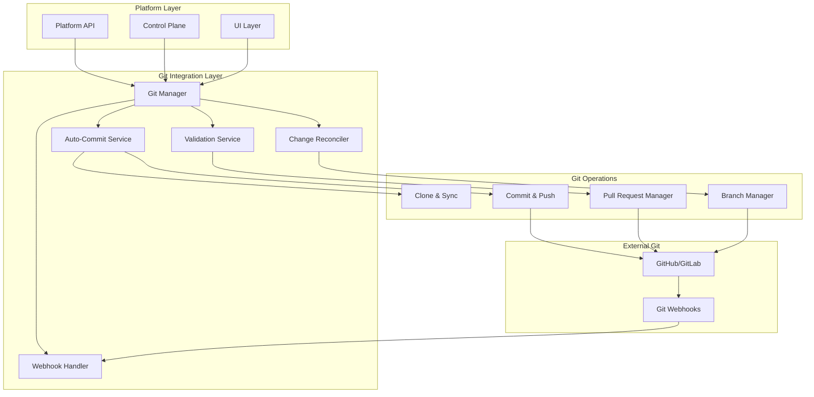

# Git Integration: Auto-Commit and Validation System

## 1. Overview

The Git integration layer manages the storage of desired state configurations in git repositories, handles automatic commits for platform-generated changes, and implements validation mechanisms to prevent drift between platform-managed state and manual modifications. This system ensures git remains the single source of truth while providing protection against configuration conflicts.

## 2. Architecture Design

### 2.1 Git Integration Components


### 2.2 Repository Structure
```
application-repo/
├── .idp/
│   ├── platform.yaml          # Platform metadata
│   ├── desired-state.yaml     # Current desired state
│   ├── validation.yaml        # Validation rules
│   └── history/              # Change history
│       ├── 2024-01-15-10-30-00.yaml
│       └── 2024-01-15-09-15-00.yaml
├── src/                      # Application source code
├── docker/                   # Container configurations
├── scripts/                  # Deployment scripts
├── docs/                     # Documentation
└── README.md
```

## 3. Git Manager Implementation

### 3.1 Core Git Manager
```go
type GitManager struct {
    gitProvider  GitProvider
    db          *sql.DB
    eventBus    EventBus
    config      GitManagerConfig
}

type GitManagerConfig struct {
    DefaultBranch    string `json:"default_branch"`
    PlatformBranch   string `json:"platform_branch"`
    AutoCommitEmail  string `json:"auto_commit_email"`
    AutoCommitName   string `json:"auto_commit_name"`
    ValidationEnabled bool  `json:"validation_enabled"`
    RequirePRs       bool   `json:"require_prs"`
}

type DesiredStateChange struct {
    ApplicationID uuid.UUID                `json:"application_id"`
    Changes       map[string]interface{}   `json:"changes"`
    Author        string                   `json:"author"`
    Message       string                   `json:"message"`
    Timestamp     time.Time               `json:"timestamp"`
}

func (gm *GitManager) UpdateDesiredState(ctx context.Context, change *DesiredStateChange) error {
    // Clone repository
    repo, err := gm.cloneRepository(ctx, change.ApplicationID)
    if err != nil {
        return fmt.Errorf("failed to clone repository: %w", err)
    }
    defer repo.Cleanup()
    
    // Create platform branch if it doesn't exist
    if gm.config.RequirePRs {
        branchName := fmt.Sprintf("platform/update-%d", time.Now().Unix())
        if err := repo.CreateBranch(branchName); err != nil {
            return fmt.Errorf("failed to create branch: %w", err)
        }
    }
    
    // Update desired state file
    if err := gm.updateDesiredStateFile(repo, change); err != nil {
        return fmt.Errorf("failed to update desired state: %w", err)
    }
    
    // Commit changes
    commitMsg := gm.generateCommitMessage(change)
    if err := repo.Commit(commitMsg, gm.config.AutoCommitEmail, gm.config.AutoCommitName); err != nil {
        return fmt.Errorf("failed to commit changes: %w", err)
    }
    
    // Push changes
    if err := repo.Push(); err != nil {
        return fmt.Errorf("failed to push changes: %w", err)
    }
    
    // Create PR if required
    if gm.config.RequirePRs {
        pr, err := gm.createPullRequest(ctx, repo, change)
        if err != nil {
            return fmt.Errorf("failed to create pull request: %w", err)
        }
        
        // Emit event for PR creation
        gm.eventBus.Emit(Event{
            Type: "git.pull_request_created",
            Data: map[string]interface{}{
                "application_id": change.ApplicationID,
                "pr_url":        pr.URL,
                "pr_number":     pr.Number,
            },
        })
    }
    
    return nil
}
```

### 3.2 Repository Operations
```go
type Repository struct {
    path         string
    gitClient    GitClient
    currentBranch string
}

func (r *Repository) UpdateFile(filePath string, content []byte) error {
    fullPath := filepath.Join(r.path, filePath)
    
    // Ensure directory exists
    if err := os.MkdirAll(filepath.Dir(fullPath), 0755); err != nil {
        return err
    }
    
    return os.WriteFile(fullPath, content, 0644)
}

func (r *Repository) Commit(message, email, name string) error {
    // Stage all changes in .idp directory
    if err := r.gitClient.Add(".idp/"); err != nil {
        return err
    }
    
    // Create commit
    return r.gitClient.Commit(message, CommitOptions{
        Author: CommitAuthor{
            Name:  name,
            Email: email,
        },
    })
}

func (r *Repository) CreateBranch(branchName string) error {
    if err := r.gitClient.CreateBranch(branchName); err != nil {
        return err
    }
    
    if err := r.gitClient.Checkout(branchName); err != nil {
        return err
    }
    
    r.currentBranch = branchName
    return nil
}
```

## 4. Auto-Commit Service

### 4.1 Commit Message Generation
```go
type CommitMessageGenerator struct {
    templates map[string]string
}

func NewCommitMessageGenerator() *CommitMessageGenerator {
    return &CommitMessageGenerator{
        templates: map[string]string{
            "resource_created": "[Platform] Create %s resource '%s'",
            "resource_updated": "[Platform] Update %s resource '%s'", 
            "resource_deleted": "[Platform] Delete %s resource '%s'",
            "config_updated":   "[Platform] Update application configuration",
            "scaling_changed":  "[Platform] Update scaling configuration",
        },
    }
}

func (cmg *CommitMessageGenerator) Generate(change *DesiredStateChange) string {
    if len(change.Changes) == 1 {
        // Single change - use specific template
        for key, value := range change.Changes {
            if resourceChange, ok := value.(map[string]interface{}); ok {
                if operation, ok := resourceChange["operation"].(string); ok {
                    template := cmg.templates[operation]
                    resourceType := resourceChange["type"].(string)
                    resourceName := resourceChange["name"].(string)
                    return fmt.Sprintf(template, resourceType, resourceName)
                }
            }
        }
    }
    
    // Multiple changes or generic change
    if change.Message != "" {
        return fmt.Sprintf("[Platform] %s", change.Message)
    }
    
    return fmt.Sprintf("[Platform] Update desired state (%d changes)", len(change.Changes))
}
```

### 4.2 Change Batching and Throttling
```go
type ChangeBuffer struct {
    changes     map[uuid.UUID][]*DesiredStateChange
    timers      map[uuid.UUID]*time.Timer
    batchDelay  time.Duration
    maxBatchSize int
    mu          sync.Mutex
}

func NewChangeBuffer(batchDelay time.Duration, maxBatchSize int) *ChangeBuffer {
    return &ChangeBuffer{
        changes:     make(map[uuid.UUID][]*DesiredStateChange),
        timers:      make(map[uuid.UUID]*time.Timer),
        batchDelay:  batchDelay,
        maxBatchSize: maxBatchSize,
    }
}

func (cb *ChangeBuffer) AddChange(change *DesiredStateChange) {
    cb.mu.Lock()
    defer cb.mu.Unlock()
    
    appID := change.ApplicationID
    
    // Add change to buffer
    cb.changes[appID] = append(cb.changes[appID], change)
    
    // If we hit max batch size, flush immediately
    if len(cb.changes[appID]) >= cb.maxBatchSize {
        cb.flushChanges(appID)
        return
    }
    
    // Reset timer for batching
    if timer, exists := cb.timers[appID]; exists {
        timer.Stop()
    }
    
    cb.timers[appID] = time.AfterFunc(cb.batchDelay, func() {
        cb.mu.Lock()
        defer cb.mu.Unlock()
        cb.flushChanges(appID)
    })
}

func (cb *ChangeBuffer) flushChanges(appID uuid.UUID) {
    changes := cb.changes[appID]
    if len(changes) == 0 {
        return
    }
    
    // Merge changes into single commit
    mergedChange := cb.mergeChanges(changes)
    
    // Clear buffer
    delete(cb.changes, appID)
    delete(cb.timers, appID)
    
    // Process merged change
    go cb.processChange(mergedChange)
}
```

## 5. Validation Service

### 5.1 Pre-Commit Validation
```go
type ValidationService struct {
    db        *sql.DB
    managers  *ResourceManagerRegistry
    gitClient GitClient
}

func (vs *ValidationService) ValidateDesiredState(ctx context.Context, appID uuid.UUID, desiredState map[string]interface{}) error {
    // Get application from database
    app, err := vs.getApplication(ctx, appID)
    if err != nil {
        return err
    }
    
    // Validate against resource manager schemas
    for resourceType, config := range desiredState {
        manager, err := vs.managers.Get(resourceType)
        if err != nil {
            return fmt.Errorf("unknown resource type: %s", resourceType)
        }
        
        if err := manager.ValidateConfig(config.(map[string]interface{})); err != nil {
            return fmt.Errorf("invalid %s configuration: %w", resourceType, err)
        }
    }
    
    // Check dependencies
    if err := vs.validateDependencies(ctx, desiredState); err != nil {
        return fmt.Errorf("dependency validation failed: %w", err)
    }
    
    // Check tenant quotas
    if err := vs.validateQuotas(ctx, app.TenantID, desiredState); err != nil {
        return fmt.Errorf("quota validation failed: %w", err)
    }
    
    return nil
}
```

### 5.2 Git Webhook Validation
```go
func (vs *ValidationService) HandleWebhook(ctx context.Context, webhook *GitWebhook) error {
    if webhook.Type != "push" {
        return nil // Only validate push events
    }
    
    // Check if changes involve platform-managed files
    platformFiles := vs.filterPlatformFiles(webhook.ModifiedFiles)
    if len(platformFiles) == 0 {
        return nil
    }
    
    // Validate platform files haven't been manually modified
    for _, file := range platformFiles {
        if err := vs.validatePlatformFile(ctx, webhook.Repository, file); err != nil {
            // Create issue or PR comment about validation failure
            return vs.createValidationIssue(ctx, webhook.Repository, file, err)
        }
    }
    
    return nil
}

func (vs *ValidationService) validatePlatformFile(ctx context.Context, repoURL, filePath string) error {
    // Get file content from git
    content, err := vs.gitClient.GetFileContent(repoURL, filePath)
    if err != nil {
        return err
    }
    
    // Parse desired state
    var desiredState map[string]interface{}
    if err := yaml.Unmarshal(content, &desiredState); err != nil {
        return fmt.Errorf("invalid YAML format: %w", err)
    }
    
    // Get expected state from database
    appID, err := vs.getApplicationIDFromRepo(repoURL)
    if err != nil {
        return err
    }
    
    app, err := vs.getApplication(ctx, appID)
    if err != nil {
        return err
    }
    
    // Compare states
    if !vs.compareStates(app.DesiredState, desiredState) {
        return fmt.Errorf("desired state has been manually modified")
    }
    
    return nil
}
```

## 6. Pull Request Management

### 6.1 Automated PR Creation
```go
type PullRequestManager struct {
    gitProvider GitProvider
    db         *sql.DB
    config     PRManagerConfig
}

type PRManagerConfig struct {
    AutoMergeEnabled     bool          `json:"auto_merge_enabled"`
    RequiredApprovals    int           `json:"required_approvals"`
    AutoMergeDelay      time.Duration `json:"auto_merge_delay"`
    DefaultReviewers    []string      `json:"default_reviewers"`
}

func (prm *PullRequestManager) CreatePullRequest(ctx context.Context, repo *Repository, change *DesiredStateChange) (*PullRequest, error) {
    prRequest := &PullRequestRequest{
        Title:       prm.generatePRTitle(change),
        Description: prm.generatePRDescription(change),
        Head:        repo.currentBranch,
        Base:        prm.config.DefaultBranch,
        Reviewers:   prm.getReviewers(change),
    }
    
    pr, err := prm.gitProvider.CreatePullRequest(ctx, repo.URL, prRequest)
    if err != nil {
        return nil, err
    }
    
    // Add platform labels
    labels := []string{"platform-managed", "desired-state-update"}
    if err := prm.gitProvider.AddLabels(ctx, pr.ID, labels); err != nil {
        log.Errorf("Failed to add labels to PR %d: %v", pr.Number, err)
    }
    
    // Schedule auto-merge if enabled
    if prm.config.AutoMergeEnabled {
        go prm.scheduleAutoMerge(ctx, pr)
    }
    
    return pr, nil
}

func (prm *PullRequestManager) generatePRDescription(change *DesiredStateChange) string {
    var builder strings.Builder
    
    builder.WriteString("## Platform-Generated Change\n\n")
    builder.WriteString("This pull request was automatically created by the IDP platform.\n\n")
    
    builder.WriteString("### Changes Summary\n")
    for key, value := range change.Changes {
        builder.WriteString(fmt.Sprintf("- **%s**: %v\n", key, value))
    }
    
    builder.WriteString("\n### Author\n")
    builder.WriteString(fmt.Sprintf("- **User**: %s\n", change.Author))
    builder.WriteString(fmt.Sprintf("- **Timestamp**: %s\n", change.Timestamp.Format(time.RFC3339)))
    
    builder.WriteString("\n### Validation\n")
    builder.WriteString("- ✅ Configuration validated\n")
    builder.WriteString("- ✅ Dependencies checked\n")
    builder.WriteString("- ✅ Quotas verified\n")
    
    return builder.String()
}
```

### 6.2 PR Status Checks
```go
type StatusCheckManager struct {
    gitProvider GitProvider
    validators  []StatusValidator
}

type StatusValidator interface {
    Name() string
    Validate(ctx context.Context, pr *PullRequest) error
}

func (scm *StatusCheckManager) RunStatusChecks(ctx context.Context, pr *PullRequest) error {
    for _, validator := range scm.validators {
        status := CheckStatus{
            Name:        validator.Name(),
            State:       "pending",
            Description: fmt.Sprintf("Running %s validation...", validator.Name()),
        }
        
        scm.gitProvider.CreateStatus(ctx, pr.Head.SHA, status)
        
        if err := validator.Validate(ctx, pr); err != nil {
            status.State = "failure"
            status.Description = fmt.Sprintf("Validation failed: %s", err.Error())
            scm.gitProvider.CreateStatus(ctx, pr.Head.SHA, status)
            return err
        }
        
        status.State = "success"
        status.Description = fmt.Sprintf("%s validation passed", validator.Name())
        scm.gitProvider.CreateStatus(ctx, pr.Head.SHA, status)
    }
    
    return nil
}

// Configuration Validator
type ConfigurationValidator struct {
    validationService *ValidationService
}

func (cv *ConfigurationValidator) Name() string {
    return "Configuration Validation"
}

func (cv *ConfigurationValidator) Validate(ctx context.Context, pr *PullRequest) error {
    // Get changed files
    files, err := cv.getChangedFiles(ctx, pr)
    if err != nil {
        return err
    }
    
    // Validate each configuration file
    for _, file := range files {
        if strings.HasSuffix(file.Path, ".yaml") && strings.Contains(file.Path, ".idp/") {
            if err := cv.validateConfigFile(ctx, file); err != nil {
                return fmt.Errorf("validation failed for %s: %w", file.Path, err)
            }
        }
    }
    
    return nil
}
```

## 7. Conflict Resolution

### 7.1 Drift Detection
```go
type DriftDetector struct {
    gitManager GitManager
    db        *sql.DB
    scheduler  *cron.Cron
}

func (dd *DriftDetector) StartDriftDetection() {
    // Run drift detection every hour
    dd.scheduler.AddFunc("0 * * * *", dd.detectDrift)
    dd.scheduler.Start()
}

func (dd *DriftDetector) detectDrift() {
    applications, err := dd.getAllApplications()
    if err != nil {
        log.Errorf("Failed to get applications: %v", err)
        return
    }
    
    for _, app := range applications {
        if err := dd.checkApplicationDrift(app); err != nil {
            log.Errorf("Drift detection failed for app %s: %v", app.ID, err)
        }
    }
}

func (dd *DriftDetector) checkApplicationDrift(app *Application) error {
    // Get desired state from git
    gitState, err := dd.gitManager.GetDesiredStateFromGit(app.ID)
    if err != nil {
        return err
    }
    
    // Compare with database state
    if !dd.compareStates(app.DesiredState, gitState) {
        // Drift detected - create drift event
        event := DriftEvent{
            ApplicationID: app.ID,
            DatabaseState: app.DesiredState,
            GitState:     gitState,
            DetectedAt:   time.Now(),
        }
        
        return dd.handleDrift(event)
    }
    
    return nil
}

func (dd *DriftDetector) handleDrift(event DriftEvent) error {
    // Create issue in git repository
    issue := &IssueRequest{
        Title: fmt.Sprintf("Configuration Drift Detected - Application %s", event.ApplicationID),
        Body:  dd.generateDriftIssueBody(event),
        Labels: []string{"configuration-drift", "platform-managed"},
    }
    
    _, err := dd.gitManager.CreateIssue(event.ApplicationID, issue)
    return err
}
```

This Git integration system provides robust version control for desired state configurations while preventing manual drift and maintaining git as the single source of truth for all platform-managed resources.
