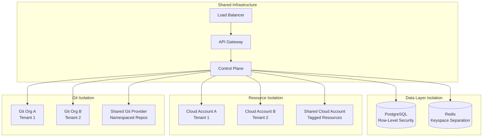

# Multi-Tenant Architecture for Commercial Platform

## 1. Overview

The multi-tenant architecture enables the IDP platform to serve multiple organizations (tenants) from a single deployment while ensuring complete data isolation, resource separation, and customizable configurations. This design supports both single-tenant deployments and large-scale commercial SaaS offerings with thousands of tenants.

## 2. Tenancy Models

### 2.1 Tenant Isolation Levels


### 2.2 Database Isolation Strategy

**Platform Data**: Single PostgreSQL database with component schemas  
**Tenant Data**: Dedicated database per tenant for security and compliance

```yaml
# Tenant database isolation models
database_isolation:
  platform_components:
    approach: "Single database, multiple schemas"
    schemas: [control_plane, api_gateway, resource_management, git_integration, user_management, audit_system]
    rationale: "Platform components can share infrastructure for operational simplicity"
    
  tenant_data:
    approach: "Database per tenant"
    
    standard_tenants:
      isolation: "Dedicated database on shared cluster"  
      naming: "tenant_{tenant_id_short}"
      features: [automated_provisioning, shared_cluster, standard_backup]
      
    enterprise_tenants:
      isolation: "Dedicated database server"
      naming: "enterprise_{tenant_name}"  
      features: [dedicated_infrastructure, custom_backup, sla_guarantees]
```

## 3. Database Multi-Tenancy

### 3.1 Row-Level Security (RLS) Implementation
```sql
-- Enable RLS on all tenant-scoped tables
ALTER TABLE applications ENABLE ROW LEVEL SECURITY;
ALTER TABLE resources ENABLE ROW LEVEL SECURITY;
ALTER TABLE users ENABLE ROW LEVEL SECURITY;
ALTER TABLE audit_log ENABLE ROW LEVEL SECURITY;

-- Create RLS policies
CREATE POLICY tenant_isolation_applications ON applications
    USING (tenant_id = current_setting('app.current_tenant_id')::uuid);

CREATE POLICY tenant_isolation_resources ON resources  
    USING (tenant_id = current_setting('app.current_tenant_id')::uuid);

CREATE POLICY tenant_isolation_users ON users
    USING (tenant_id = current_setting('app.current_tenant_id')::uuid);

CREATE POLICY tenant_isolation_audit ON audit_log
    USING (tenant_id = current_setting('app.current_tenant_id')::uuid);

-- Function to set tenant context
CREATE OR REPLACE FUNCTION set_tenant_context(p_tenant_id UUID)
RETURNS VOID AS $$
BEGIN
    PERFORM set_config('app.current_tenant_id', p_tenant_id::text, true);
END;
$$ LANGUAGE plpgsql;
```

### 3.2 Tenant Context Management
```go
type TenantContext struct {
    TenantID   uuid.UUID `json:"tenant_id"`
    TenantName string    `json:"tenant_name"`
    Plan       string    `json:"plan"`
    Features   []string  `json:"features"`
    Limits     TenantLimits `json:"limits"`
}

type TenantLimits struct {
    MaxApplications  int `json:"max_applications"`
    MaxUsers         int `json:"max_users"`
    MaxResources     int `json:"max_resources"`
    MaxStorageGB     int `json:"max_storage_gb"`
    MaxBandwidthGB   int `json:"max_bandwidth_gb"`
    RateLimit        int `json:"rate_limit_per_minute"`
}

type TenantContextMiddleware struct {
    db              *sql.DB
    tenantExtractor TenantExtractor
}

func (tcm *TenantContextMiddleware) Handle(next http.Handler) http.Handler {
    return http.HandlerFunc(func(w http.ResponseWriter, r *http.Request) {
        // Extract tenant context from request
        tenantCtx, err := tcm.tenantExtractor.Extract(r)
        if err != nil {
            http.Error(w, "Invalid tenant context", http.StatusBadRequest)
            return
        }
        
        // Validate tenant exists and is active
        tenant, err := tcm.getTenant(tenantCtx.TenantID)
        if err != nil {
            http.Error(w, "Tenant not found", http.StatusNotFound)
            return
        }
        
        if tenant.Status != "active" {
            http.Error(w, "Tenant suspended", http.StatusForbidden)
            return
        }
        
        // Set database context
        db := tcm.getDBWithTenantContext(tenantCtx.TenantID)
        
        // Add to request context
        ctx := context.WithValue(r.Context(), "tenant", tenantCtx)
        ctx = context.WithValue(ctx, "db", db)
        
        next.ServeHTTP(w, r.WithContext(ctx))
    })
}

func (tcm *TenantContextMiddleware) getDBWithTenantContext(tenantID uuid.UUID) *sql.DB {
    db, _ := tcm.db.Conn(context.Background())
    
    // Set tenant context in database session
    _, err := db.ExecContext(context.Background(), 
        "SELECT set_tenant_context($1)", tenantID)
    if err != nil {
        log.Errorf("Failed to set tenant context: %v", err)
    }
    
    return tcm.db // Return configured connection
}
```

## 4. Tenant Extraction Strategies

### 4.1 Domain-Based Tenant Extraction
```go
type DomainTenantExtractor struct {
    db                    *sql.DB
    defaultTenantID       uuid.UUID
    subdomainToTenantMap  map[string]uuid.UUID
}

func (dte *DomainTenantExtractor) Extract(r *http.Request) (*TenantContext, error) {
    host := r.Host
    
    // Remove port if present
    if colonIndex := strings.Index(host, ":"); colonIndex != -1 {
        host = host[:colonIndex]
    }
    
    // Extract subdomain
    parts := strings.Split(host, ".")
    if len(parts) < 3 {
        return dte.getDefaultTenant()
    }
    
    subdomain := parts[0]
    
    // Look up tenant by subdomain
    tenantID, exists := dte.subdomainToTenantMap[subdomain]
    if !exists {
        // Query database for dynamic lookup
        tenantID, err := dte.getTenantBySubdomain(subdomain)
        if err != nil {
            return nil, fmt.Errorf("tenant not found for subdomain: %s", subdomain)
        }
        
        // Cache result
        dte.subdomainToTenantMap[subdomain] = tenantID
    }
    
    return dte.getTenantContext(tenantID)
}
```

### 4.2 Header-Based Tenant Extraction  
```go
type HeaderTenantExtractor struct {
    db         *sql.DB
    headerName string // e.g., "X-Tenant-ID" or "Authorization"
}

func (hte *HeaderTenantExtractor) Extract(r *http.Request) (*TenantContext, error) {
    // Extract from custom header
    tenantHeader := r.Header.Get(hte.headerName)
    if tenantHeader == "" {
        return nil, errors.New("tenant header not provided")
    }
    
    var tenantID uuid.UUID
    var err error
    
    if hte.headerName == "Authorization" {
        // Extract tenant from JWT token
        token := strings.TrimPrefix(tenantHeader, "Bearer ")
        tenantID, err = hte.extractTenantFromJWT(token)
    } else {
        // Direct tenant ID in header
        tenantID, err = uuid.Parse(tenantHeader)
    }
    
    if err != nil {
        return nil, fmt.Errorf("invalid tenant identifier: %w", err)
    }
    
    return hte.getTenantContext(tenantID)
}

func (hte *HeaderTenantExtractor) extractTenantFromJWT(tokenString string) (uuid.UUID, error) {
    token, err := jwt.Parse(tokenString, func(token *jwt.Token) (interface{}, error) {
        return []byte(os.Getenv("JWT_SECRET")), nil
    })
    
    if err != nil {
        return uuid.Nil, err
    }
    
    if claims, ok := token.Claims.(jwt.MapClaims); ok && token.Valid {
        if tenantIDStr, ok := claims["tenant_id"].(string); ok {
            return uuid.Parse(tenantIDStr)
        }
    }
    
    return uuid.Nil, errors.New("tenant_id not found in JWT claims")
}
```

## 5. Resource Isolation and Quotas

### 5.1 Resource Quota Management
```go
type QuotaManager struct {
    db        *sql.DB
    redis     *redis.Client
    quotaCache *cache.Cache
}

type ResourceQuota struct {
    TenantID      uuid.UUID `json:"tenant_id"`
    ResourceType  string    `json:"resource_type"`
    Limit         int       `json:"limit"`
    Used          int       `json:"used"`
    Available     int       `json:"available"`
}

func (qm *QuotaManager) CheckQuota(ctx context.Context, tenantID uuid.UUID, resourceType string, requestedQuantity int) error {
    quota, err := qm.getQuota(ctx, tenantID, resourceType)
    if err != nil {
        return err
    }
    
    if quota.Available < requestedQuantity {
        return &QuotaExceededError{
            TenantID:     tenantID,
            ResourceType: resourceType,
            Requested:    requestedQuantity,
            Available:    quota.Available,
        }
    }
    
    return nil
}

func (qm *QuotaManager) ConsumeQuota(ctx context.Context, tenantID uuid.UUID, resourceType string, quantity int) error {
    // Use Redis for atomic quota consumption
    key := fmt.Sprintf("quota:%s:%s", tenantID, resourceType)
    
    // Lua script for atomic decrement with limit check
    script := `
        local key = KEYS[1]
        local quantity = tonumber(ARGV[1])
        local current = tonumber(redis.call('GET', key) or 0)
        local limit = tonumber(redis.call('HGET', key .. ':limit', 'value') or 0)
        
        if current + quantity > limit then
            return -1
        else
            redis.call('INCRBY', key, quantity)
            return current + quantity
        end
    `
    
    result, err := qm.redis.Eval(ctx, script, []string{key}, quantity).Result()
    if err != nil {
        return err
    }
    
    if result.(int64) == -1 {
        return &QuotaExceededError{
            TenantID:     tenantID,
            ResourceType: resourceType,
            Requested:    quantity,
        }
    }
    
    return nil
}
```

### 5.2 Cloud Resource Tagging Strategy
```go
type CloudResourceTagger struct {
    cloudProvider CloudProvider
}

func (crt *CloudResourceTagger) TagResource(ctx context.Context, resourceID string, tenantCtx *TenantContext) error {
    tags := map[string]string{
        "tenant_id":         tenantCtx.TenantID.String(),
        "tenant_name":       tenantCtx.TenantName,
        "managed_by":        "idp-platform",
        "tenant_plan":       tenantCtx.Plan,
        "billing_account":   crt.getBillingAccount(tenantCtx),
        "environment":       "production",
    }
    
    return crt.cloudProvider.TagResource(ctx, resourceID, tags)
}

func (crt *CloudResourceTagger) getBillingAccount(tenantCtx *TenantContext) string {
    // Return appropriate billing account based on tenant plan
    switch tenantCtx.Plan {
    case "enterprise_dedicated":
        return fmt.Sprintf("dedicated-%s", tenantCtx.TenantID)
    case "professional_isolated":
        return "shared-professional"
    default:
        return "shared-standard"
    }
}
```

## 6. Git Repository Isolation

### 6.1 Git Organization Management
```go
type GitOrganizationManager struct {
    gitProvider GitProvider
    config      GitOrgConfig
}

type GitOrgConfig struct {
    SharedOrgName        string            `json:"shared_org_name"`
    DedicatedOrgTemplate string            `json:"dedicated_org_template"`
    RepoNamingPatterns   map[string]string `json:"repo_naming_patterns"`
}

func (gom *GitOrganizationManager) GetRepositoryName(tenantCtx *TenantContext, appName string) string {
    switch tenantCtx.Plan {
    case "enterprise_dedicated":
        // Dedicated organization, simple app name
        return appName
    
    case "professional_isolated":
        // Shared organization with tenant prefix
        return fmt.Sprintf("%s-%s", tenantCtx.TenantName, appName)
        
    default:
        // Shared organization with tenant ID prefix
        return fmt.Sprintf("tenant-%s-%s", tenantCtx.TenantID.String()[:8], appName)
    }
}

func (gom *GitOrganizationManager) GetOrganizationName(tenantCtx *TenantContext) string {
    switch tenantCtx.Plan {
    case "enterprise_dedicated":
        return fmt.Sprintf("%s-org", tenantCtx.TenantName)
    default:
        return gom.config.SharedOrgName
    }
}

func (gom *GitOrganizationManager) CreateTenantOrganization(ctx context.Context, tenantCtx *TenantContext) error {
    if tenantCtx.Plan != "enterprise_dedicated" {
        return nil // No dedicated org needed
    }
    
    orgName := gom.GetOrganizationName(tenantCtx)
    
    orgConfig := GitOrganizationConfig{
        Name:        orgName,
        Description: fmt.Sprintf("Git organization for %s", tenantCtx.TenantName),
        Private:     true,
        Settings: map[string]interface{}{
            "default_repository_permission": "read",
            "members_can_create_repositories": false,
            "two_factor_requirement": true,
        },
    }
    
    _, err := gom.gitProvider.CreateOrganization(ctx, orgConfig)
    return err
}
```

## 7. Billing and Metering

### 7.1 Usage Metering System
```go
type MeteringService struct {
    db           *sql.DB
    eventBus     EventBus
    billingSvc   BillingService
}

type UsageEvent struct {
    TenantID     uuid.UUID              `json:"tenant_id"`
    EventType    string                 `json:"event_type"`
    ResourceType string                 `json:"resource_type"`
    ResourceID   uuid.UUID              `json:"resource_id"`
    Quantity     float64                `json:"quantity"`
    Unit         string                 `json:"unit"`
    Metadata     map[string]interface{} `json:"metadata"`
    Timestamp    time.Time              `json:"timestamp"`
}

func (ms *MeteringService) RecordUsage(ctx context.Context, event *UsageEvent) error {
    // Store usage event
    if err := ms.storeUsageEvent(ctx, event); err != nil {
        return err
    }
    
    // Update aggregated metrics
    if err := ms.updateAggregates(ctx, event); err != nil {
        return err
    }
    
    // Check if billing thresholds are crossed
    if err := ms.checkBillingThresholds(ctx, event); err != nil {
        return err
    }
    
    return nil
}

func (ms *MeteringService) GetUsageSummary(ctx context.Context, tenantID uuid.UUID, period string) (*UsageSummary, error) {
    query := `
        SELECT 
            resource_type,
            SUM(quantity) as total_quantity,
            unit,
            COUNT(*) as event_count
        FROM usage_events 
        WHERE tenant_id = $1 
          AND timestamp >= $2 
          AND timestamp <= $3
        GROUP BY resource_type, unit
    `
    
    start, end := ms.getPeriodRange(period)
    rows, err := ms.db.QueryContext(ctx, query, tenantID, start, end)
    if err != nil {
        return nil, err
    }
    defer rows.Close()
    
    summary := &UsageSummary{
        TenantID: tenantID,
        Period:   period,
        Resources: make(map[string]*ResourceUsage),
    }
    
    for rows.Next() {
        var resourceType, unit string
        var totalQuantity float64
        var eventCount int
        
        if err := rows.Scan(&resourceType, &totalQuantity, &unit, &eventCount); err != nil {
            return nil, err
        }
        
        summary.Resources[resourceType] = &ResourceUsage{
            Type:         resourceType,
            TotalQuantity: totalQuantity,
            Unit:         unit,
            EventCount:   eventCount,
        }
    }
    
    return summary, nil
}
```

### 7.2 Cost Calculation and Billing
```go
type BillingService struct {
    db            *sql.DB
    meteringService *MeteringService
    priceBook     PriceBook
}

type PriceBook struct {
    ResourcePrices map[string]*ResourcePrice `json:"resource_prices"`
    PlanPrices     map[string]*PlanPrice     `json:"plan_prices"`
}

type ResourcePrice struct {
    BasePrice     float64   `json:"base_price"`
    Unit          string    `json:"unit"`
    TieredPricing []PriceTier `json:"tiered_pricing"`
}

type PriceTier struct {
    From     float64 `json:"from"`
    To       float64 `json:"to"`
    Price    float64 `json:"price"`
}

func (bs *BillingService) CalculateMonthlyBill(ctx context.Context, tenantID uuid.UUID, month time.Time) (*Bill, error) {
    // Get usage summary for the month
    usage, err := bs.meteringService.GetUsageSummary(ctx, tenantID, "monthly")
    if err != nil {
        return nil, err
    }
    
    bill := &Bill{
        TenantID:   tenantID,
        Period:     month,
        LineItems:  make([]*LineItem, 0),
        TotalAmount: 0.0,
    }
    
    // Calculate base plan cost
    tenant, err := bs.getTenant(ctx, tenantID)
    if err != nil {
        return nil, err
    }
    
    planPrice := bs.priceBook.PlanPrices[tenant.Plan]
    bill.LineItems = append(bill.LineItems, &LineItem{
        Description: fmt.Sprintf("%s Plan", tenant.Plan),
        Quantity:    1,
        UnitPrice:   planPrice.MonthlyPrice,
        Total:       planPrice.MonthlyPrice,
    })
    bill.TotalAmount += planPrice.MonthlyPrice
    
    // Calculate usage-based costs
    for resourceType, resourceUsage := range usage.Resources {
        cost := bs.calculateResourceCost(resourceType, resourceUsage)
        
        bill.LineItems = append(bill.LineItems, &LineItem{
            Description: fmt.Sprintf("%s Usage", resourceType),
            Quantity:    resourceUsage.TotalQuantity,
            UnitPrice:   cost / resourceUsage.TotalQuantity,
            Total:       cost,
        })
        bill.TotalAmount += cost
    }
    
    return bill, nil
}
```

## 8. Tenant Provisioning and Lifecycle

### 8.1 Tenant Onboarding
```go
type TenantProvisioningService struct {
    db                 *sql.DB
    gitManager         *GitManager
    cloudManager       CloudManager
    billingService     *BillingService
    eventBus           EventBus
}

type TenantProvisioningRequest struct {
    TenantName     string            `json:"tenant_name"`
    Plan           string            `json:"plan"`
    AdminUser      UserCreateRequest `json:"admin_user"`
    CloudProvider  string            `json:"cloud_provider"`
    GitProvider    string            `json:"git_provider"`
    CustomDomain   string            `json:"custom_domain,omitempty"`
    Configuration  map[string]interface{} `json:"configuration"`
}

func (tps *TenantProvisioningService) ProvisionTenant(ctx context.Context, req *TenantProvisioningRequest) (*Tenant, error) {
    // Start provisioning workflow
    workflow := NewTenantProvisioningWorkflow(req)
    
    // Step 1: Create tenant record
    tenant, err := tps.createTenantRecord(ctx, req)
    if err != nil {
        return nil, fmt.Errorf("failed to create tenant record: %w", err)
    }
    
    workflow.SetTenantID(tenant.ID)
    
    // Step 2: Setup cloud resources (if dedicated)
    if req.Plan == "enterprise_dedicated" {
        if err := tps.setupDedicatedCloudResources(ctx, tenant); err != nil {
            tps.rollbackTenant(ctx, tenant.ID)
            return nil, fmt.Errorf("failed to setup cloud resources: %w", err)
        }
    }
    
    // Step 3: Setup git organization (if dedicated)
    if req.Plan == "enterprise_dedicated" {
        if err := tps.setupGitOrganization(ctx, tenant); err != nil {
            tps.rollbackTenant(ctx, tenant.ID)
            return nil, fmt.Errorf("failed to setup git organization: %w", err)
        }
    }
    
    // Step 4: Create admin user
    adminUser, err := tps.createAdminUser(ctx, tenant.ID, req.AdminUser)
    if err != nil {
        tps.rollbackTenant(ctx, tenant.ID)
        return nil, fmt.Errorf("failed to create admin user: %w", err)
    }
    
    // Step 5: Setup billing
    if err := tps.billingService.SetupTenantBilling(ctx, tenant.ID, req.Plan); err != nil {
        tps.rollbackTenant(ctx, tenant.ID)
        return nil, fmt.Errorf("failed to setup billing: %w", err)
    }
    
    // Step 6: Configure custom domain (if provided)
    if req.CustomDomain != "" {
        if err := tps.setupCustomDomain(ctx, tenant.ID, req.CustomDomain); err != nil {
            // Don't rollback for domain setup failures
            log.Errorf("Failed to setup custom domain: %v", err)
        }
    }
    
    // Mark tenant as active
    tenant.Status = "active"
    if err := tps.updateTenantStatus(ctx, tenant.ID, "active"); err != nil {
        return nil, err
    }
    
    // Emit provisioning complete event
    tps.eventBus.Emit(Event{
        Type: "tenant.provisioned",
        Data: map[string]interface{}{
            "tenant_id":   tenant.ID,
            "tenant_name": tenant.Name,
            "plan":        tenant.Plan,
            "admin_user":  adminUser.ID,
        },
    })
    
    return tenant, nil
}
```

This multi-tenant architecture provides complete isolation and scalability for commercial platform offerings while maintaining operational efficiency and cost-effectiveness.
