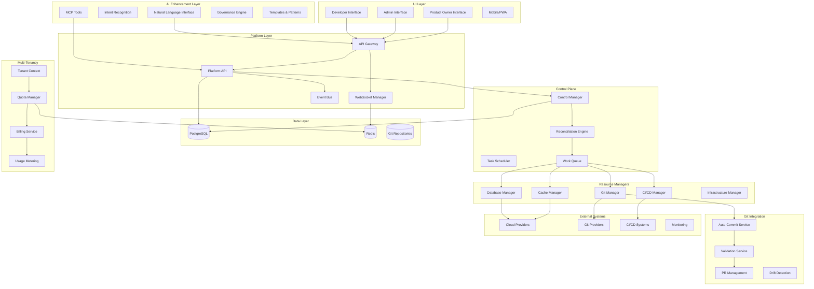

# Platform Layer Implementation Roadmap

## 1. Overview

This document provides a comprehensive implementation roadmap for the IDP Platform Layer, building upon the AI-powered enhancement layer. The platform is designed to scale to 4,000+ developers while supporting commercial multi-tenant deployments.

## 2. Architecture Summary

### 2.1 Complete System Architecture


### 2.2 Key Design Decisions
- **Custom Control Plane**: PostgreSQL-based instead of Kubernetes/etcd for better scaling
- **Multi-Tenant Ready**: Row-level security and resource isolation
- **Git-Centric**: All desired state stored in git repositories
- **Real-Time Updates**: WebSocket-based real-time communication
- **Pluggable Architecture**: Resource managers for easy extensibility
- **Role-Based Access**: Different interfaces for different user types

## 3. Implementation Phases

### 3.1 Phase 1: Core Platform Foundation (Weeks 1-8)
```yaml
deliverables:
  - Basic API Gateway with authentication
  - PostgreSQL database schema with RLS
  - Control plane with simple reconciliation
  - Basic resource managers (Git, Database)
  - Developer UI with basic functionality
  - Single-tenant deployment

components:
  api_gateway:
    priority: high
    estimated_effort: 2_weeks
    dependencies: []
    
  database_schema:
    priority: high
    estimated_effort: 1_week
    dependencies: []
    
  control_plane_core:
    priority: high
    estimated_effort: 3_weeks
    dependencies: [database_schema]
    
  git_resource_manager:
    priority: high
    estimated_effort: 2_weeks
    dependencies: [control_plane_core]
    
  basic_ui:
    priority: medium
    estimated_effort: 2_weeks
    dependencies: [api_gateway]

success_criteria:
  - Developers can create applications via UI
  - Git repositories are automatically created
  - Basic reconciliation works
  - Single-tenant deployment is stable
```

### 3.2 Phase 2: Resource Management & Real-Time (Weeks 9-16)
```yaml
deliverables:
  - Database and cache resource managers
  - CI/CD pipeline integration
  - WebSocket real-time updates
  - Advanced UI with real-time features
  - Git auto-commit and validation

components:
  database_manager:
    priority: high
    estimated_effort: 2_weeks
    dependencies: [control_plane_core]
    
  cache_manager:
    priority: high
    estimated_effort: 1_week
    dependencies: [database_manager]
    
  cicd_manager:
    priority: high
    estimated_effort: 2_weeks
    dependencies: [git_resource_manager]
    
  websocket_system:
    priority: high
    estimated_effort: 1_week
    dependencies: [api_gateway]
    
  git_automation:
    priority: medium
    estimated_effort: 2_weeks
    dependencies: [git_resource_manager]
    
  advanced_ui:
    priority: medium
    estimated_effort: 2_weeks
    dependencies: [websocket_system]

success_criteria:
  - Full resource lifecycle management
  - Real-time status updates in UI
  - Automatic git commits work
  - CI/CD pipelines are created automatically
```

### 3.3 Phase 3: Multi-Tenancy & Scaling (Weeks 17-24)
```yaml
deliverables:
  - Multi-tenant architecture
  - Quota and billing systems
  - Advanced role-based access control
  - Administrative interfaces
  - Performance optimization

components:
  multi_tenancy:
    priority: high
    estimated_effort: 3_weeks
    dependencies: [database_schema, api_gateway]
    
  quota_system:
    priority: high
    estimated_effort: 2_weeks
    dependencies: [multi_tenancy]
    
  billing_system:
    priority: medium
    estimated_effort: 2_weeks
    dependencies: [quota_system]
    
  admin_ui:
    priority: medium
    estimated_effort: 1_week
    dependencies: [multi_tenancy]
    
  performance_optimization:
    priority: medium
    estimated_effort: 2_weeks
    dependencies: [multi_tenancy]

success_criteria:
  - Multiple tenants can be onboarded
  - Resource quotas are enforced
  - Billing metrics are collected
  - Platform scales to 1000+ users
```

### 3.4 Phase 4: AI Integration & Polish (Weeks 25-32)
```yaml
deliverables:
  - Full AI layer integration
  - MCP tools implementation
  - Advanced validation and governance
  - Mobile/PWA interface
  - Commercial deployment readiness

components:
  ai_integration:
    priority: high
    estimated_effort: 3_weeks
    dependencies: [control_plane_core, git_automation]
    
  mcp_tools:
    priority: high
    estimated_effort: 2_weeks
    dependencies: [ai_integration]
    
  advanced_governance:
    priority: medium
    estimated_effort: 2_weeks
    dependencies: [ai_integration]
    
  mobile_interface:
    priority: low
    estimated_effort: 1_week
    dependencies: [advanced_ui]
    
  commercial_deployment:
    priority: high
    estimated_effort: 2_weeks
    dependencies: [billing_system, performance_optimization]

success_criteria:
  - AI can create and manage applications
  - MCP tools work seamlessly
  - Platform ready for commercial use
  - Mobile interface is functional
```

## 4. Technology Stack Recommendations

### 4.1 Backend Services
```yaml
core_platform:
  language: Go 1.21+
  framework: gin-gonic/gin or echo
  database: 
    platform: "Single PostgreSQL 15+ with component schemas"
    tenants: "Database per tenant for isolation"
  cache: Redis 7+ (shared for platform, isolated for tenants)
  message_queue: Redis Streams or Apache Kafka
  
api_gateway:
  option_1: Kong (feature-rich, plugin ecosystem)
  option_2: Envoy Proxy (high performance)
  option_3: Custom Go implementation (full control)
  
control_plane:
  language: Go
  database: PostgreSQL with connection pooling
  work_queue: Redis with reliable queues
  monitoring: Prometheus + Grafana
  
resource_managers:
  cloud_providers:
    - AWS SDK Go v2
    - GCP Client Libraries
    - Azure SDK for Go
  git_providers:
    - GitHub API v4 (GraphQL)
    - GitLab API v4
  cicd_systems:
    - GitHub Actions API
    - GitLab CI API
    - Jenkins API
```

### 4.2 Frontend Applications
```yaml
web_ui:
  approach: Vanilla JavaScript + Web Standards
  components: Native Web Components (Custom Elements)
  state_management: Custom lightweight state management
  routing: Native History API with URL routing
  styling: Modern CSS with Custom Properties
  charts: Chart.js or D3.js
  websocket: Native WebSocket API with reconnection logic
  
mobile_pwa:
  approach: Progressive Web App with Service Workers
  offline_support: Cache API + IndexedDB
  notifications: Web Push API
  installation: Native web app manifest
  
development_tools:
  bundler: Vite (minimal - mainly for dev experience)
  testing: Vitest with native DOM testing
  linting: ESLint + Prettier
  type_checking: Optional TypeScript for complex logic
```

### 4.3 Infrastructure & Deployment
```yaml
containerization:
  runtime: Docker
  orchestration: Kubernetes or Docker Swarm
  registry: Private container registry
  
deployment:
  strategy: Blue-green or Rolling updates
  automation: GitOps with ArgoCD or Flux
  environments: dev, staging, production
  
monitoring:
  metrics: Prometheus + Grafana
  logging: ELK Stack or Loki
  tracing: Jaeger or OpenTelemetry
  alerting: AlertManager + PagerDuty
  
security:
  secrets: Vault or Kubernetes Secrets
  scanning: Trivy for container scanning
  policies: OPA (Open Policy Agent)
  compliance: SOC 2, ISO 27001 ready
```

## 5. Database Design and Migrations

### 5.1 Core Schema Evolution
```sql
-- Migration 001: Initial schema
CREATE EXTENSION IF NOT EXISTS "uuid-ossp";
CREATE EXTENSION IF NOT EXISTS "pgcrypto";

-- Migration 002: Multi-tenancy setup
ALTER TABLE applications ADD COLUMN tenant_id UUID NOT NULL;
ALTER TABLE resources ADD COLUMN tenant_id UUID NOT NULL;
ENABLE ROW LEVEL SECURITY;

-- Migration 003: Audit logging
CREATE TABLE audit_log (
    id UUID PRIMARY KEY DEFAULT gen_random_uuid(),
    tenant_id UUID NOT NULL,
    table_name VARCHAR(100) NOT NULL,
    record_id UUID NOT NULL,
    operation VARCHAR(10) NOT NULL,
    old_values JSONB,
    new_values JSONB,
    user_id VARCHAR(255),
    timestamp TIMESTAMP WITH TIME ZONE DEFAULT NOW()
);

-- Migration 004: Resource quotas
CREATE TABLE tenant_quotas (
    id UUID PRIMARY KEY DEFAULT gen_random_uuid(),
    tenant_id UUID NOT NULL,
    resource_type VARCHAR(100) NOT NULL,
    quota_limit INTEGER NOT NULL,
    quota_used INTEGER DEFAULT 0,
    UNIQUE(tenant_id, resource_type)
);
```

### 5.2 Performance Optimization
```sql
-- Indexes for common queries
CREATE INDEX CONCURRENTLY idx_applications_tenant_status 
ON applications(tenant_id, status) WHERE status != 'deleted';

CREATE INDEX CONCURRENTLY idx_resources_tenant_type 
ON resources(tenant_id, type) WHERE status = 'ready';

CREATE INDEX CONCURRENTLY idx_operations_status_priority 
ON reconciliation_operations(status, priority DESC) 
WHERE status IN ('pending', 'retrying');

-- Partitioning for audit logs
CREATE TABLE audit_log_y2024m01 PARTITION OF audit_log
FOR VALUES FROM ('2024-01-01') TO ('2024-02-01');

-- Connection pooling configuration
-- max_connections = 200
-- shared_buffers = 256MB
-- effective_cache_size = 1GB
-- work_mem = 4MB
```

## 6. Security Considerations

### 6.1 Security Architecture
```yaml
authentication:
  primary: JWT tokens with RS256
  refresh: Secure HTTP-only cookies
  mfa: TOTP (Google Authenticator compatible)
  sso: OIDC integration (OAuth 2.0)
  
authorization:
  model: Role-Based Access Control (RBAC)
  enforcement: API Gateway + Database RLS
  policies: Defined in code and database
  
data_protection:
  encryption_at_rest: Database TDE, encrypted storage
  encryption_in_transit: TLS 1.3 everywhere
  key_management: HashiCorp Vault or cloud KMS
  pii_handling: GDPR/CCPA compliant
  
network_security:
  api_security: Rate limiting, IP whitelisting
  internal_communication: mTLS between services
  vulnerability_scanning: Automated security scans
  penetration_testing: Quarterly pen tests
```

### 6.2 Compliance Framework
```yaml
compliance_standards:
  - SOC 2 Type II
  - ISO 27001
  - GDPR (for EU customers)
  - CCPA (for California customers)
  
security_controls:
  access_logging: All API calls logged
  data_retention: Configurable per tenant
  backup_encryption: All backups encrypted
  incident_response: Automated alerting
  
audit_requirements:
  user_actions: Full audit trail
  system_changes: Configuration changes logged
  data_access: All data access logged
  export_capabilities: Audit log export
```

## 7. Performance and Scalability

### 7.1 Performance Targets
```yaml
api_performance:
  response_time_p95: 200ms
  response_time_p99: 500ms
  throughput: 10,000 RPS
  availability: 99.9%
  
database_performance:
  connection_pooling: 100 connections per service
  query_timeout: 30 seconds
  slow_query_threshold: 1 second
  replication_lag: < 1 second
  
ui_performance:
  first_contentful_paint: < 2 seconds
  largest_contentful_paint: < 3 seconds
  time_to_interactive: < 4 seconds
  cumulative_layout_shift: < 0.1
```

### 7.2 Scaling Strategy
```yaml
horizontal_scaling:
  api_services: Auto-scaling based on CPU/memory
  control_plane: Multiple instances with leader election
  resource_managers: Stateless, easily scalable
  ui_services: CDN + multiple geographic regions
  
vertical_scaling:
  database: Read replicas + connection pooling
  redis: Clustering for high availability
  storage: Auto-scaling cloud storage
  
caching_strategy:
  api_responses: Redis with TTL
  database_queries: Query result caching
  static_assets: CDN with long cache times
  user_sessions: Redis-backed sessions
```

## 8. Monitoring and Observability

### 8.1 Monitoring Stack
```yaml
metrics:
  collection: Prometheus
  visualization: Grafana dashboards
  alerting: AlertManager + Slack/PagerDuty
  retention: 30 days high-res, 1 year aggregated
  
logging:
  collection: Fluentd or Vector
  storage: Elasticsearch or Loki
  analysis: Kibana or Grafana
  retention: 90 days standard, 1 year compliance
  
tracing:
  system: Jaeger or OpenTelemetry
  sampling: 1% of requests, 100% of errors
  storage: 7 days detailed, 30 days sampled
  
health_checks:
  endpoints: /health, /ready, /metrics
  frequency: Every 30 seconds
  timeout: 5 seconds
  dependencies: Database, Redis, external APIs
```

## 9. Testing Strategy

### 9.1 Test Pyramid
```yaml
unit_tests:
  coverage: 80% minimum
  frameworks: Go testing, Jest/Vitest
  automation: Run on every commit
  
integration_tests:
  database: Test with real PostgreSQL
  apis: Test complete request/response cycles
  automation: Run on PR creation
  
end_to_end_tests:
  user_journeys: Critical user flows
  cross_browser: Chrome, Firefox, Safari
  automation: Run on deployment
  
performance_tests:
  load_testing: JMeter or k6
  stress_testing: Gradual load increase
  automation: Weekly automated runs
```

## 10. Deployment and Operations

### 10.1 Deployment Strategy
```yaml
environments:
  development: Local and cloud dev environment
  staging: Production-like environment
  production: High-availability deployment
  
deployment_pipeline:
  - Code commit
  - Automated testing
  - Security scanning
  - Build container images
  - Deploy to staging
  - Automated testing in staging
  - Manual approval for production
  - Blue-green deployment
  - Health checks
  - Rollback capability
  
infrastructure_as_code:
  provisioning: Terraform
  configuration: Ansible or cloud-init
  secrets: Vault or cloud secret managers
  monitoring: Automated setup with deployment
```

This implementation roadmap provides a clear path from initial development to commercial deployment, with specific milestones, success criteria, and technical recommendations for building a scalable, multi-tenant IDP platform.
