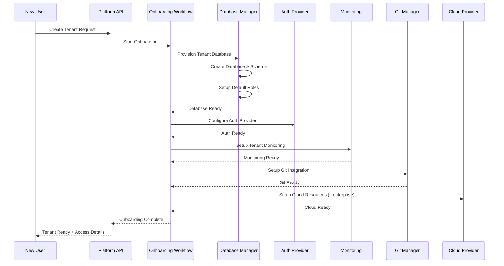

# Tenant Onboarding and Database Operations

## 1. Overview

This document outlines the comprehensive tenant onboarding process, including automated database provisioning, role management, monitoring setup, and ongoing operational procedures. The system supports both self-service onboarding for standard tenants and assisted onboarding for enterprise customers.

## 2. Tenant Onboarding Architecture

### 2.1 Onboarding Workflow


## 3. Database Provisioning and Management

### 3.1 Automated Database Provisioning
```go
type TenantDatabaseManager struct {
    platformDB      *sql.DB
    dbCluster       DatabaseCluster
    migrationRunner MigrationRunner
    monitoring      MonitoringService
    vault          VaultService
}

type TenantProvisionRequest struct {
    TenantID        uuid.UUID `json:"tenant_id"`
    TenantName      string    `json:"tenant_name"`
    Plan            string    `json:"plan"`
    Region          string    `json:"region"`
    BackupPolicy    BackupPolicy `json:"backup_policy"`
    MonitoringLevel string    `json:"monitoring_level"`
}

func (tdm *TenantDatabaseManager) ProvisionTenantDatabase(ctx context.Context, req *TenantProvisionRequest) error {
    // Generate database name
    dbName := fmt.Sprintf("tenant_%s", req.TenantID.String()[:8])
    
    // Create database with appropriate collation and settings
    dbConfig := DatabaseConfig{
        Name:     dbName,
        Owner:    "tenant_admin",
        Encoding: "UTF8",
        Collate:  "en_US.UTF-8",
        Template: "template0",
        ConnectionLimit: tdm.getConnectionLimit(req.Plan),
    }
    
    // Step 1: Create database
    if err := tdm.dbCluster.CreateDatabase(ctx, dbConfig); err != nil {
        return fmt.Errorf("failed to create database: %w", err)
    }
    
    // Step 2: Run schema migrations
    if err := tdm.migrationRunner.RunMigrations(ctx, dbName); err != nil {
        tdm.dbCluster.DropDatabase(ctx, dbName) // Cleanup on failure
        return fmt.Errorf("failed to run migrations: %w", err)
    }
    
    // Step 3: Create default roles and users
    if err := tdm.setupDefaultRoles(ctx, dbName, req.TenantID); err != nil {
        tdm.dbCluster.DropDatabase(ctx, dbName) // Cleanup on failure
        return fmt.Errorf("failed to setup roles: %w", err)
    }
    
    // Step 4: Setup monitoring
    if err := tdm.setupDatabaseMonitoring(ctx, dbName, req.MonitoringLevel); err != nil {
        log.Errorf("Failed to setup monitoring for %s: %v", dbName, err)
        // Don't fail onboarding for monitoring issues
    }
    
    // Step 5: Configure backup policy
    if err := tdm.setupBackupPolicy(ctx, dbName, req.BackupPolicy); err != nil {
        log.Errorf("Failed to setup backup policy for %s: %v", dbName, err)
        // Don't fail onboarding for backup setup issues
    }
    
    // Step 6: Store tenant database info in platform DB
    if err := tdm.storeTenantDBInfo(ctx, req.TenantID, dbName, dbConfig); err != nil {
        return fmt.Errorf("failed to store tenant database info: %w", err)
    }
    
    return nil
}
```

### 3.2 Default Schema and Tables
```sql
-- Tenant database schema template
-- This schema is deployed to every new tenant database

-- Application definitions
CREATE TABLE applications (
    id UUID PRIMARY KEY DEFAULT gen_random_uuid(),
    name VARCHAR(255) NOT NULL UNIQUE,
    description TEXT,
    team VARCHAR(255) NOT NULL,
    git_repository VARCHAR(512),
    desired_state JSONB NOT NULL DEFAULT '{}',
    actual_state JSONB NOT NULL DEFAULT '{}',
    status VARCHAR(50) NOT NULL DEFAULT 'pending',
    created_at TIMESTAMP WITH TIME ZONE DEFAULT NOW(),
    updated_at TIMESTAMP WITH TIME ZONE DEFAULT NOW(),
    created_by VARCHAR(255) NOT NULL,
    updated_by VARCHAR(255)
);

-- Resources managed by applications
CREATE TABLE resources (
    id UUID PRIMARY KEY DEFAULT gen_random_uuid(),
    application_id UUID REFERENCES applications(id) ON DELETE CASCADE,
    type VARCHAR(100) NOT NULL,
    name VARCHAR(255) NOT NULL,
    desired_config JSONB NOT NULL DEFAULT '{}',
    actual_config JSONB NOT NULL DEFAULT '{}',
    status VARCHAR(50) NOT NULL DEFAULT 'pending',
    provider_resource_id VARCHAR(512),
    created_at TIMESTAMP WITH TIME ZONE DEFAULT NOW(),
    updated_at TIMESTAMP WITH TIME ZONE DEFAULT NOW(),
    UNIQUE(name, type)
);

-- Deployment history
CREATE TABLE deployments (
    id UUID PRIMARY KEY DEFAULT gen_random_uuid(),
    application_id UUID NOT NULL REFERENCES applications(id),
    version VARCHAR(255) NOT NULL,
    status VARCHAR(50) NOT NULL,
    started_at TIMESTAMP WITH TIME ZONE DEFAULT NOW(),
    completed_at TIMESTAMP WITH TIME ZONE,
    triggered_by VARCHAR(255) NOT NULL,
    metadata JSONB DEFAULT '{}'
);

-- User activity audit log
CREATE TABLE user_activity (
    id UUID PRIMARY KEY DEFAULT gen_random_uuid(),
    user_id VARCHAR(255) NOT NULL,
    action VARCHAR(255) NOT NULL,
    resource_type VARCHAR(100),
    resource_id UUID,
    details JSONB DEFAULT '{}',
    ip_address INET,
    user_agent TEXT,
    created_at TIMESTAMP WITH TIME ZONE DEFAULT NOW()
);

-- Indexes for performance
CREATE INDEX idx_applications_status ON applications(status);
CREATE INDEX idx_applications_team ON applications(team);
CREATE INDEX idx_resources_application_id ON resources(application_id);
CREATE INDEX idx_resources_type_status ON resources(type, status);
CREATE INDEX idx_deployments_application_id ON deployments(application_id);
CREATE INDEX idx_deployments_status ON deployments(status);
CREATE INDEX idx_user_activity_user_id ON user_activity(user_id);
CREATE INDEX idx_user_activity_created_at ON user_activity(created_at);
```

### 3.3 Default Roles and Permissions
```go
type DatabaseRole struct {
    Name        string   `json:"name"`
    Permissions []string `json:"permissions"`
    Description string   `json:"description"`
}

func (tdm *TenantDatabaseManager) setupDefaultRoles(ctx context.Context, dbName string, tenantID uuid.UUID) error {
    roles := []DatabaseRole{
        {
            Name:        "tenant_admin",
            Permissions: []string{"ALL PRIVILEGES"},
            Description: "Full administrative access to tenant database",
        },
        {
            Name:        "application_manager",
            Permissions: []string{
                "SELECT, INSERT, UPDATE, DELETE ON applications",
                "SELECT, INSERT, UPDATE, DELETE ON resources",
                "SELECT, INSERT, UPDATE, DELETE ON deployments",
                "SELECT, INSERT ON user_activity",
            },
            Description: "Can manage applications and resources",
        },
        {
            Name:        "developer",
            Permissions: []string{
                "SELECT ON applications",
                "SELECT ON resources",
                "SELECT ON deployments",
                "SELECT, INSERT ON user_activity",
            },
            Description: "Read-only access with activity logging",
        },
        {
            Name:        "auditor",
            Permissions: []string{
                "SELECT ON applications",
                "SELECT ON resources", 
                "SELECT ON deployments",
                "SELECT ON user_activity",
            },
            Description: "Read-only access for compliance and auditing",
        },
    }
    
    conn, err := tdm.getTenantConnection(dbName)
    if err != nil {
        return err
    }
    defer conn.Close()
    
    for _, role := range roles {
        // Create role
        _, err := conn.ExecContext(ctx, fmt.Sprintf("CREATE ROLE %s", role.Name))
        if err != nil {
            return fmt.Errorf("failed to create role %s: %w", role.Name, err)
        }
        
        // Grant permissions
        for _, permission := range role.Permissions {
            _, err := conn.ExecContext(ctx, fmt.Sprintf("GRANT %s TO %s", permission, role.Name))
            if err != nil {
                return fmt.Errorf("failed to grant permission to %s: %w", role.Name, err)
            }
        }
        
        // Store role info in Vault for later user assignment
        roleSecret := map[string]interface{}{
            "tenant_id":   tenantID.String(),
            "database":    dbName,
            "role":        role.Name,
            "description": role.Description,
            "created_at":  time.Now().Format(time.RFC3339),
        }
        
        secretPath := fmt.Sprintf("tenant-roles/%s/%s", tenantID.String(), role.Name)
        if err := tdm.vault.WriteSecret(secretPath, roleSecret); err != nil {
            log.Errorf("Failed to store role info in Vault: %v", err)
        }
    }
    
    return nil
}
```

## 4. User Management and Access Control

### 4.1 User Onboarding to Tenant
```go
type TenantUserManager struct {
    platformDB *sql.DB
    vault      VaultService
    authProviders map[string]AuthProvider
}

type UserInviteRequest struct {
    TenantID  uuid.UUID `json:"tenant_id"`
    Email     string    `json:"email"`
    Role      string    `json:"role"`
    Teams     []string  `json:"teams"`
    InvitedBy string    `json:"invited_by"`
}

func (tum *TenantUserManager) InviteUser(ctx context.Context, req *UserInviteRequest) error {
    // Validate role exists
    if !tum.isValidRole(req.Role) {
        return fmt.Errorf("invalid role: %s", req.Role)
    }
    
    // Check if user already exists in tenant
    exists, err := tum.userExistsInTenant(ctx, req.TenantID, req.Email)
    if err != nil {
        return err
    }
    if exists {
        return fmt.Errorf("user %s already exists in tenant", req.Email)
    }
    
    // Generate database user credentials
    dbUser := fmt.Sprintf("user_%s", generateUserID())
    dbPassword := generateSecurePassword()
    
    // Create database user
    if err := tum.createDatabaseUser(ctx, req.TenantID, dbUser, dbPassword, req.Role); err != nil {
        return err
    }
    
    // Store user info in platform database
    userInfo := TenantUser{
        TenantID:     req.TenantID,
        Email:        req.Email,
        Role:         req.Role,
        Teams:        req.Teams,
        DatabaseUser: dbUser,
        Status:       "invited",
        InvitedBy:    req.InvitedBy,
        InvitedAt:    time.Now(),
    }
    
    if err := tum.storeTenantUser(ctx, userInfo); err != nil {
        return err
    }
    
    // Store credentials in Vault
    credentialsPath := fmt.Sprintf("tenant-users/%s/%s", req.TenantID.String(), dbUser)
    credentials := map[string]interface{}{
        "database_user":     dbUser,
        "database_password": dbPassword,
        "tenant_id":        req.TenantID.String(),
        "email":            req.Email,
        "role":             req.Role,
        "created_at":       time.Now().Format(time.RFC3339),
    }
    
    if err := tum.vault.WriteSecret(credentialsPath, credentials); err != nil {
        return fmt.Errorf("failed to store credentials: %w", err)
    }
    
    // Send invitation email
    if err := tum.sendInvitationEmail(req.Email, req.TenantID, userInfo); err != nil {
        log.Errorf("Failed to send invitation email: %v", err)
        // Don't fail the invite process for email issues
    }
    
    return nil
}
```

### 4.2 Authentication Provider Integration
```go
type AuthProviderConfig struct {
    GitHub *GitHubAuthConfig `json:"github,omitempty"`
    EntraID *EntraIDAuthConfig `json:"entra_id,omitempty"`
    OIDC   *OIDCAuthConfig   `json:"oidc,omitempty"`
}

type GitHubAuthConfig struct {
    ClientID     string   `json:"client_id"`
    ClientSecret string   `json:"client_secret"`
    Organization string   `json:"organization,omitempty"`
    Teams        []string `json:"teams,omitempty"`
}

type EntraIDAuthConfig struct {
    TenantID     string   `json:"tenant_id"`
    ClientID     string   `json:"client_id"`
    ClientSecret string   `json:"client_secret"`
    Groups       []string `json:"groups,omitempty"`
}

func (tum *TenantUserManager) ConfigureAuthProvider(ctx context.Context, tenantID uuid.UUID, config AuthProviderConfig) error {
    // Store auth provider config in Vault
    configPath := fmt.Sprintf("tenant-auth/%s", tenantID.String())
    
    if err := tum.vault.WriteSecret(configPath, config); err != nil {
        return fmt.Errorf("failed to store auth config: %w", err)
    }
    
    // Update tenant record with auth provider info
    query := `
        UPDATE control_plane.tenants 
        SET settings = settings || $1 
        WHERE id = $2
    `
    
    settings := map[string]interface{}{
        "auth_providers": getEnabledProviders(config),
        "auth_updated_at": time.Now(),
    }
    
    _, err := tum.platformDB.ExecContext(ctx, query, settings, tenantID)
    return err
}
```

## 5. Monitoring and Observability Setup

### 5.1 Tenant-Specific Monitoring
```go
type TenantMonitoringManager struct {
    prometheus    PrometheusClient
    grafana      GrafanaClient
    alertManager AlertManagerClient
}

func (tmm *TenantMonitoringManager) SetupTenantMonitoring(ctx context.Context, tenantID uuid.UUID, monitoringLevel string) error {
    // Create tenant-specific Prometheus scrape configs
    scrapeConfig := PrometheusScrapeConfig{
        JobName: fmt.Sprintf("tenant-%s", tenantID.String()[:8]),
        Targets: []string{
            fmt.Sprintf("tenant-%s-api:8080/metrics", tenantID.String()[:8]),
            fmt.Sprintf("tenant-%s-db:5432/metrics", tenantID.String()[:8]),
        },
        Labels: map[string]string{
            "tenant_id": tenantID.String(),
            "tier":      monitoringLevel,
        },
    }
    
    if err := tmm.prometheus.AddScrapeConfig(scrapeConfig); err != nil {
        return err
    }
    
    // Create Grafana dashboard for tenant
    dashboard := tmm.generateTenantDashboard(tenantID, monitoringLevel)
    if err := tmm.grafana.CreateDashboard(dashboard); err != nil {
        return err
    }
    
    // Setup alerts based on monitoring level
    alerts := tmm.generateTenantAlerts(tenantID, monitoringLevel)
    for _, alert := range alerts {
        if err := tmm.alertManager.CreateAlert(alert); err != nil {
            log.Errorf("Failed to create alert for tenant %s: %v", tenantID, err)
        }
    }
    
    return nil
}

func (tmm *TenantMonitoringManager) generateTenantAlerts(tenantID uuid.UUID, level string) []AlertRule {
    baseAlerts := []AlertRule{
        {
            Name: fmt.Sprintf("tenant-%s-high-error-rate", tenantID.String()[:8]),
            Expr: fmt.Sprintf(`rate(http_requests_total{tenant_id="%s", status=~"5.."}[5m]) > 0.05`, tenantID.String()),
            Duration: "5m",
            Labels: map[string]string{
                "severity": "warning",
                "tenant_id": tenantID.String(),
            },
            Annotations: map[string]string{
                "summary": "High error rate detected for tenant",
                "description": "Error rate is above 5% for 5 minutes",
            },
        },
        {
            Name: fmt.Sprintf("tenant-%s-db-connection-limit", tenantID.String()[:8]),
            Expr: fmt.Sprintf(`pg_stat_activity_count{tenant_id="%s"} > pg_settings_max_connections * 0.8`, tenantID.String()),
            Duration: "2m",
            Labels: map[string]string{
                "severity": "critical",
                "tenant_id": tenantID.String(),
            },
            Annotations: map[string]string{
                "summary": "Database connection limit approaching",
                "description": "Database connections are at 80% of limit",
            },
        },
    }
    
    // Add premium alerts for higher tiers
    if level == "enterprise" {
        premiumAlerts := []AlertRule{
            {
                Name: fmt.Sprintf("tenant-%s-sla-breach", tenantID.String()[:8]),
                Expr: fmt.Sprintf(`avg_over_time(http_request_duration_seconds{tenant_id="%s"}[5m]) > 0.5`, tenantID.String()),
                Duration: "1m",
                Labels: map[string]string{
                    "severity": "critical",
                    "tenant_id": tenantID.String(),
                    "sla": "true",
                },
            },
        }
        baseAlerts = append(baseAlerts, premiumAlerts...)
    }
    
    return baseAlerts
}
```

## 6. Backup and Disaster Recovery

### 6.1 Automated Backup Management
```go
type BackupPolicy struct {
    Schedule         string `json:"schedule"`         // Cron format
    RetentionDays    int    `json:"retention_days"`
    BackupType       string `json:"backup_type"`      // full, incremental
    EncryptionLevel  string `json:"encryption_level"` // standard, high
    StorageLocation  string `json:"storage_location"` // region-specific
}

func (tdm *TenantDatabaseManager) setupBackupPolicy(ctx context.Context, dbName string, policy BackupPolicy) error {
    // Create backup configuration
    backupConfig := BackupConfiguration{
        DatabaseName:    dbName,
        Schedule:        policy.Schedule,
        RetentionDays:  policy.RetentionDays,
        BackupType:     policy.BackupType,
        Encryption:     policy.EncryptionLevel,
        StorageClass:   "STANDARD_IA", // Cost-optimized
        Compression:    true,
        Notification:   true, // Alert on backup failures
    }
    
    // Register with backup service
    if err := tdm.backupService.CreateBackupJob(backupConfig); err != nil {
        return err
    }
    
    // Setup monitoring for backup jobs
    backupAlert := AlertRule{
        Name: fmt.Sprintf("backup-failed-%s", dbName),
        Expr: fmt.Sprintf(`backup_job_success{database="%s"} == 0`, dbName),
        Duration: "1m",
        Labels: map[string]string{
            "severity": "critical",
            "service": "backup",
        },
    }
    
    return tdm.alertManager.CreateAlert(backupAlert)
}
```

## 7. Tenant Lifecycle Management

### 7.1 Tenant Suspension and Recovery
```go
func (tdm *TenantDatabaseManager) SuspendTenant(ctx context.Context, tenantID uuid.UUID, reason string) error {
    // Get tenant database info
    dbInfo, err := tdm.getTenantDBInfo(ctx, tenantID)
    if err != nil {
        return err
    }
    
    // Revoke all user connections
    if err := tdm.revokeAllConnections(ctx, dbInfo.DatabaseName); err != nil {
        return err
    }
    
    // Update tenant status
    query := `
        UPDATE control_plane.tenants 
        SET status = 'suspended', 
            settings = settings || $1 
        WHERE id = $2
    `
    
    settings := map[string]interface{}{
        "suspended_at": time.Now(),
        "suspension_reason": reason,
    }
    
    _, err = tdm.platformDB.ExecContext(ctx, query, settings, tenantID)
    return err
}

func (tdm *TenantDatabaseManager) DestroyTenant(ctx context.Context, tenantID uuid.UUID) error {
    // This is a destructive operation - require confirmation
    dbInfo, err := tdm.getTenantDBInfo(ctx, tenantID)
    if err != nil {
        return err
    }
    
    // Create final backup before destruction
    backupName := fmt.Sprintf("final-backup-%s-%d", tenantID.String()[:8], time.Now().Unix())
    if err := tdm.createFinalBackup(ctx, dbInfo.DatabaseName, backupName); err != nil {
        log.Errorf("Failed to create final backup: %v", err)
    }
    
    // Remove database
    if err := tdm.dbCluster.DropDatabase(ctx, dbInfo.DatabaseName); err != nil {
        return err
    }
    
    // Clean up Vault secrets
    secretPath := fmt.Sprintf("tenant-roles/%s", tenantID.String())
    if err := tdm.vault.DeletePath(secretPath); err != nil {
        log.Errorf("Failed to clean up Vault secrets: %v", err)
    }
    
    // Remove monitoring configuration
    if err := tdm.monitoring.RemoveTenantMonitoring(tenantID); err != nil {
        log.Errorf("Failed to remove monitoring: %v", err)
    }
    
    // Update platform database
    query := `
        UPDATE control_plane.tenants 
        SET status = 'destroyed', 
            settings = settings || $1 
        WHERE id = $2
    `
    
    settings := map[string]interface{}{
        "destroyed_at": time.Now(),
        "final_backup": backupName,
    }
    
    _, err = tdm.platformDB.ExecContext(ctx, query, settings, tenantID)
    return err
}
```

This tenant onboarding system provides comprehensive automation for database provisioning, user management, monitoring setup, and lifecycle management while maintaining security and operational best practices.
