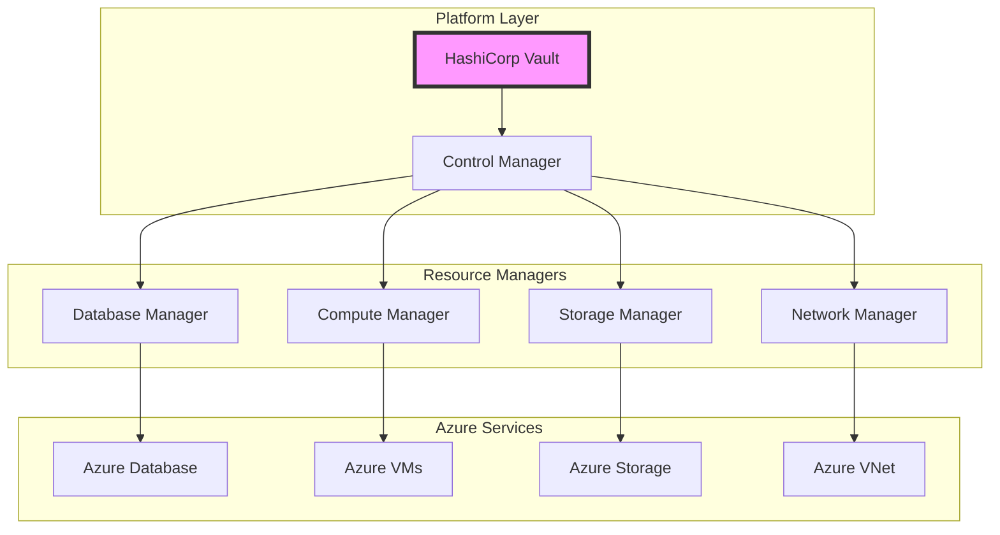
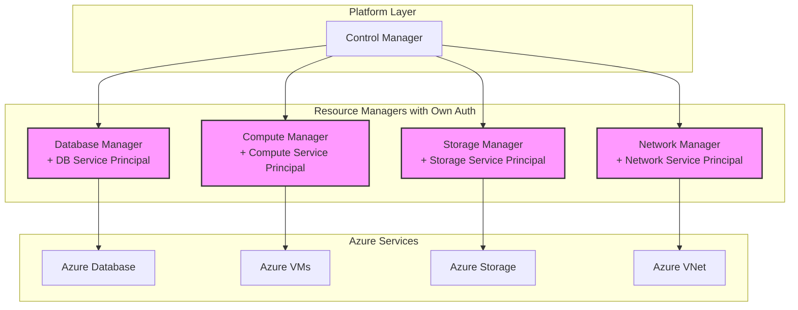
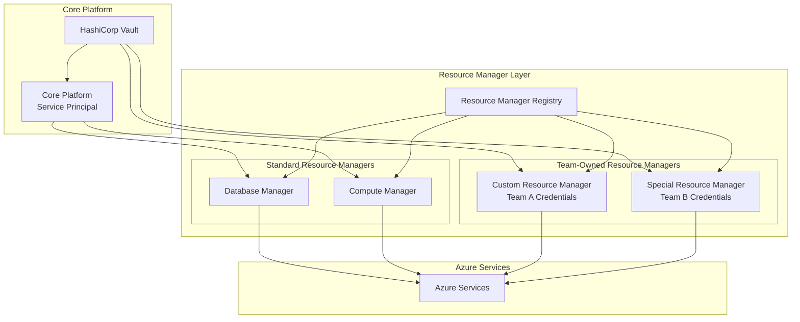

# Cloud Service Provider Authentication Strategy

## 1. Overview

This document addresses the critical architectural decision of how the IDP platform authenticates with cloud service providers (Azure, AWS, etc.). The choice between centralized platform credentials versus distributed per-resource-provider authentication has significant implications for security, operational complexity, and team autonomy.

## 2. Authentication Strategy Options

### 2.1 Option A: Centralized Platform Authentication


### 2.2 Option B: Distributed Per-Resource-Provider Authentication


## 3. Detailed Analysis

### 3.1 Centralized Platform Authentication

#### Implementation Approach
```yaml
centralized_auth:
  service_principal:
    name: "idp-platform-service-principal"
    scope: "Subscription-level access"
    permissions: [
      "Microsoft.Sql/servers/*",
      "Microsoft.Compute/virtualMachines/*",
      "Microsoft.Storage/storageAccounts/*",
      "Microsoft.Network/virtualNetworks/*",
      "Microsoft.ContainerInstance/containerGroups/*"
    ]
    
  vault_integration:
    credential_storage: "secret/azure/platform-credentials"
    rotation_schedule: "90 days"
    access_policy: "platform-services-only"
    
  resource_manager_config:
    shared_client: "Single Azure SDK client instance"
    credential_source: "Vault dynamic secrets"
    retry_policy: "Shared exponential backoff"
```

#### Pros:
- **Simplified Credential Management**: Single set of credentials to manage
- **Centralized Rotation**: One place to handle credential rotation
- **Easier Monitoring**: Single authentication flow to monitor
- **Cost Efficiency**: Fewer service principals to maintain
- **Simplified RBAC**: One principal with well-defined permissions

#### Cons:
- **Single Point of Failure**: If platform credentials are compromised, entire system is at risk
- **Broad Permissions**: Service principal needs permissions for all resource types
- **Team Autonomy**: All teams must coordinate changes through central authentication
- **Blast Radius**: Security incidents affect all resource providers

### 3.2 Distributed Per-Resource-Provider Authentication

#### Implementation Approach
```yaml
distributed_auth:
  service_principals:
    database_manager:
      name: "idp-database-service-principal"
      scope: "Database-specific resources only"
      permissions: [
        "Microsoft.Sql/servers/*",
        "Microsoft.Cache/Redis/*"
      ]
      
    compute_manager:
      name: "idp-compute-service-principal"
      scope: "Compute-specific resources only"
      permissions: [
        "Microsoft.Compute/virtualMachines/*",
        "Microsoft.ContainerInstance/containerGroups/*"
      ]
      
    storage_manager:
      name: "idp-storage-service-principal"
      scope: "Storage-specific resources only"
      permissions: [
        "Microsoft.Storage/storageAccounts/*"
      ]
      
    network_manager:
      name: "idp-network-service-principal"
      scope: "Network-specific resources only"
      permissions: [
        "Microsoft.Network/virtualNetworks/*",
        "Microsoft.Network/loadBalancers/*"
      ]
```

#### Pros:
- **Principle of Least Privilege**: Each service principal has minimal required permissions
- **Security Isolation**: Compromise of one doesn't affect others
- **Team Autonomy**: Different teams can manage different resource providers independently
- **Easier Auditing**: Clear separation of which service accessed what
- **Granular Control**: Fine-tuned permissions per service

#### Cons:
- **Operational Complexity**: Multiple service principals to manage and rotate
- **Coordination Overhead**: Cross-resource operations might require multiple authentications
- **Monitoring Complexity**: Multiple authentication flows to monitor
- **Higher Cost**: More service principals and management overhead

## 4. Hybrid Approach (Recommended)

### 4.1 Hybrid Architecture


### 4.2 Hybrid Implementation Strategy
```go
type CloudAuthStrategy interface {
    GetCredentials(ctx context.Context, resourceType string) (CloudCredentials, error)
    RefreshCredentials(ctx context.Context, resourceType string) error
}

type HybridAuthStrategy struct {
    vault           VaultClient
    defaultPrincipal string
    customPrincipals map[string]string
}

func (has *HybridAuthStrategy) GetCredentials(ctx context.Context, resourceType string) (CloudCredentials, error) {
    // Check if this resource type has custom authentication
    if customPrincipal, exists := has.customPrincipals[resourceType]; exists {
        return has.getCustomCredentials(ctx, customPrincipal)
    }
    
    // Use default platform credentials
    return has.getDefaultCredentials(ctx)
}

func (has *HybridAuthStrategy) getDefaultCredentials(ctx context.Context) (CloudCredentials, error) {
    secret, err := has.vault.ReadSecret(ctx, "azure/platform-credentials")
    if err != nil {
        return CloudCredentials{}, err
    }
    
    return CloudCredentials{
        TenantID:     secret.Data["tenant_id"].(string),
        ClientID:     secret.Data["client_id"].(string),
        ClientSecret: secret.Data["client_secret"].(string),
        SubscriptionID: secret.Data["subscription_id"].(string),
    }, nil
}

func (has *HybridAuthStrategy) getCustomCredentials(ctx context.Context, principalName string) (CloudCredentials, error) {
    secretPath := fmt.Sprintf("azure/custom-credentials/%s", principalName)
    secret, err := has.vault.ReadSecret(ctx, secretPath)
    if err != nil {
        return CloudCredentials{}, err
    }
    
    return CloudCredentials{
        TenantID:     secret.Data["tenant_id"].(string),
        ClientID:     secret.Data["client_id"].(string),
        ClientSecret: secret.Data["client_secret"].(string),
        SubscriptionID: secret.Data["subscription_id"].(string),
    }, nil
}
```

### 4.3 Configuration Model
```yaml
# Platform configuration
cloud_authentication:
  default_strategy: "centralized"
  custom_strategies:
    "database": "centralized"  # Use platform credentials
    "compute": "centralized"   # Use platform credentials
    "storage": "centralized"   # Use platform credentials
    "ai-services": "custom"    # Team-specific credentials
    "analytics": "custom"      # Team-specific credentials
    
  service_principals:
    platform:
      client_id: "vault:azure/platform-credentials/client_id"
      tenant_id: "vault:azure/platform-credentials/tenant_id"
      permissions: [
        "Microsoft.Sql/servers/*",
        "Microsoft.Compute/virtualMachines/*", 
        "Microsoft.Storage/storageAccounts/*",
        "Microsoft.Network/*"
      ]
      
    ai-services:
      client_id: "vault:azure/ai-team-credentials/client_id"
      tenant_id: "vault:azure/ai-team-credentials/tenant_id"
      permissions: [
        "Microsoft.CognitiveServices/*",
        "Microsoft.MachineLearningServices/*"
      ]
      
    analytics:
      client_id: "vault:azure/analytics-team-credentials/client_id" 
      tenant_id: "vault:azure/analytics-team-credentials/tenant_id"
      permissions: [
        "Microsoft.DataFactory/*",
        "Microsoft.Synapse/*"
      ]
```

## 5. Security Considerations

### 5.1 Credential Rotation Strategy
```go
type CredentialRotationManager struct {
    vault        VaultClient
    azureClient  AzureClient
    scheduler    cron.Scheduler
}

func (crm *CredentialRotationManager) SetupRotationSchedule() error {
    // Rotate platform credentials every 90 days
    crm.scheduler.AddFunc("0 0 1 */3 *", func() {
        crm.rotatePlatformCredentials()
    })
    
    // Rotate custom credentials every 60 days  
    crm.scheduler.AddFunc("0 0 1 */2 *", func() {
        crm.rotateCustomCredentials()
    })
    
    return crm.scheduler.Start()
}

func (crm *CredentialRotationManager) rotatePlatformCredentials() error {
    // Get current platform service principal
    principalID := "idp-platform-service-principal"
    
    // Generate new client secret
    newSecret, err := crm.azureClient.CreateClientSecret(principalID)
    if err != nil {
        return err
    }
    
    // Test new credentials
    if err := crm.testCredentials(newSecret); err != nil {
        return err
    }
    
    // Update Vault with new credentials
    credentialData := map[string]interface{}{
        "client_secret": newSecret.Value,
        "rotated_at":   time.Now().Format(time.RFC3339),
        "expires_at":   newSecret.ExpiresAt.Format(time.RFC3339),
    }
    
    if err := crm.vault.WriteSecret("azure/platform-credentials", credentialData); err != nil {
        return err
    }
    
    // Wait for services to pick up new credentials (grace period)
    time.Sleep(5 * time.Minute)
    
    // Delete old client secret
    return crm.azureClient.DeleteClientSecret(principalID, oldSecret.KeyID)
}
```

### 5.2 Audit and Monitoring
```yaml
audit_requirements:
  credential_access:
    log_all_vault_reads: true
    log_azure_api_calls: true
    retention: "2 years"
    
  authentication_events:
    successful_auth: "INFO level logging"
    failed_auth: "WARN level logging with alerting"
    credential_rotation: "INFO level with notification"
    
  compliance:
    quarterly_access_review: "Review all service principal permissions"
    annual_penetration_testing: "Include credential security testing"
    principle_of_least_privilege: "Regular permission audits"
```

## 6. Implementation Recommendations

### 6.1 Phase 1: Start Centralized (MVP)
```yaml
mvp_approach:
  authentication: "Single platform service principal"
  justification: "Simplicity for initial implementation"
  timeline: "Weeks 1-16"
  
  implementation_steps:
    1. "Create Azure service principal with required permissions"
    2. "Store credentials in HashiCorp Vault"
    3. "Implement shared Azure client in resource managers"
    4. "Setup credential rotation automation"
```

### 6.2 Phase 2: Add Selective Distribution (Scale)
```yaml
scale_approach:
  authentication: "Hybrid with selective custom credentials"
  justification: "Enable team autonomy for specialized services"
  timeline: "Weeks 17-24"
  
  implementation_steps:
    1. "Implement pluggable authentication strategy"
    2. "Add support for custom service principals"
    3. "Migrate high-risk or team-specific services to custom auth"
    4. "Maintain centralized auth for core platform services"
```

### 6.3 Phase 3: Full Flexibility (Enterprise)
```yaml
enterprise_approach:
  authentication: "Fully configurable per tenant/resource type"
  justification: "Enterprise customers may have specific security requirements"
  timeline: "Weeks 25+"
  
  features:
    - "Per-tenant service principals (enterprise customers)"
    - "Customer-managed identities"
    - "Cross-cloud authentication strategies"
    - "Advanced compliance and audit features"
```

## 7. Decision Matrix

| Factor | Centralized | Distributed | Hybrid |
|--------|-------------|-------------|---------|
| **Security** | ⚠️ Single point of failure | ✅ Isolated failure domains | ✅ Balanced approach |
| **Operational Complexity** | ✅ Simple to manage | ❌ Complex management | ⚠️ Moderate complexity |
| **Team Autonomy** | ❌ Limited autonomy | ✅ High autonomy | ✅ Flexible autonomy |
| **Principle of Least Privilege** | ❌ Broad permissions | ✅ Minimal permissions | ✅ Configurable permissions |
| **Implementation Speed** | ✅ Fast to implement | ❌ Slower implementation | ⚠️ Moderate implementation |
| **Cost** | ✅ Lower cost | ❌ Higher cost | ⚠️ Moderate cost |
| **Monitoring Complexity** | ✅ Simple monitoring | ❌ Complex monitoring | ⚠️ Moderate monitoring |
| **Compliance** | ⚠️ Harder to audit | ✅ Easier to audit | ✅ Flexible audit approach |

## 8. Final Recommendation

**Start with Centralized, Evolve to Hybrid**

1. **Phase 1 (MVP)**: Centralized authentication for speed and simplicity
2. **Phase 2 (Scale)**: Hybrid approach enabling team autonomy where needed  
3. **Phase 3 (Enterprise)**: Full flexibility with per-tenant authentication options

This approach balances implementation speed, operational complexity, and security requirements while providing a clear evolution path as the platform matures and customer needs become more sophisticated.

The hybrid model ultimately provides the best long-term architecture, allowing core platform services to benefit from centralized management while enabling specialized or team-owned services to use more appropriate authentication strategies.
