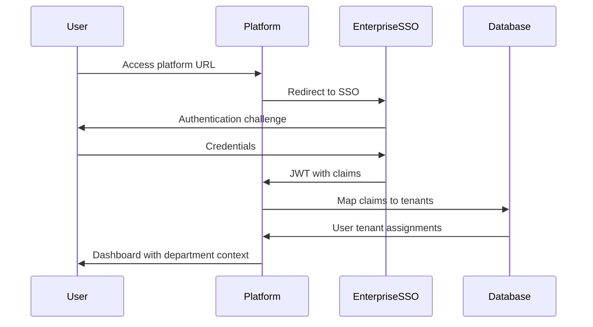

# Multi-Tenant Authentication Flows

## Overview

This document explores different approaches to user authentication and tenant assignment in multi-tenant environments, analyzing how major cloud providers handle this challenge and recommending strategies for different deployment scenarios.

## 1. Industry Analysis: How Others Handle Multi-Tenancy

### 1.1 AWS Approach
```yaml
model: Organization + Account-based
user_assignment:
  method: "Invitation + Federation"
  process:
    - Admin creates AWS Account
    - Users invited via email OR
    - Auto-assigned via SAML/OIDC claims (e.g., department)
  cross_account: "Assume Role" for multi-tenant access
  
authentication_flow:
  - User authenticates to identity provider
  - Claims determine which account(s) they can access
  - Account switching via web console or CLI
```

### 1.2 Azure Approach  
```yaml
model: Azure AD Tenant + Subscription-based
user_assignment:
  method: "Directory Membership + Claims"
  process:
    - Users exist in Azure AD directory
    - Auto-assigned to subscriptions based on group membership
    - Claims in token determine resource access
  cross_tenant: "Guest user" invitations or B2B federation

authentication_flow:
  - User authenticates to Azure AD
  - Token contains subscription/role claims
  - Resource access controlled via RBAC
```

### 1.3 GitHub Approach
```yaml
model: Organization-based
user_assignment:
  method: "Invitation + Auto-assignment"
  process:
    - Admin creates GitHub Organization
    - Users invited by email OR
    - SAML claims auto-assign to teams/orgs
  multi_org: Users can belong to multiple organizations

authentication_flow:
  - User authenticates (GitHub OAuth or SAML)
  - Organization context selected in UI
  - Permissions scoped to selected organization
```

### 1.4 Slack Approach
```yaml
model: Workspace-based
user_assignment:
  method: "Invitation-first + Claims-based"
  process:
    - Workspace admin sends email invitation
    - User accepts invitation to specific workspace
    - Optional: SAML claims for automatic workspace assignment
  multi_workspace: Separate authentication per workspace

authentication_flow:
  - User selects workspace (subdomain)
  - Authenticates to that specific workspace
  - No cross-workspace context switching
```

## 2. Recommended Multi-Tenant Authentication Strategies

### 2.1 Internal Enterprise Deployment (Departments as Tenants)

**Scenario**: Single company, departments are tenants (Engineering, Marketing, Finance)

```yaml
approach: "Claims-Based Auto-Assignment"
identity_provider: "Entra ID / OIDC"

authentication_flow:
  1. User authenticates via company SSO
  2. JWT contains department claims
  3. Platform auto-assigns user to department tenant(s)
  4. User sees unified dashboard with department-scoped resources

implementation:
  jwt_claims:
    - "department": ["engineering", "devops"] 
    - "role": ["developer", "admin"]
    - "cost_center": "CC-ENG-001"
  
  tenant_mapping:
    claim_field: "department"
    mapping_rules:
      - claim_value: "engineering" 
        tenant_id: "tenant-eng"
        default_role: "developer"
      - claim_value: "devops"
        tenant_id: "tenant-eng" 
        default_role: "admin"
        
  fallback_strategy: "pending_assignment" # If no matching claims
```

**Database Schema Extension**:
```sql
-- Add to user_management schema
CREATE TABLE user_tenant_assignments (
    id UUID PRIMARY KEY DEFAULT gen_random_uuid(),
    user_id VARCHAR(255) NOT NULL,
    tenant_id UUID NOT NULL REFERENCES control_plane.tenants(id),
    role VARCHAR(100) NOT NULL DEFAULT 'developer',
    assignment_method VARCHAR(50) NOT NULL, -- 'auto_claims', 'admin_invite', 'self_service'
    assigned_by VARCHAR(255), -- admin user_id if manually assigned
    assigned_at TIMESTAMP WITH TIME ZONE DEFAULT NOW(),
    claims_snapshot JSONB, -- Store claims that led to assignment
    status VARCHAR(50) DEFAULT 'active', -- active, suspended, pending
    UNIQUE(user_id, tenant_id)
);

CREATE TABLE pending_user_assignments (
    id UUID PRIMARY KEY DEFAULT gen_random_uuid(),
    user_id VARCHAR(255) NOT NULL,
    email VARCHAR(255) NOT NULL,
    claims JSONB NOT NULL,
    reason VARCHAR(255), -- 'no_matching_claims', 'approval_required'
    created_at TIMESTAMP WITH TIME ZONE DEFAULT NOW(),
    resolved_at TIMESTAMP WITH TIME ZONE,
    resolved_by VARCHAR(255)
);
```

### 2.2 Public SaaS Deployment (Organizations as Tenants)

**Scenario**: Public platform, each organization is a tenant

```yaml
approach: "Hybrid: Self-Service + Invitation"
identity_providers: ["GitHub OAuth", "Google OAuth", "Custom OIDC"]

authentication_flow:
  1. User signs up with OAuth provider
  2. User either:
     a) Creates new organization (becomes admin)
     b) Accepts invitation to existing organization
     c) Requests access to organization (pending approval)

implementation:
  signup_flow:
    new_user:
      - User authenticates via OAuth
      - Platform creates user record
      - Option 1: Create new tenant (user becomes admin)
      - Option 2: Show "Join Organization" form
      - Option 3: Enter invitation code
      
    organization_creation:
      - User provides organization name/subdomain
      - Platform creates tenant database
      - User assigned as "owner" role
      - Organization ready for use
      
    invitation_flow:
      - Org admin sends email invitation
      - Invited user clicks link
      - User authenticates (new account or existing)
      - Auto-assigned to organization with specified role
```

**Implementation Code**:
```go
type AuthenticationService struct {
    db              *sql.DB
    tenantManager   *TenantManager
    inviteManager   *InvitationManager
    claimsProcessor *ClaimsProcessor
}

func (auth *AuthenticationService) ProcessAuthentication(token *jwt.Token) (*UserContext, error) {
    claims := auth.extractClaims(token)
    user := auth.getOrCreateUser(claims)
    
    // Strategy 1: Claims-based assignment (Enterprise)
    if tenants := auth.claimsProcessor.GetTenantsFromClaims(claims); len(tenants) > 0 {
        return auth.assignUserToTenants(user, tenants, "auto_claims")
    }
    
    // Strategy 2: Check pending invitations (SaaS)
    if invite := auth.inviteManager.GetPendingInvitation(user.Email); invite != nil {
        return auth.processInvitationAcceptance(user, invite)
    }
    
    // Strategy 3: Check existing assignments
    if assignments := auth.getUserTenantAssignments(user.ID); len(assignments) > 0 {
        return auth.createUserContext(user, assignments), nil
    }
    
    // Strategy 4: New user - show onboarding options
    return auth.createPendingUserContext(user, claims), nil
}

func (auth *AuthenticationService) assignUserToTenants(user *User, tenants []TenantAssignment, method string) (*UserContext, error) {
    for _, assignment := range tenants {
        _, err := auth.db.Exec(`
            INSERT INTO user_tenant_assignments (user_id, tenant_id, role, assignment_method, claims_snapshot) 
            VALUES ($1, $2, $3, $4, $5)
            ON CONFLICT (user_id, tenant_id) 
            DO UPDATE SET 
                role = EXCLUDED.role,
                claims_snapshot = EXCLUDED.claims_snapshot,
                assigned_at = NOW()`,
            user.ID, assignment.TenantID, assignment.Role, method, assignment.Claims)
        if err != nil {
            return nil, err
        }
    }
    
    return auth.createUserContext(user, tenants), nil
}
```

### 2.3 Multi-Organization Users (GitHub Model)

**Scenario**: Users can belong to multiple tenants with different roles

```yaml
approach: "Context Switching"
ui_pattern: "Organization Selector"

user_experience:
  login_flow:
    1. User authenticates once
    2. Platform shows list of accessible organizations
    3. User selects organization context
    4. All subsequent operations scoped to selected org
    5. User can switch context via UI dropdown

database_design:
  user_context_table:
    - user_id: Reference to user
    - current_tenant_id: Currently selected tenant
    - session_id: Tie to web session
    - selected_at: When context was selected
    
  tenant_switching_audit:
    - user_id: Who switched
    - from_tenant_id: Previous context  
    - to_tenant_id: New context
    - switched_at: When
    - ip_address: Security audit
```

**UI Implementation**:
```javascript
class TenantContextManager {
    constructor() {
        this.currentTenant = null;
        this.availableTenants = [];
        this.initializeTenantContext();
    }
    
    async initializeTenantContext() {
        // Get user's tenant assignments
        this.availableTenants = await this.fetchUserTenants();
        
        // Try to restore previous context from session
        const lastTenant = localStorage.getItem('selected_tenant');
        if (lastTenant && this.availableTenants.find(t => t.id === lastTenant)) {
            await this.switchTenant(lastTenant);
        } else if (this.availableTenants.length === 1) {
            // Auto-select if only one tenant
            await this.switchTenant(this.availableTenants[0].id);
        } else {
            // Show tenant selector
            this.showTenantSelector();
        }
    }
    
    async switchTenant(tenantId) {
        // Update backend session
        await fetch('/api/auth/switch-tenant', {
            method: 'POST',
            body: JSON.stringify({ tenantId }),
            headers: { 'Content-Type': 'application/json' }
        });
        
        // Update local state
        this.currentTenant = tenantId;
        localStorage.setItem('selected_tenant', tenantId);
        
        // Emit context change event
        window.dispatchEvent(new CustomEvent('tenant-context-changed', {
            detail: { tenantId }
        }));
        
        // Refresh page data
        window.location.reload();
    }
    
    showTenantSelector() {
        const selector = document.createElement('tenant-selector');
        selector.tenants = this.availableTenants;
        selector.addEventListener('tenant-selected', (e) => {
            this.switchTenant(e.detail.tenantId);
        });
        document.body.appendChild(selector);
    }
}

// Tenant Selector Web Component
class TenantSelector extends HTMLElement {
    connectedCallback() {
        this.innerHTML = `
            <div class="tenant-selector-overlay">
                <div class="tenant-selector-modal">
                    <h2>Select Organization</h2>
                    <div class="tenant-list">
                        ${this.tenants.map(tenant => `
                            <div class="tenant-option" data-tenant-id="${tenant.id}">
                                <div class="tenant-name">${tenant.name}</div>
                                <div class="tenant-role">${tenant.role}</div>
                            </div>
                        `).join('')}
                    </div>
                    <button class="create-org-btn">Create New Organization</button>
                </div>
            </div>
        `;
        
        this.addEventListener('click', this.handleSelection.bind(this));
    }
    
    handleSelection(e) {
        const tenantOption = e.target.closest('.tenant-option');
        if (tenantOption) {
            const tenantId = tenantOption.dataset.tenantId;
            this.dispatchEvent(new CustomEvent('tenant-selected', {
                detail: { tenantId }
            }));
        }
    }
}
customElements.define('tenant-selector', TenantSelector);
```

## 3. Security Considerations

### 3.1 Claims Validation
```go
type ClaimsProcessor struct {
    trustedIssuers map[string]bool
    tenantMappings map[string]TenantMapping
}

func (cp *ClaimsProcessor) ValidateAndMapClaims(token *jwt.Token) ([]TenantAssignment, error) {
    // Validate issuer
    issuer := token.Claims["iss"].(string)
    if !cp.trustedIssuers[issuer] {
        return nil, errors.New("untrusted token issuer")
    }
    
    // Extract and validate claims
    claims := cp.extractRelevantClaims(token)
    
    // Map claims to tenants
    assignments := []TenantAssignment{}
    for claimKey, claimValue := range claims {
        if mapping, exists := cp.tenantMappings[claimKey]; exists {
            if assignment := mapping.MapToTenant(claimValue); assignment != nil {
                assignments = append(assignments, *assignment)
            }
        }
    }
    
    return assignments, nil
}
```

### 3.2 Cross-Tenant Access Prevention
```go
// Middleware to enforce tenant isolation
func TenantIsolationMiddleware(next http.Handler) http.Handler {
    return http.HandlerFunc(func(w http.ResponseWriter, r *http.Request) {
        userContext := r.Context().Value("user").(*UserContext)
        requestedTenant := r.Header.Get("X-Tenant-ID")
        
        // Verify user has access to requested tenant
        if !userContext.HasAccessToTenant(requestedTenant) {
            http.Error(w, "Access denied to tenant", http.StatusForbidden)
            return
        }
        
        // Add tenant context to request
        ctx := context.WithValue(r.Context(), "tenant_id", requestedTenant)
        next.ServeHTTP(w, r.WithContext(ctx))
    })
}
```

## 4. Configuration Examples

### 4.1 Enterprise Configuration (Claims-Based)
```yaml
# config/auth-enterprise.yaml
authentication:
  mode: "enterprise"
  provider:
    type: "oidc"
    issuer: "https://company.com/oidc"
    client_id: "platform-client"
    
tenant_assignment:
  strategy: "claims_based"
  claim_mappings:
    - claim: "department"
      values:
        "engineering": 
          tenant: "eng-tenant"
          default_role: "developer"
        "devops":
          tenant: "eng-tenant" 
          default_role: "admin"
        "finance":
          tenant: "finance-tenant"
          default_role: "viewer"
          
  fallback: "pending_assignment"
  admin_approval_required: true
```

### 4.2 SaaS Configuration (Self-Service)
```yaml
# config/auth-saas.yaml  
authentication:
  mode: "saas"
  providers:
    - type: "github"
      client_id: "github-oauth-client"
    - type: "google" 
      client_id: "google-oauth-client"
      
tenant_assignment:
  strategy: "invitation_based"
  allow_self_service_org_creation: true
  org_creation_limits:
    max_orgs_per_user: 3
    require_email_verification: true
    
  invitation_settings:
    expire_after: "7d"
    require_admin_approval: false
    allow_domain_based_auto_join: true # @company.com users auto-join company org
```

## 5. Strategic Deployment Models

### 5.1 Primary Target: Enterprise Self-Hosted (GitLab Enterprise Model)

**Value Proposition**: "Your IDP, your infrastructure, your control"

```yaml
deployment_model: "Enterprise Self-Hosted"
target_customers: 
  - Large enterprises (1000+ developers)
  - Regulated industries (finance, healthcare, government)  
  - Companies requiring air-gapped deployments
  
authentication_strategy:
  primary: "Enterprise SSO Integration"
  providers: ["Entra ID", "Okta", "ADFS", "Custom SAML/OIDC"]
  tenant_model: "Departments/Teams as Tenants"
  
architectural_requirements:
  - Kubernetes deployment (Helm charts)
  - Enterprise database support (PostgreSQL, SQL Server)
  - Network isolation capabilities
  - Audit logging and compliance features
  - Air-gap installation support
  
pricing_model: "Per-developer licensing + support contracts"
```

**Authentication Flow for Enterprise**:


### 5.2 Secondary Target: SaaS Platform (GitHub.com Model)

**Value Proposition**: "Start fast, scale globally, pay as you grow"

```yaml
deployment_model: "Multi-Tenant SaaS"
target_customers:
  - Startups and scale-ups (10-500 developers)
  - Teams wanting quick setup
  - Companies evaluating platform capabilities
  
authentication_strategy:
  primary: "Social OAuth + Invitations"
  providers: ["GitHub", "Google", "Microsoft", "Custom OIDC"]
  tenant_model: "Organizations as Tenants"
  
architectural_requirements:
  - Global multi-region deployment
  - Horizontal scaling capabilities
  - SaaS billing integration
  - Self-service onboarding
  - Usage analytics and metering
  
pricing_model: "Per-developer monthly/annual subscriptions"
```

## 6. Unified Architecture for Dual Deployment

### 6.1 Configuration-Driven Authentication

**Key Innovation**: Single codebase that adapts to deployment mode via configuration

```yaml
# Enterprise deployment config
deployment:
  mode: "enterprise"
  installation_id: "acme-corp-prod"

authentication:
  provider:
    type: "oidc"
    issuer: "https://acmecorp.okta.com"
    client_id: "platform-client"
    
  tenant_strategy: "claims_based"
  claim_mappings:
    department: 
      "engineering": { tenant: "eng", role: "developer" }
      "devops": { tenant: "eng", role: "admin" }
      "security": { tenant: "security", role: "admin" }
    cost_center:
      "CC-001": { tenant: "engineering" }
      "CC-002": { tenant: "marketing" }

features:
  self_service_org_creation: false
  cross_tenant_visibility: true  # Admins can see all tenants
  audit_logging: "comprehensive"
  compliance_mode: true
```

```yaml
# SaaS deployment config  
deployment:
  mode: "saas"
  region: "us-east-1"

authentication:
  providers:
    - type: "github"
      client_id: "github-oauth"
    - type: "google"
      client_id: "google-oauth"
      
  tenant_strategy: "organization_based"
  invitation_settings:
    expire_after: "7d"
    allow_domain_auto_join: true

features:
  self_service_org_creation: true
  billing_integration: "stripe"
  usage_metering: true
  support_chat: true
```

### 6.2 Enterprise-Specific Features

#### Advanced Tenant Management for Enterprises
```go
// Enterprise tenant management with department hierarchy
type EnterpriseTenantManager struct {
    db              *sql.DB
    ldapClient      LDAPClient
    auditLogger     *AuditLogger
    complianceMode  bool
}

func (etm *EnterpriseTenantManager) SyncWithLDAP() error {
    // Sync department structure from Active Directory/LDAP
    departments, err := etm.ldapClient.GetDepartments()
    if err != nil {
        return err
    }
    
    for _, dept := range departments {
        tenant := &Tenant{
            Name: dept.Name,
            Type: "department",
            Settings: map[string]interface{}{
                "cost_center": dept.CostCenter,
                "manager": dept.Manager,
                "budget_limit": dept.BudgetLimit,
            },
        }
        
        if err := etm.CreateOrUpdateTenant(tenant); err != nil {
            etm.auditLogger.LogError("tenant_sync_failed", dept.Name, err)
        }
    }
    
    return nil
}

func (etm *EnterpriseTenantManager) HandleUserJoinEvent(userID string, claims map[string]interface{}) error {
    // Enterprise-specific user assignment logic
    assignments := etm.calculateTenantAssignments(claims)
    
    for _, assignment := range assignments {
        // Create audit trail for compliance
        etm.auditLogger.LogUserTenantAssignment(userID, assignment.TenantID, assignment.Role, "auto_ldap_sync")
        
        // Apply enterprise policies (e.g., privileged access approval)
        if assignment.Role == "admin" && etm.complianceMode {
            etm.requireApprovalForPrivilegedAccess(userID, assignment)
        } else {
            etm.assignUserToTenant(userID, assignment)
        }
    }
    
    return nil
}
```

## 7. Enterprise Deployment Strategy

### 7.1 Installation Models

#### **Air-Gapped Enterprise** (Highest Security)
```yaml
deployment_type: "air_gapped"
requirements:
  - No internet connectivity required
  - Offline container registry
  - Local certificate authority
  - LDAP/Active Directory integration
  
installation_method:
  - Helm chart with embedded images
  - Offline documentation bundle
  - Enterprise support engagement
  
authentication:
  - SAML/OIDC with internal IdP
  - Certificate-based authentication
  - No external OAuth providers
```

#### **Private Cloud Enterprise** (Standard)
```yaml
deployment_type: "private_cloud"
requirements:
  - Kubernetes cluster (EKS, AKS, GKE, OpenShift)
  - Managed PostgreSQL (RDS, Azure Database)
  - Enterprise networking (VPN, private endpoints)
  
installation_method:
  - Helm chart from public registry
  - GitOps deployment (ArgoCD/Flux)
  - Infrastructure as Code (Terraform)
  
authentication:
  - Enterprise SSO (Okta, Entra ID)
  - Optional: Social OAuth for contractors
```

### 7.2 Enterprise Feature Differentiation

**Enterprise-Only Features** (justify premium pricing):
```yaml
enterprise_features:
  security:
    - Advanced audit logging with compliance reports
    - Role-based access control with custom roles
    - API rate limiting per tenant/user
    - Secrets encryption at rest with customer keys
    
  operations:
    - Multi-region deployment support
    - Backup/restore with enterprise SLAs
    - Advanced monitoring and alerting
    - Custom branding and white-labeling
    
  governance:
    - Policy-as-code enforcement (OPA integration)
    - Compliance frameworks (SOX, HIPAA, PCI-DSS)
    - Advanced approval workflows
    - Cost allocation and chargeback reporting
    
  integration:
    - LDAP/Active Directory sync
    - Enterprise service mesh integration
    - Custom MCP server development support
    - Professional services and training
```

## 8. Go-to-Market Strategy

### 8.1 Enterprise Sales Motion

**Target Personas**:
- **Platform Engineering Leaders**: Want to reduce developer toil
- **Engineering VPs**: Need to show developer productivity gains
- **CTOs**: Want standardization without stifling innovation
- **Security Teams**: Need compliance and auditability

**Sales Process**:
1. **Pilot Deployment** (30-60 days): Single department, limited scope
2. **Proof of Value** (90 days): Measure developer productivity gains  
3. **Enterprise Rollout** (6-12 months): Full organization deployment
4. **Expansion** (Year 2+): Additional use cases, advanced features

### 8.2 SaaS Growth Strategy

**Freemium Model**:
```yaml
free_tier:
  - Up to 5 developers
  - Basic resource types (Git, CI/CD)
  - Community support
  - GitHub authentication only
  
pro_tier: # $20/developer/month
  - Unlimited developers
  - All resource types
  - Email support
  - Multiple auth providers
  - Basic AI features
  
enterprise_tier: # Contact for pricing
  - Everything in Pro
  - Advanced AI features
  - SSO integration
  - Audit logging
  - Dedicated support
```

## 9. Implementation Roadmap (Revised)

### **Phase 1: Enterprise MVP** (Months 1-6)
**Goal**: Self-hosted enterprise deployment with basic multi-tenancy

- ✅ Kubernetes deployment (Helm charts)
- ✅ PostgreSQL with tenant isolation
- ✅ OIDC/SAML authentication
- ✅ Claims-based tenant assignment
- ✅ Basic resource management (Git, CI/CD, databases)
- ✅ Web UI with department context

### **Phase 2: Enterprise Production** (Months 7-12)
**Goal**: Production-ready enterprise features

- 🔄 Advanced audit logging
- 🔄 LDAP/AD integration
- 🔄 Custom RBAC
- 🔄 Compliance reporting
- 🔄 Air-gap deployment support
- 🔄 Professional services offering

### **Phase 3: SaaS Launch** (Months 13-18)
**Goal**: Multi-tenant SaaS platform

- ⏳ Multi-region deployment
- ⏳ Billing integration
- ⏳ Self-service onboarding
- ⏳ Usage analytics
- ⏳ Freemium tier

### **Phase 4: Advanced AI** (Months 19-24)
**Goal**: AI-powered differentiation

- ⏳ MCP server registry
- ⏳ AI-enhanced templates
- ⏳ Intelligent cost optimization
- ⏳ Predictive scaling
- ⏳ Natural language operations
