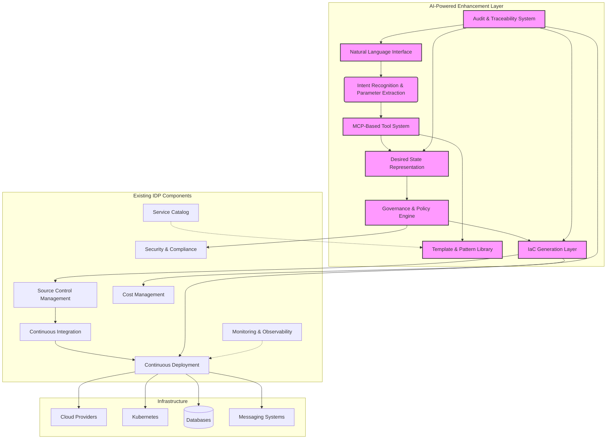

# AI-Powered Internal Developer Platform: Augmenting Existing IDP Investments

## 1. Introduction

This document outlines a vision for enhancing Internal Developer Platforms (IDPs) with agentic AI capabilities while preserving and extending existing infrastructure investments. Our approach addresses the growing demand for natural language interfaces in development workflows while solving critical challenges around reproducibility, governance, and integration with established infrastructure-as-code (IaC) practices.

## 2. Problem Statement

Today's developers increasingly leverage AI to generate code, yet still require robust platforms to host that code and manage underlying infrastructure. While natural language interfaces offer convenience, they introduce significant challenges:

- **Inconsistency**: AI systems may generate different outputs for similar prompts
- **Lack of Auditability**: Conversations and decisions can be lost or forgotten
- **Governance Gaps**: Unconstrained AI might create resources that violate organizational policies
- **Integration Complexity**: Bridging natural language requests with existing IaC toolchains

Traditional GUI-based infrastructure provisioning suffers from similar issues - it relies on human memory and lacks the codification, version control, and reproducibility that made IaC the standard for infrastructure management.

## 3. Proposed Solution Overview

We propose an AI-powered enhancement to existing IDPs that translates natural language requests into governed, version-controlled infrastructure definitions. Rather than replacing established systems, our approach augments them by adding a natural language interface that generates standardized, policy-compliant infrastructure code.

### Core Principles

1. **Intent-to-State Translation**: Convert natural language into structured desired state representations
2. **Governance by Design**: Enforce organizational policies through constrained AI tooling
3. **IaC Foundation**: Generate and maintain infrastructure as code that integrates with existing toolchains
4. **Template-Driven Consistency**: Leverage standardized patterns for common application architectures
5. **Full Auditability**: Maintain traceability from natural language request to deployed infrastructure
6. **Augmentation, Not Replacement**: Extend existing IDP investments rather than replacing them

## 4. Key Architectural Components

### 4.1 Natural Language Interface

A conversational interface that allows developers to express infrastructure needs in natural language. This interface captures the developer's intent and context, providing a more accessible entry point than traditional GUIs or raw IaC.

### 4.2 Intent Recognition & Parameter Extraction

This component analyzes natural language requests to:
- Identify the type of infrastructure or service being requested
- Extract key parameters (names, sizes, configurations)
- Classify the request into known patterns (API servers, Kafka consumers, etc.)

### 4.3 MCP-Based Tool Constrained System

Leveraging the Model Context Protocol (MCP), we define a set of tools that the AI agent can use to interact with the infrastructure. These tools enforce governance and consistency by:

- Exposing only approved resource types and configurations
- Providing clear parameters and validation
- Ensuring deterministic outputs for given inputs

Example MCP tools:
- `create_api_server(params)`
- `create_kafka_consumer(params)`
- `create_database(params)`
- `validate_configuration(params)`

### 4.4 Template & Pattern Library

A curated collection of templates for common application patterns:
- **Code Templates**: Standardized starting points for different application types
- **Infrastructure Templates**: Pre-defined Terraform/CloudFormation modules
- **Configuration Schemas**: Structured definitions of customizable parameters

For example, an "API Server" pattern might include:
- Application code template (Node.js, Python, Java, etc.)
- Associated infrastructure (compute, networking, security groups)
- Default database (PostgreSQL)
- Default caching layer (Redis)

### 4.5 Desired State Representation

A standardized, structured representation (JSON/YAML) that captures:
- The developer's intent
- Extracted parameters
- Selected templates and patterns
- Governance decisions

This representation becomes the "source of truth" that is version-controlled and linked to the original conversation.

### 4.6 Governance & Policy Engine

Enforces organizational policies by:
- Validating requested resources against approved configurations
- Applying cost, security, and compliance constraints
- Auto-correcting or flagging violations
- Providing feedback to developers

### 4.7 IaC Generation Layer

Converts the governed desired state into executable infrastructure code:
- Generates Terraform, CloudFormation, or other IaC formats
- Uses versioned templates and modules
- Maintains consistency through standardized patterns
- Integrates with existing CI/CD pipelines

### 4.8 Audit & Traceability System

Maintains a complete record of:
- Original natural language requests
- Generated desired state representations
- Governance decisions and policy applications
- Resulting infrastructure code
- Deployment status and outcomes

## 5. Integration with Wider IDP Ecosystem

Our AI-powered enhancement is designed to integrate seamlessly with existing IDP investments, extending their capabilities rather than replacing them. This approach preserves the value of current systems while adding new functionality.

### 5.1 Augmenting Existing IDP Components

The AI-powered components serve as an additional interface layer that enhances existing IDP functionality:

- **Source Control Management**: We continue to leverage existing SCM systems to store generated IaC code and desired state representations, maintaining established version control practices.
  
- **CI/CD Pipelines**: Generated infrastructure code feeds into existing CI/CD pipelines, preserving established deployment processes, approval gates, and environment management.
  
- **Service Catalog**: Our template library extends existing service catalogs by providing AI-generated templates that adhere to the same governance standards as manually created entries.
  
- **Security & Compliance**: The governance engine integrates with existing security and compliance frameworks, extending their reach to AI-generated infrastructure without creating new silos.
  
- **Cost Management**: AI-generated resources are tracked through existing cost management systems, maintaining unified financial oversight.

### 5.2 System Architecture Diagram

### 5.3 Integration Benefits
This augmentation approach provides several key advantages:

- **Preservation of Investment**: Existing IDP components continue to provide core functionality, protecting prior investments.
- **Gradual Adoption**: Teams can adopt the AI interface at their own pace while continuing to use traditional methods.
- **Unified Governance**: A single governance framework applies to both AI-generated and manually created infrastructure.
- **Consistent Experience**: Developers receive a consistent experience whether using the AI interface or traditional tools.
- **Operational Continuity**: Existing operational processes, monitoring, and support mechanisms remain unchanged.

## 6. Benefits
### For Developers
- **Lower Barrier to Entry**: Express infrastructure needs in natural language
- **Faster Provisioning**: Reduce time from request to deployed infrastructure
- **Consistent Environments**: Standardized templates ensure uniformity
- **Self-Service**: Reduce dependency on operations teams
### For Organizations
- **Governance at Scale**: Enforce policies consistently across all infrastructure
- **Cost Control**: Limit resource options to approved, cost-effective configurations
- **Compliance**: Maintain audit trails from request to deployment
- **Knowledge Preservation**: Capture infrastructure decisions in a structured way
- **Investment Protection**: Extend existing IDP capabilities rather than replacing them
### For Operations
- **Reduced Toil**: Automate routine infrastructure provisioning
- **Standardization**: Enforce best practices through templates
- **Visibility**: Clear insight into what infrastructure is being created and why
- **Integration**: Leverage existing IaC toolchains and processes
- **Continuity**: Maintain operational processes while adding new capabilities

## 7. Next Steps
This document provides the high-level vision for augmenting existing IDPs with AI capabilities. The next phase will involve creating detailed specifications for each component:

1. **Intent Recognition & Parameter Extraction**: Detailed design for pattern recognition and parameter extraction
2. **MCP Tool Specification**: Complete definition of tools, parameters, and constraints
3. **Template Library Design**: Structure and content for common application patterns
4. **Governance Engine Implementation**: Policy definition, validation, and enforcement mechanisms
5. **Integration Architecture**: Detailed specifications for connecting with existing IDP components
Each of these documents will include implementation details, examples, and decision criteria to guide the development process.

## 8. Conclusion
By combining the convenience of natural language interfaces with the governance and consistency of IaC, our AI-powered enhancement represents the next evolution in developer platforms. This approach addresses the key challenges of AI-generated infrastructure while maintaining the principles that have made modern infrastructure management reliable and scalable.

Most importantly, this solution is designed to augment existing IDP investments rather than replace them. By extending current capabilities with a natural language interface, we provide a path for organizations to evolve their developer platforms incrementally, preserving the value of prior investments while embracing new technologies.

The result is a system that empowers developers to express their needs naturally while ensuring that the resulting infrastructure is secure, compliant, cost-effective, and operationally sound - all while building upon the foundation of existing IDP investments.